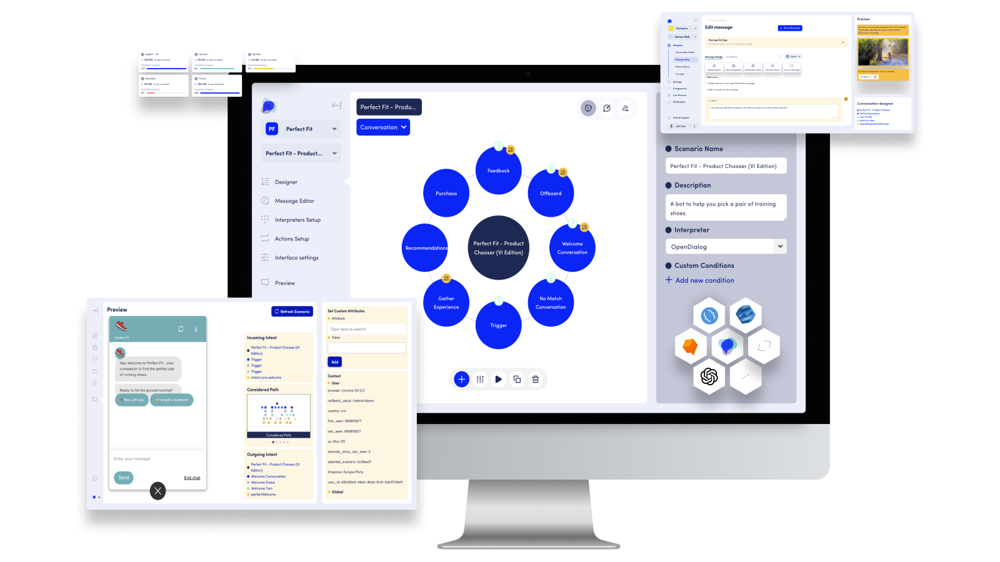

# Getting Started

<figure><figcaption>
The OpenDialog Conversational AI Platform
</figcaption></figure>

Welcome to OpenDialog!

OpenDialog is a platform for building GenAI-powered conversational applications. It helps you keep complete control of the user experience while incorporating the best of what LLMs can offer through a unique approach to automated conversations.

Our documentation acts as a guide to the platform and the OpenDialog way of building conversational applications, but also as a broader reference for Conversational AI.

Here's an overview of the main sections.

* [**Working with OpenDialog**](introduction.md) covers the OpenDialog model, interface and features.
* [**Integrating with OpenDialog**](broken-reference) covers the backend engineering aspects of building conversational experiences, including integrations with other data sources.
* [**Release Notes**](release-notes/release-notes.md) informs you of the new features and improvements being launched for the platform each month.

For more generation information around conversation design have a look at [best practices for great experiences](broken-reference) introduces a design process and tips to build enjoyable and useful experiences.

_If you have any questions or would like to talk to the OpenDialog team about your GenAI-powered application contact us at support@opendialog.ai._
