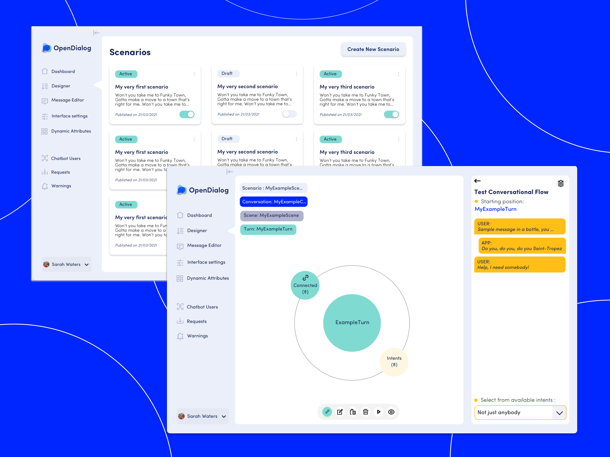

# OpenDialog

**OpenDialog** is a conversational application management platform. 

It enables teams to design, develop, deploy, test, maintain and refine conversational applications.

To achieve this OpenDialog provides:

* **Method**: A specific and opinionated approach to designing conversations \([see core concepts](concepts-1/concepts.md)\).
* **Tooling**: A web-based conversation designer and conversation management system supported by a modular, [open-source](https://github.com/opendialogai/opendialog), development framework for designing and developing conversational applications.
* **Integrations**:
  * A flexible webchat widget for web-based chat.
  * An API endpoint for custom chat integrations to your own conversational interface.
  * Support for other popular conversational interfaces such as Slack, Facebook, WhatsApp, etc.
  * Support for integration with NLU systems such as Dialogflow, LUIS, Lex and Spacy.  

### Who is OpenDialog for? 

OpenDialog is for anyone looking to develop conversational applications. Whether you call them chatbots, virtual assistants, intelligent assistants or simply bots - they are all conversational applications and OpenDialog provides a structured, reliable and, at the same time, flexible method to design and develop them. 

**For conversation designers,** OpenDialog offers a fast, flexible and resilient way of designing conversations, from prototype to final deployment.

**For Conversational AI developers,** OpenDialog provides integrations to leading NLP solutions and an architectural approach that means you can pick and mix tools and approaches down to the level of individual intents.

**For application developers,** OpenDialog provides a modular and robust framework that makes it easy to integrate conversational applications with the rest of your digital ecosystem.

**For product owners and strategists**, OpenDialog provides a comprehensive and robust platform on which to base your Conversational Automation strategy over the long-term. 

**OpenDialog is a tool for the entire team**. It allows everyone to speak the same language, collaborate through the same tool and produce better conversational applications as a result. 

### **How does OpenDialog work?** 

At OpenDialog's core is its Conversation Designer. This no-code conversation design and development tool enables you to describe complex conversational patterns quickly and efficiently. 

The Conversation Builder translates your conversation design to OpenDialog's Conversation Description Language \(CDL\). Our conversation engine can then manage the conversation based on your specifications and co-ordinate the interaction with other systems \(Natural Language Understanding tools or external APIs\). We offer flexible integration with a variety of interpreters of user input, supports the interleaving of actions with conversation, and rich semantic context management. 

### Why OpenDialog? 

We are strong believers in the power of conversational applications to transform digital experiences. At the same time, we recognise that building great conversational applications is hard and requires the combination of a number of different disciplines.

We built OpenDialog because we wanted a platform that focuses strongly on the conversational model without making any limiting assumptions about how user utterances are interpreted, machine output is generated, and the coordination of activities is handled. We accept that different types of interactions and context will require different interpretation capabilities and different conversational patterns. There is no single silver bullet. OpenDialog enables us to describe all this variety through a consistent model and manages the conversational flow flexibly based on that.  

OpenDialog taps into multi-agent systems research and linguistics to provide a comprehensive and flexible model of conversational applications. These strong foundations make it possible to build a platform that is easy to understand while being very adaptable and expandable. 

We captured our foundational ideas about conversational applications in our [OpenDialog Manifesto](https://www.opendialog.ai/manifesto).

