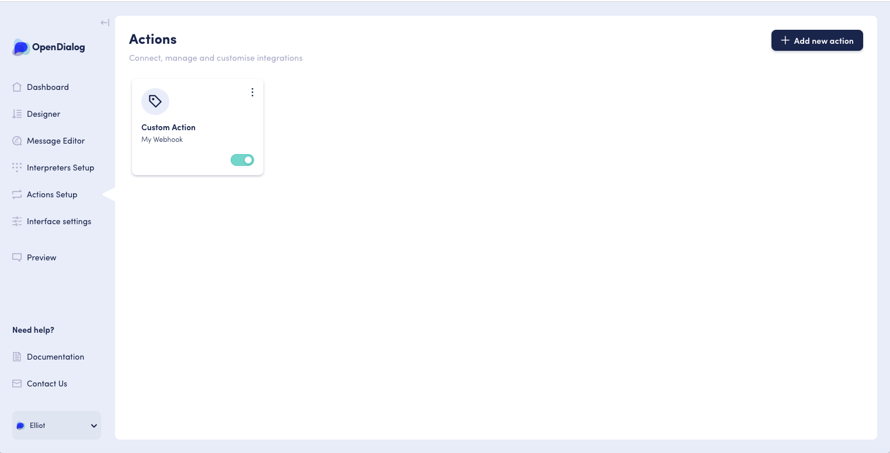
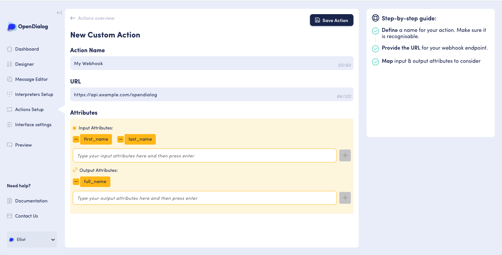
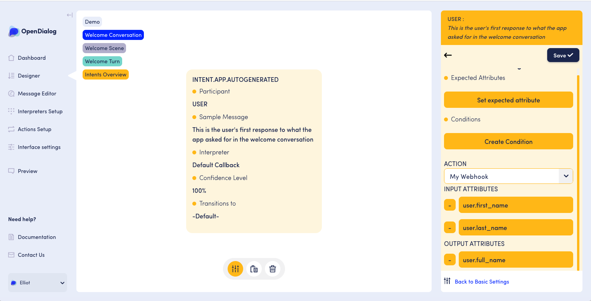

# Actions

## Introduction

Throughout the course of a conversation, we may want to communicate with systems outside of OpenDialog to send or receive data. This may be as simple as a "ping" to a URL representing a milestone in the user's journey, or an integration with an external data source which takes some input data from the conversation, and outputs some new data into the conversation. In short, actions are how we can run bespoke functionality in an OpenDialog application.

As mentioned, actions can take input and return output, both of which are modelled as [OpenDialog attributes](https://docs.opendialog.ai/developing-with-opendialog/attributes-and-contexts#what-are-attributes). An attribute is a single piece of data that has a name, type and value. For example, among the many default attributes, there is a string \(text\) attribute called `first_name` that stores the user's first name, and an integer \(number\) attribute called `seconds_since_last_seen` that stores the number of seconds since we last interacted with the user. Actions allow us to define input and output attributes as a way to pass data in and out of our applications.

Each intent in a conversation has the possibility of having an assigned action, which will be run after that intent is matched. For user intents, the action will be run directly after interpretation and matching of the user's utterance, which provides the possibility of using the [expected attributes](https://docs.opendialog.ai/introduction#expected-attributes) of the intent as inputs to the action. For application intents, the action will be run directly after intent conditions are evaluated, but before messages are selected and rendered, which provides the possibility of action outputs affecting which message is chosen and the attributes included within messages.

## Creating an action

New actions can be created in the "Actions Setup" section.

Each action will require a unique name, as well as the list of input and output attributes that you may want to be sent or received. Each action type may have additional fields that are unique to that action type, for example the webhook action will require a URL. Please see the relevant sub-section for further guidance on the specific action type you are using.

After you've saved your new action, make sure to activate it by sliding its toggle on the "Actions Setup" page.


In the future, OpenDialog will provide pre-built integrations with various common third party services.


## Adding an action to an intent

Now that the action is created, it needs to be added to an intent. After selecting the action, we will also need to provide [context mappings](https://docs.opendialog.ai/developing-with-opendialog/attributes-and-contexts#storing-and-retrieving-attributes) for each of the input and output attributes. These mappings will inform the action of where to find the input attributes and where to store the output attributes. If a mapping isn't provided for an output attribute, OpenDialog will default to storing it in the `user` context.

