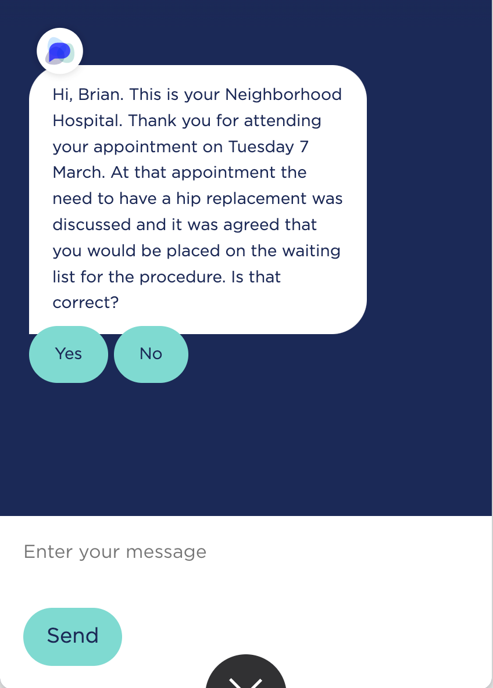

# Messages best practices

## Bite-size pieces are easier to read

A single turn may include several pieces of information. For instance, it may include a welcome, some instructions, and some facts such as appointment information to verify during the interaction.&#x20;

It helps legibility if the information is provided in multiple messages (all within the same app intent).&#x20;

Notice the difference between the following screens:&#x20;

<figure><figcaption>
All text in a single message
</figcaption></figure>

    .png>)

## Words per app turn

How much information can be conveyed in a single app turn? This depends to some extent on the nature of the assistant and the interaction. Some turns convey a lot of information, some can be quite concise. E.g. "Thank you. Anything else?"

A key practice is to make sure that the content of a single turn does not exceed the screen height. In other words, the user should not have to scroll to view all the information that is shared in a single turn. To force the user to do so requires effort from the user, they may hardly be aware that there is more information that scrolled up, and it breaks the easy reading experience.&#x20;

A rule of thumb in a typical OpenDialog assistant is to limit the text in a single turn (if the content consists entirely of text):

* 9 lines with buttons, ideally in 3 or 4 chunks
* Consider that on average, each line holds about 30 - 35 characters, or 5 to 6 words of average length (based on an average word length in English of 4.7 characters per word).

<figure><figcaption>
Example screen and content
</figcaption></figure>

Always test your assistant to make sure the content does not scroll up. Note that images or carousels take up a lot of vertical space, so be mindful of the amount of text you add before or after such an element in a single turn.&#x20;
