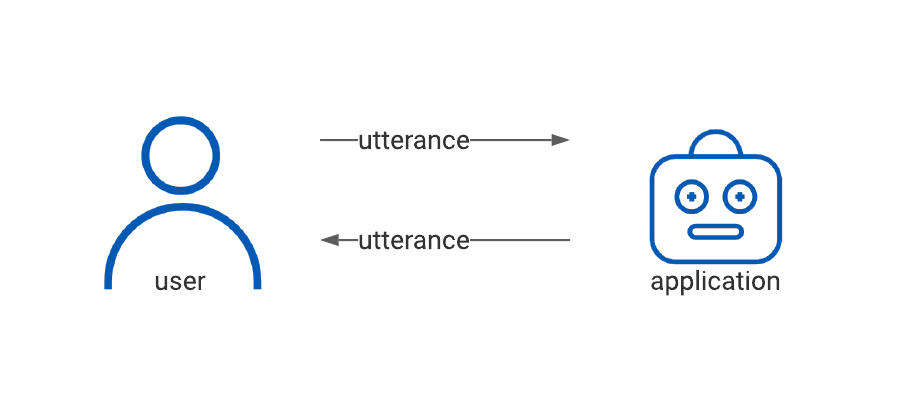
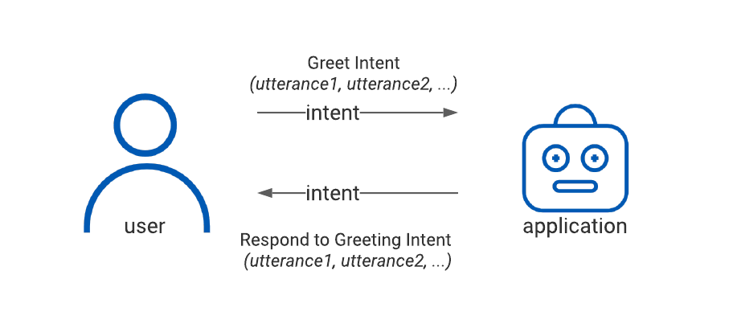
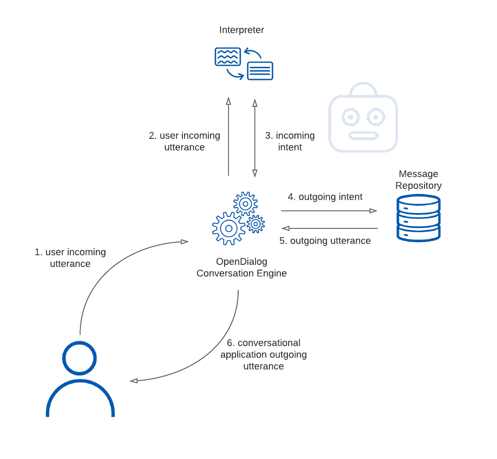
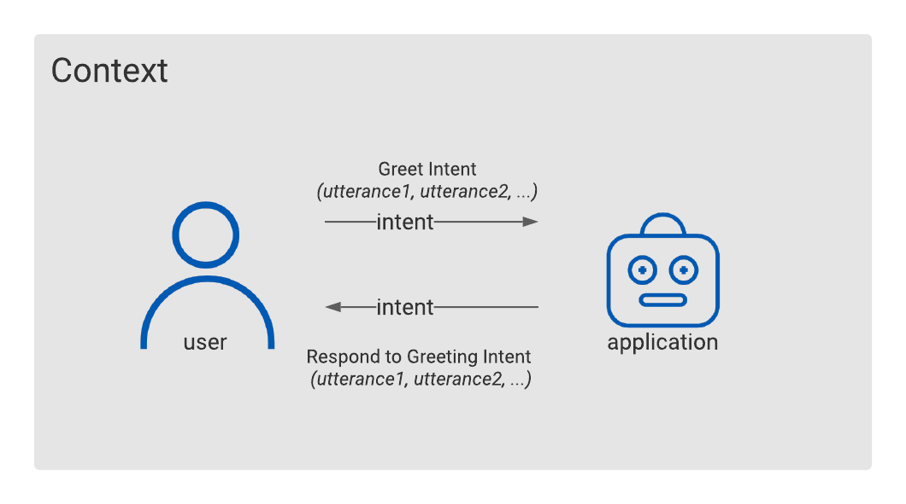

# 1. Start with a conversation model

Imagine being tasked to design a house but not having any specific reference about the components you can use to create an actual structure. You have a general understanding of buildings as enclosed spaces with walls that form different functional areas, but no specific concept or definition of  components type like bedrooms, offices, kitchens or bathrooms. No definition of even smaller blocks such as corridors, stairs, windows, doors or how they connect and relate to each other. You have to figure all of that from first principles. Quite a task! 

That is what trying to design a conversation without a strong and clear conversation model looks like. It forces us to start from first principles every time. It doesn't enable us to create reusable patterns and share best practices. It doesn't allow us to build relationships between different components of the conversation so that we can more efficiently design more complex conversation.  

That is why OpenDialog starts with a conversation model at its core. A conversation model, breaks down a conversation into its constituent parts and allows us to flexibly manipulate them, reason about them and define patterns about how to reuse them. Only then can we design effective conversations! 

## What is a conversation?

Consider what is a conversation \(or at least a simple exchange\) in the context of a conversational application. 

You have a user, uttering phrases \(referred to as utterances\), that will be received by some sort of interface \(text chat, voice, etc\) and will hit an application that needs to respond by uttering its own phrases.

If you were to draw a picture to illustrate it, it might look a bit like this.

> **In a conversation there are at least two participants**, and they interact with each other by exchanging utterances.

Now, each utterance carries what we call a specific intent. The intent the is the actual information that the user or the application needs to transmit across to the other side. 

For example, when I utter the words "Hello, nice to meet you!" my intent is to greet the other participant. When the counterparts says something like "Nice to meet you too!" their intent is to respond to my greeting. If I said something like "Hi, how is it going?" and the other side replied with "Hi, how are you doing?" we are still transmitting the same intents even if the utterances that we used changed.

To model this we could update the Basic Conversation figure to something as follows.

This gives us a somewhat more sophisticated understanding now. 

> In a conversation there are least two participants, and they interact with each other by exchanging intents. Each intent can be conveyed using a variety of utterances.

## The lifecycle of an exchange 

Digging a bit deeper into this we can start trying to solve the question of how do we know what intent the user is attempting to convey through an utterance and how \(as the application creators\) do we decide what utterance to use to convey the application's intents. 

To achieve this we need two things. First, in order to understand what the user is saying we need an _interpreter_. 

> An interpreter is a component that enables us to interpret an utterance and map it to an intent.

Secondly, in order to convey an application intent to the user we need a repository of messages that we can access that map intents to potential utterances \(in other words the opposite of the process we use for the user\). 

> A message repository maps an intent to a specific message that carries the appropriate utterance to the user.

Here is a high level view of the process in OpenDialog. 

* Step 1: The user utters a phrase - what we call the _incoming utterance._ 
* Step 2: The OpenDialog conversation engine passes that phrase to an appropriate interpreter \(or interpreters\) based on the instructions we've provided the engine. 
* Step 3: The interpreter will map that phrase to an intent \(the _incoming_ intent\). 
* Step 4: We will use that intent to identify a suitable _outgoing_ intent - i.e. the intent that the application wants to use to reply to the user. 
* Step 5: That outgoing intent will then be sent to a message repository where we will identify a suitable message to carry that intent \(through an utterance\) back to the user. 
* Step 6: The engine will format and package that message and send it back to the user. 

## High-level view of the OpenDialog Architecture

The process described above is only part of the story. Here we dive even deeper and look at how a request from the user and a response from the application flows through the entire OpenDialog architecture. 

The video below walks you through the request-response lifecycle in detail. 



## From a single exchange to multiple exchanges

All of this gives us a model and understanding of a single exchange. 

Conversations, however, consist of multiple exchanges. Furthermore, conversations do not happen in a void or for no reason \(mostly!\). Exchanges always take place within a specific context. Understanding what that context is is crucial in helping us to interpret user utterances and identify suitable application responses. This brings us to the next part of the OpenDialog Model. Context. 

OpenDialog is a context-first conversation model since every conversation takes place in a specific context and that context is crucial for understand the conversation. 

[Read on for our second principle - OpenDialog is a context-first conversation model. ](2.-design-using-a-context-first-approach.md)

