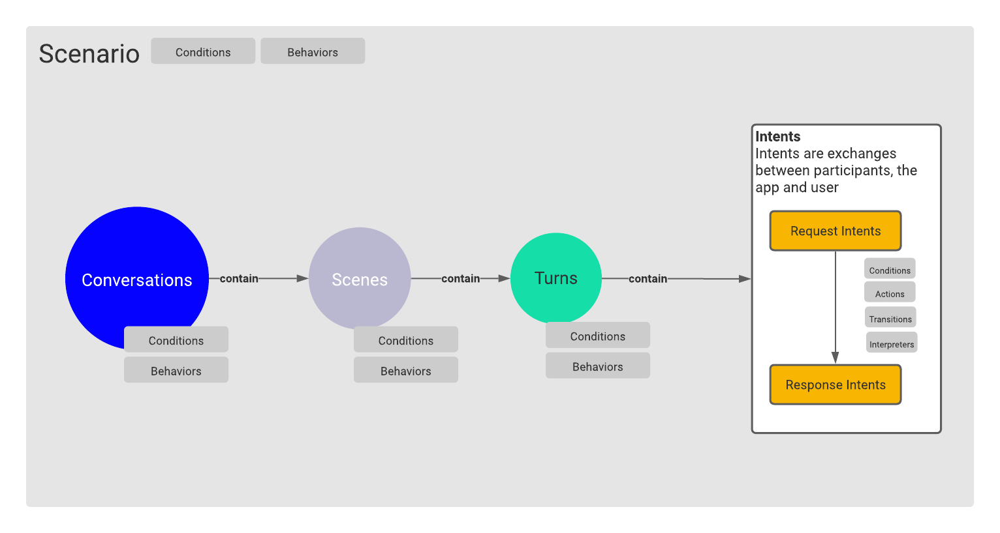
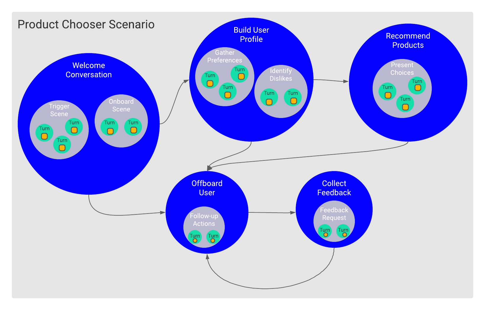
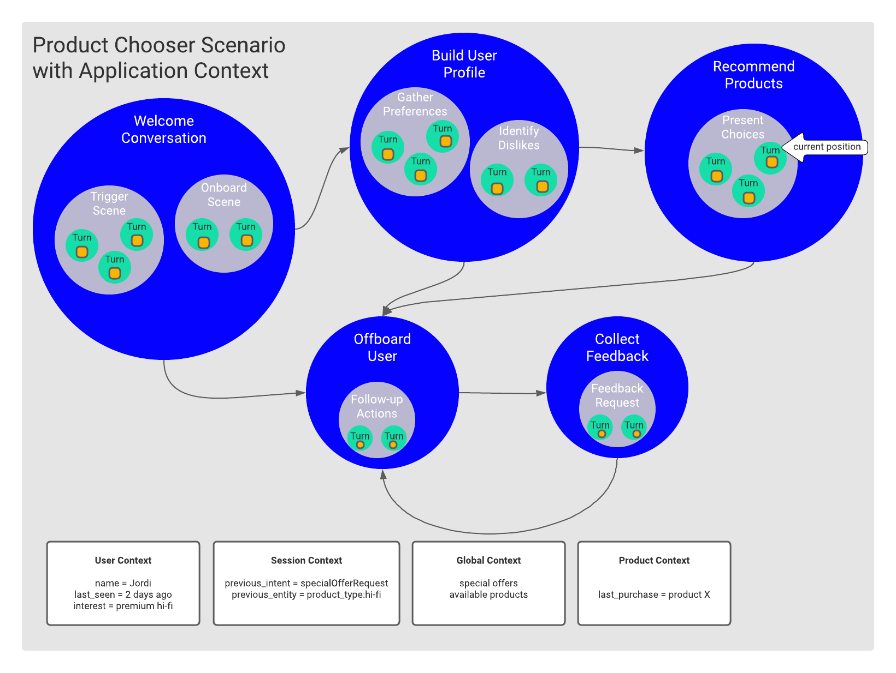

# 2. Design using a context-first approach

> Thinking in a context-first way is the single biggest step towards becoming a more effective OpenDialog conversation designer.

When thinking of how to design a conversational application we might be tempted to dive straight into the possible types of phrases that user might say \(the intents\). It has, unfortunately, become common to discuss conversational applications in terms of number of intents that they handle. We typically then jump straight into worrying about how to train a natural language understanding system to identify those intents. Figuring out how to stitch those intents into a broader conversation becomes almost an afterthought. 

Alternatively, we might dive into thinking about very specific flows for our use case,  our "happy paths" from start to finish. We design decision trees that attempt to capture every single step. When things fail we attempt to retrofit recovery strategies. The end result is a brittle and inflexible system that is hard to scale. 

OpenDialog takes a different approach to conversation design. 

**OpenDialog starts by encouraging the conversation designer to think about context first. Context is an essential component of the OpenDialog model.**

With context we describe both the purpose and setting within which an interaction may occur \(the conversational context\) and what information may be available \(the application context\). It is only with that understanding in place that we can then reason about what exchanges may be sensible, how they should be interpreted and what flows might be useful. 

### Conversational Context 

The conversational context can be thought of as a _map of the conversational space_. Just like a map it describes what places are there, what are their characteristics and the possible ways you could go from point A to point B. The different _places_ in a conversation are described in a hierarchical structure starting from the biggest \(a scenario\) to the smallest \(an intent\).  

When a user initiates a conversation with your application, the job of the OpenDialog conversation engine is to place the user on this map. The position on the map will help determine where the user might be able to go next. As with a geographical map we can describe our position in multiple levels. The Scenario would represent something such as the region we are in, a conversation represents the city, a scene the specific street and the turn represents the specific house on that street!

We call these different levels **Conversational Components.**

A **scenario** is meant to encapsulate a set of related conversations that are all focused on helping the user achieve a specific high-level goal. You can think of scenarios as stand-alone use cases or single bots. 

Scenarios contain within them **Conversations**. Conversations capture the exchanges for smaller specific goals on the way to the larger scenario goal. 

Conversations are then split into specific **Scenes**. Scenes focus on even smaller aspects of a conversation. They are different stages of a single conversation. 

Finally, **Turns** capture single exchanges. A conversational turn consists of the user and the application exchanging **Intents**. Note here, that we use intents to capture both potential user input and potential application output. A user utterance will need to be interpreted before it is matched to a specific intent while an application intent will have to be matched to a suitable outgoing message that will carry that intent to the user. 

Along the way, we can define _**conditions**_ and _**behaviors**_ and attach them to conversational components. 

A _**condition**_ allows us to query contextual information to ensure that the conversational component is relevant at a given phase of the conversation. For example, there is little reason to enter a _Checkout_ conversation if there are no items in our cart to checkout. So we can add a condition that ensures that the Checkout Scenario will only be considered if the cart has information within it. 

A _**behavior**_ is a directive that we give to the OpenDialog conversational engine about how to treat a specific Conversational Component. Currently, we support a small and simple set of behaviors \(although we have grand plans for this in the future!\). For example, you can assign a Scene the behavior of _starting_, this indicates to the Conversation Engine that that scene should be considered as an _entry_ scene for a conversation. A scene that does not have the starting behavior cannot be entered into unless the user is already in a conversation.  



#### OpenDialog Conversation Map

Here is an example of how the conversation context can be thought of as a map. The scenario below deals with product chooser application. The aim is to help the user select a product based on the user preferences and dislikes. There are five key conversations. 

* Welcome conversation: where we will be  triggering the conversational experience and onboarding the user
* Build user profile: where we will be asking the user questions in order to form a profile
* Recommend products: where we will be suggesting products based on the profile we built. 
* Offboard user: where we will be offboarding the user when they request to end the experience or the experience has reached a natural end
* Collect feedback: where we gather feedback on the conversation

The hierarchical encapsulation of concerns allows us to break the problem down into its individual parts and solve each aspect in isolation. The conversational context also helps us better deal with possible exchanges. For example a user asking for help within the Welcome conversation is an indication that they are curious about the overall experience, while a user asking for help within the Recommend Products conversation is probably more relevant to the product choices they've just seen. 

### Application Context 

Now, if the conversational context is the map of our conversational space, the application context provides a dynamic layer of live information on top of that map. The application context captures information such as what do we know about the user navigating our map \(are they a new or returning user, are they logged in, etc\), what was said previously \(where are they coming from on the map\) and application-specific information dependent on the domain \(the availability of items, the cost, etc\). All this information is described in what we call **attributes.**

**Attributes** are stored in application contexts and within OpenDialog we use different application context containers to capture related information. For example, the **user** context stores information about the user while the **global** context stores information that is relevant across multiple users. The **session** context stores information about the last exchange the user had with the app and so on. We will be delving more deeply into how you can take advantage of application contexts throughout the documentation. 

