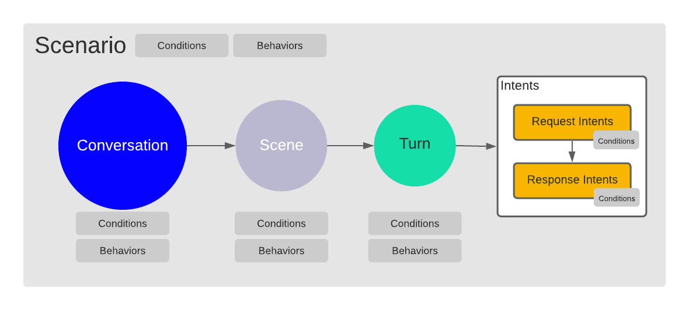
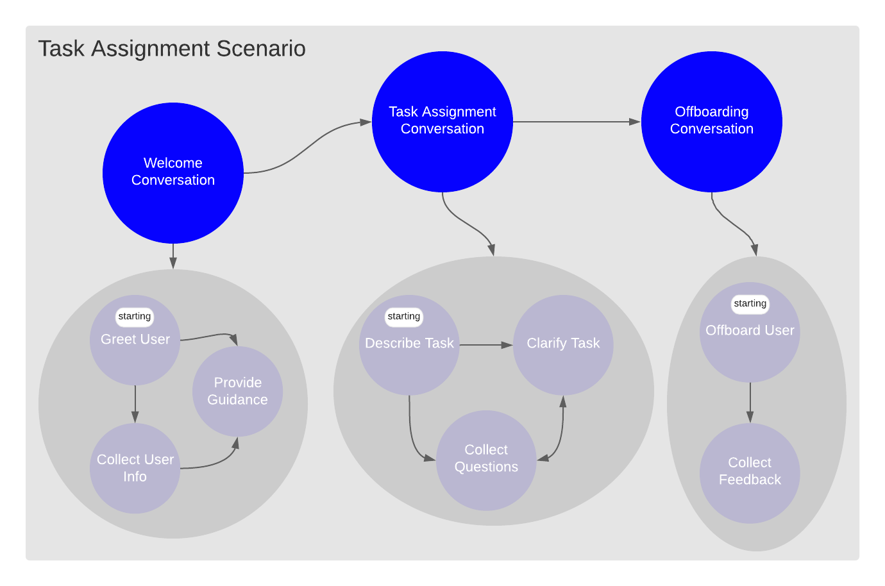

# The OpenDialog Way

## Introduction

The OpenDialog conversational model provides a series of concepts to allow us to deconstruct a conversation into its individual components and to be able to reason about different levels of the conversation in isolation. This provides a lot of flexibility to intervene at just the right level and also to break the problem down enough so that you are dealing with a series of smaller, solvable challenges rather than one big intractable conversation.

There are multiple ways to construct a specific conversation so it is useful to allow yourself to experiment with different approaches. The conversation builder supports this explorative approach so that it is a low-cost effort. 

## Model Overview

The OpenDialog model is a collection of **Conversational Components** that are related between them in a hierarchical way. 

We start with **Scenarios**. A scenario is meant to encapsulate a set of related conversations that are all focused on helping the user achieve a specific high-level goal. 

Scenarios contain within them **Conversations**. Conversations capture the exchanges for smaller specific goals on the way to the larger scenario goal. 

Conversations are then split into specific **Scenes**. Scenes focus on even smaller aspects of a conversation. They are different stages of a single conversation. 

Finally, **Turns** capture single exchanges. A conversational turn consists of the user and the application exchanging **Intents**. Note here, that we use intents to capture both potential user input and potential application output. A user utterance will need to be interpreted before it is matched to a specific intent while an application intent will have to be matched to a suitable outgoing message that will carry that intent to the user. 

Along the way, we can define _**conditions**_ and _**behaviors**_ and attach them to conversational components. 

A _condition_ allows us to query contextual information to ensure that the conversational component is relevant at a given phase of the conversation. For example, there is little reason to enter a _Checkout_ scenario if there are items in our cart to checkout. So we can add a condition that ensures that the Checkout Scenario will only be considered if the cart has information within it. 

A _behavior_ is a directive that we give to the OpenDialog conversational engine about how to treat a specific Conversational Component. Currently, we support a small and simple set of behaviors \(although we have grand plans for this in the future!\). For example, you can assign a Scene the behavior of _starting_, this indicates to the Conversation Engine that that scene should be considered as an _entry_ scene for a conversation. A scene that does not have the starting behavior cannot be entered into unless the user is already in a conversation.  

## An Example OpenDialog Scenario

### Capturing the high-level flow

In the figure above we show an example of what an OpenDialog Scenario might look like. In this case the problem we are working towards solving is letting the user know about a task that they have been assigned. 

The conversation may start in a conversational interface such as Slack or by notifying the user through an audio device. 

It begins with a greeting to the user that is handled through the Welcome Conversation. Following the greeting, there are a couple of things that may happen that the welcome conversation caters for. Once we greet the user we may need some additional information, which we would be handling in the "Collect User Info" scene. At the same time, the user might require some guidance or have some questions about what is the purpose of this conversation, which we handle in the "Provide Guidance" scene.

With the preliminaries out of the way we move to the main "Task Assignment Conversation", where the user has the task detailed to them in "Describe Task", we handle and clarification questions in "Clarify Task", and collect questions that should be sent back to the task management system in "Collect Questions". Finally, the user is offboarded, and if appropriate feedback is collected on the interaction. 

As you can see we walked through the different stages of the conversation just at the scene level. We didn't concern ourselves just yet with lower-level intent exchange through turns. This comes next.

### Handling exchanges in turns

The image above shows a possible Turn. It has a _starting_ behavior which means it can be considered as a way to start a conversation. In this case, the conversation starts with the App notifying the User that they have a new task assigned. 

As a result, the user could do a number of different things. They could ask for a summary to be provided of the task or they might be wondering exactly with what they are interacting. We capture these broad possibilities as two possible response intents within this turn. Please note that while we are using example phrases what is far more significant is the intent that we are considering. Also, it is entirely possible that the user has a completely different intent in mind or says something that we cannot interpret at all - we will discuss those possibilities and how they can be handled in other sections. 

Focusing, for the time being, on the most likely intents we can expect that the **Further Info Intent** would cause a transition to the Task Assignment conversation \(where we would be looking for possible starting scenes with starting turns\), while the **Clarification** **Intent** causes a transition to the Clarification scene within the same conversation \(where we would be looking for starting turns within just that scene\). This illustrates how we can keep track of conversational context through the conversational structure. If we are still clarifying what is going on we are still in the Welcome Conversation, while if we are on to talk about the details of the task we have moved on to the Task Assignment conversation. 

