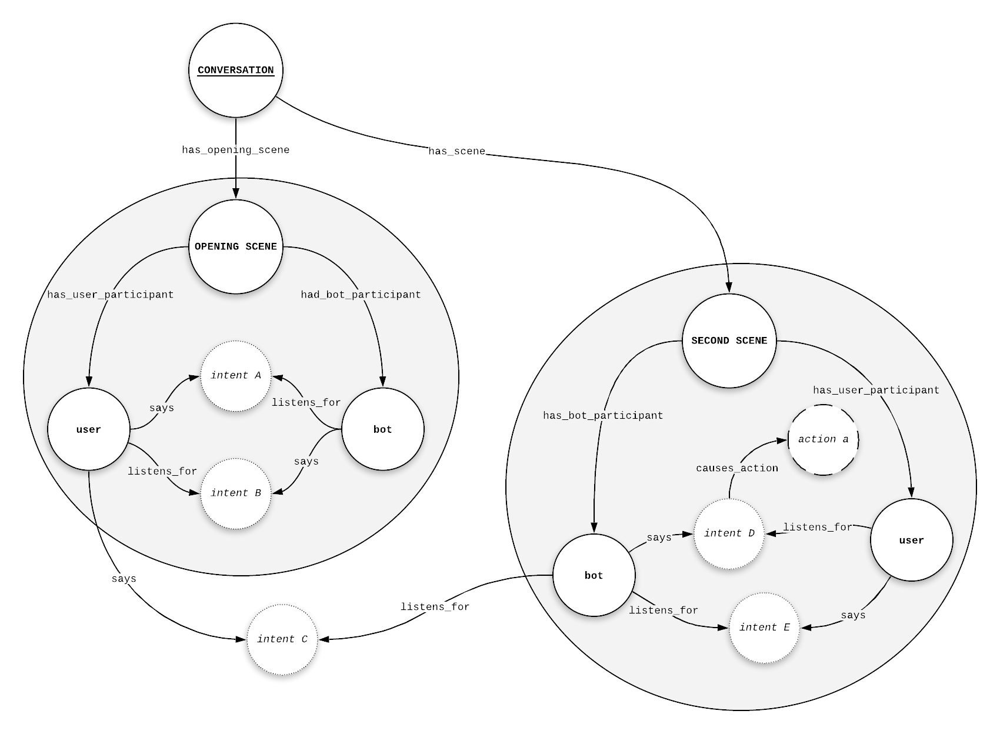

# Enchanced Dooley Graphs


Warning - you are browsing the documentation for an older version of OpenDialog. Please check out the latest version. 


### Representing conversations

An EI is made up by the sum of possible conversations that participants in the EI can have. A conversation captures some higher order goal.

Conversations have a specific structure that we can reason about within OpenDialog. Below is simple conversation with just two scenes and a connection between the scenes.

There are a few things going on so let's break it down.

#### A conversation is represented as a graph.

The graph allows us to capture the different scenes, the participants in each scene and the exchanges between participants as well as any other information such as actions. The graph structure within a graph database enables us to explore the conversational space flexibly and efficiently.

#### A conversation is divided in scenes with participants exchanging intents

Participants in scenes intent to _say_ intents and _listen_ to intents.

A conversation can develop within a single scene or it can branch out to different scenes. Scenes are connected through intents that one participant in one scene says and a participant in an other scene listens for.

Each scene has a specific sub-goal, the sum of goals giving us the overall objective.

#### Intents can cause actions

When OpenDialog has determined that a participant said a specific intent and that intent is associated with an action that action is performed.

### Reasoning about conversations

The task of OpenDialog is to facilitate the definition of conversation, starting from the core concepts defined here, and manage the processes of _running_ these conversations through a conversational interface.

As you dive into other aspects of the document you will see how these basic concepts find practical implementation and are able to support a variety of different conversational patterns - from very simple ones to increasingly more sophisticated ones.

