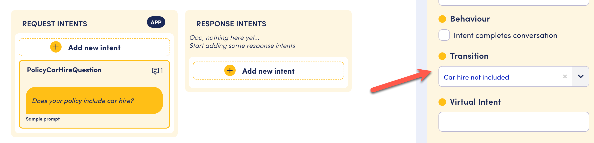
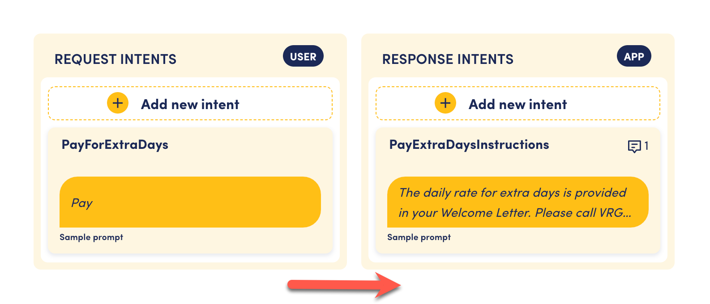
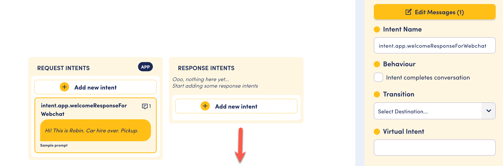
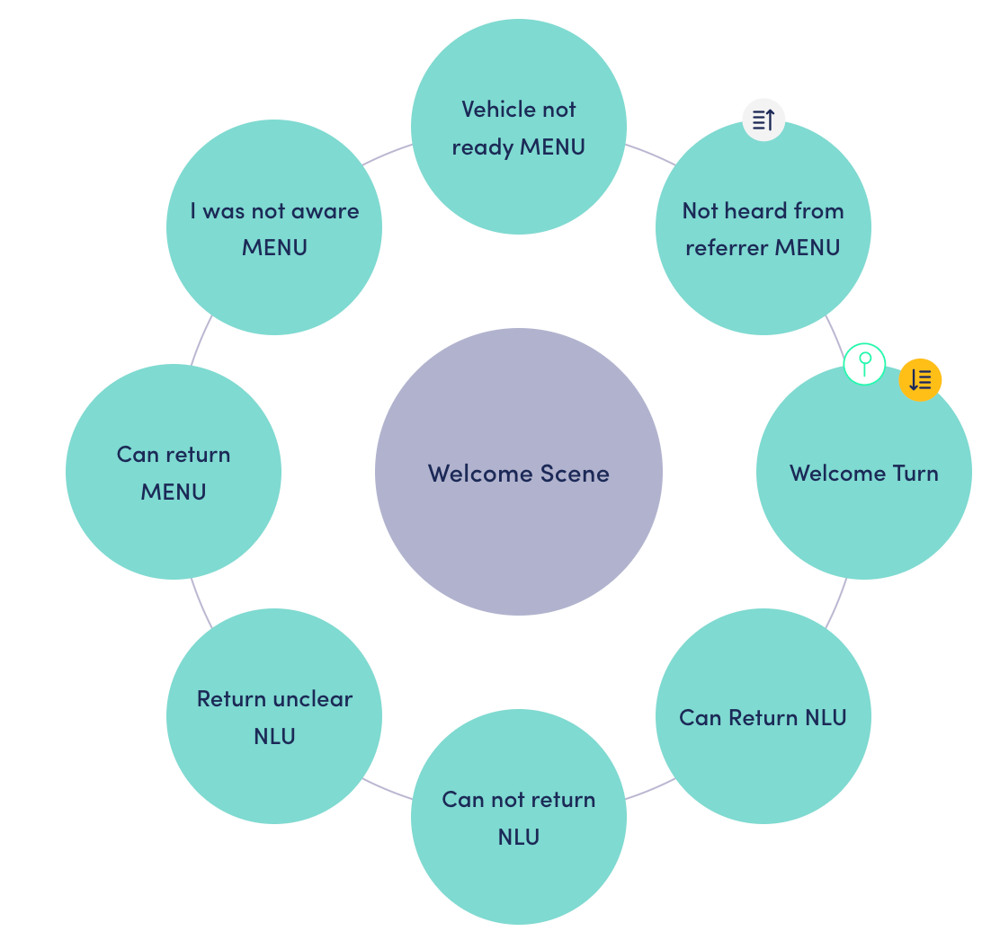

# How the conversation engine thinks

Creating an architecture for your assistant is flexible in the OpenDialog platform.&#x20;

In order to build robust applications, and to be able to troubleshoot your design, it is critical to understand how the conversation engine decides where to look for a next action.&#x20;

## Starting and open behavior

Starting components, for instance a turn that is a starting turn, are only considered when you join a level for the first time. After the first interaction, they are no longer considered.&#x20;

Open turns are considered only after the starting turn is over. They are always considered from that time on.&#x20;

Components can be both open and starting. &#x20;

Because of these rules, it is very important for a designer to consider the behavior for any component.

&#x20;

## Conversation engine at the start of an interaction

At the start of an interaction, the conversation engine&#x20;

* Explores all starting conversations, all the starting scenes within these conversations, all the starting turns within those scenes and any request intents associated with those starting turns will be considered as possible starting intents
* Considers the incoming utterance and attempts to match it to one of the possible starting intents
* If the match is successful the conversation state is updated to that intent and we are now in a fully defined conversation state down to the level of an intent.

## During an interaction, these prioritization rules apply

1. If the matching user intent defines a transition, the engine will follow that transition.&#x20;

<figure><figcaption></figcaption></figure>

2. If there is no transition, look for a matching app response intent within the turn.&#x20;

<figure><figcaption></figcaption></figure>

3. If there is no transition and no response intent is present in the turn, the engine will look for a next intent in another turn within the same scene.

<figure><figcaption></figcaption></figure>

<figure><figcaption></figcaption></figure>

4. If an intent has ending behavior: after this intent is executed we go back up to the scenario level.&#x20;
5. If none of the rules in this section apply, then a no match is triggered, either local or global (scenario level).

