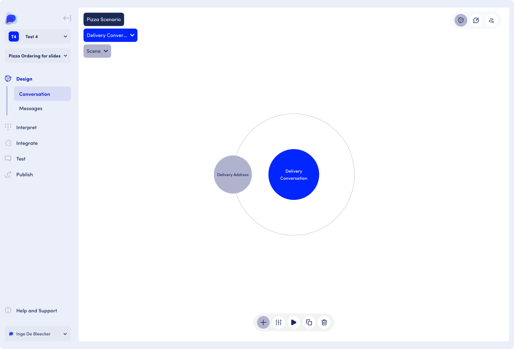
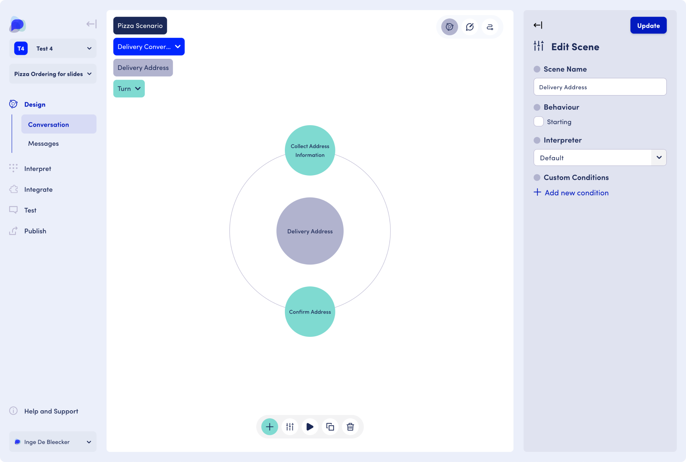
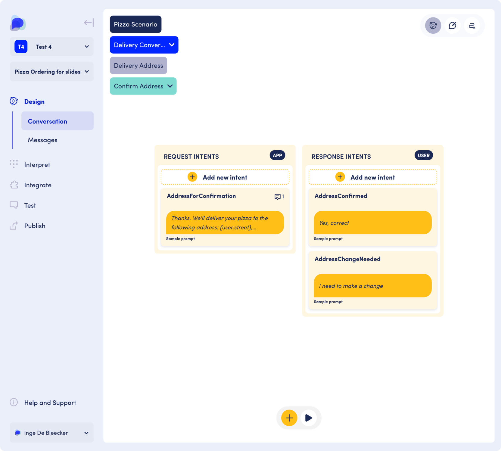

# Designing Conversational AI Agents

The title is not the whole truth. &#x20;

We are sorry about that, but we had to give this page a title that people will recognise.&#x20;

When you are designing a solution, however, you are not _just_ designing a Conversational AI Agent. You are doing much more than that.-The OpenDialog approach acknowledges it and supports you in doing it.&#x20;

When you are designing a solution you are actually designing a (software) space within which an AI-powered agent **and** a user will _enter_ to interact by exchanging messages, trying to co-operate and co-ordinate to solve a problem or enjoy a chat. &#x20;

This distinction may sound philosophical but it is crucial. You cannot design for something if you don't have access to all the elements that make up that design.&#x20;

Let's see what this means in practice.&#x20;

## The OpenDialog Conversation Framework

The OpenDialog conversation framework enables much of the flexibility that the platform provides. It consists of levels and components that help you define this space within which your agent and the user communicate. It allows you to **take a design-system approach to conversation design**, going from high-level descriptions to individual turns within a conversation.

The different levels of the framework are:&#x20;

<figure><figcaption>
Levels of the OpenDialog framework
</figcaption></figure>

## Scenario

When we start an OpenDialog application we start with a **Scenario.** This holds the highest-level description of the _space_ we are designing.&#x20;

A scenario is the highest level in the OpenDialog framework. It encompasses the set of functionalities that make up all the conversational application. For example your scenario might be a Pizza Order activity, an Insurance Claim activity or a Customer Support activity.&#x20;

<figure><figcaption>
Creating a Scenario in OpenDialog
</figcaption></figure>

## Conversations

Within a Scenario your AI agent and the user will have conversations. A conversation refers to communication for specific goals. Conversations can be viewed as steps in the customer journey, or conversations to be had. Examples: a welcome conversation, a payment and delivery conversation.&#x20;

<figure><figcaption>
Conversations within an OpenDialog scenario.
</figcaption></figure>

## Scenes

Conversations then are further split into scenes. A scene deals with a specific stage, aspect or subgoal of a conversation. It is a middle layer in the model that allows for much flexibility in building out conversations. Example: a payment conversation can include a scene to enter payment data, a scene to confirm paument and a scene to finalize payment. A delivery conversation can include a scene to collect delivery details such as the address.

<figure><figcaption>
Scenes in OpenDialog conversations
</figcaption></figure>

## Turns

In a turn the user and application exchange specific information or intents. Example: the scene to collect a delivery address can have two turns: a turn to collect the address details and a turn to confirm the address details that were collected.

<figure><figcaption></figcaption></figure>

## Intents

A turn consists of intents. An intent holds the message and its meaning. An intent can come from the app or the user. For example the application may request an address and the user may provide it or the application may display an address for confirmation and the user can confirm it.&#x20;

This is where you can connect what we said at the start about desiging a space where the agent _and_ the user are represented. We have intents _both_ for the app (our AI agent) and the user.

<figure><figcaption></figcaption></figure>

## To summarize

<figure><figcaption>
Overview of the components in the OpenDialog model
</figcaption></figure>

As you start designing in OpenDialog you will see that we provide multiple ways for you to explore this space and get familiar with the concepts, which, in turn, will equip you with tool to create really flexible Gen-AI powered conversational applications.&#x20;

