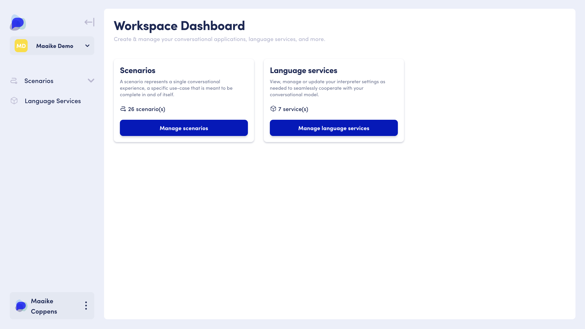
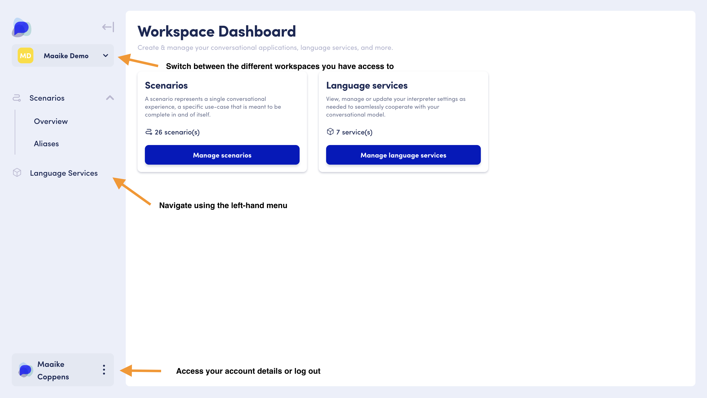
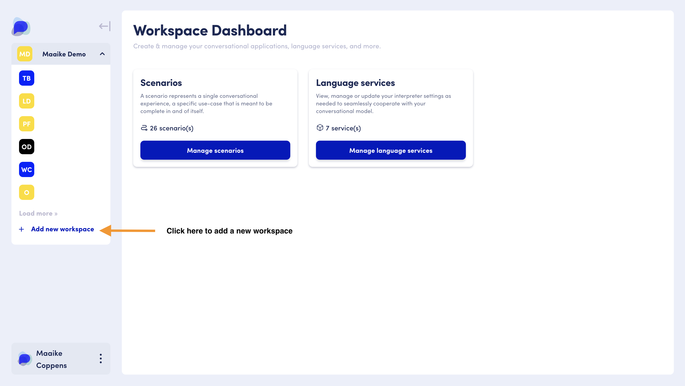

# OpenDialog Platform

## Welcome to the OpenDialog Workspace !

When you engage with OpenDialog, a workspace gets set up for you. You will be provided with an appropriate URL : _\<company\_name>.opendialog.ai._&#x20;

The workspace is the starting point for accessing the main OpenDialog functionalities:  [scenarios](../the-opendialog-model/scenarios.md) for setting up your Conversational AI application ,  [language services](language-services.md) to configure language capabilities available to use in your different scenarios, and your  [account management](opendialog-account-management/). &#x20;

<figure><figcaption>
The Workspace Dashboard is your go-to starting point to create &#x26; manage your applications.
</figcaption></figure>

## Navigating the OpenDialog Workspace

Most OpenDialog features are presented in two to three sections : the main menu (on the left-hand side of the screen ) for navigating its different features, a central panel exposing a feature's main functionality, and sometimes a third-panel on the right-hand side for additional functionality or guidance within a feature.

When logging into your OpenDialog workspace, you are presented with the Workspace Dashboard.  From here you can use the main menu to navigate to the different areas of the product, or switch to a different workspace you have access to. &#x20;

<figure><figcaption>
Switching to another workspace or adding a new workspace
</figcaption></figure>


At any point in the OpenDialog product, you can go back to your Workspace Dashboard by clicking on the OpenDialog logo in the upper left corner of your screen, in the main menu.


## Creating an additional workspace

If you wish to create a new workspace, you can do so directly from the workspace dashboard. &#x20;


* Go to the main menu on the left-hand side of the screen
* Click on the down arrow next to your workspace's name
* Go to the bottom of the list that appears and click on <mark style="color:blue;">**Create New +**</mark>
* Give your new workspace a name and click on <mark style="color:blue;">**Create**</mark>
* The central panel shows a loading animation during the workspace creation
* Congratulations 🙌🏻 , you now have an additional workspace!


<figure><figcaption>
Use the workspace dropdown to create a new workspace
</figcaption></figure>

