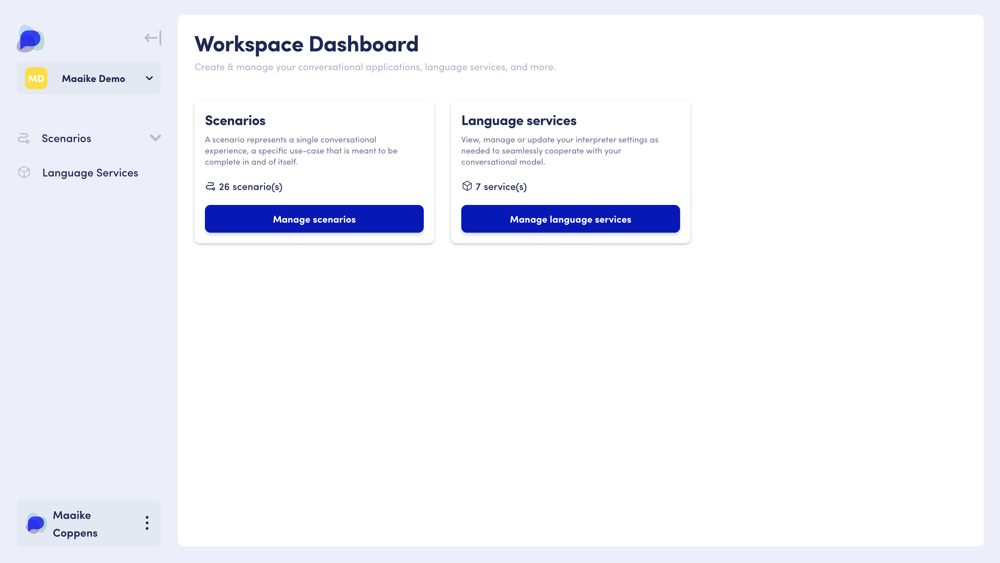

# Language Services

## What is a Language Service?

To interpret an end user's input, your conversational application needs to be equipped with Natural Language Processing (NLP) capabilities. OpenDialog's language services allow you to set up this capability directly in the OpenDialog interface.

## When to use a language service

By creating a Language Service in OpenDialog, you gain the convenience of managing your language model within a single interface. This model can then be used across various scenarios in OpenDialog, making your development process more efficient.

## Types of language services

OpenDialog is tailored to three types of Language Services: Semantic Intent Classifier, RAG Service (for retrieval augmented generation), and Intent Classification, all of which are powered by an LLM (Large Language Model).&#x20;

### Semantic Intent Classifier&#x20;

A Semantic Intent Classifier allows you to create intents and sub-intents with instructions that optimise how an LLM is prompted. This will allow the application to make more informed choices when selecting intents within a conversation, and provide more accurate responses to customers.&#x20;

A Semantic Intent Classifier also allows you to define additional prompt information[ that specifies how the LLM s](#user-content-fn-1)[^1]hould act and behave in response to user queries. You can use the prompt to provide the LLM with background information such as the role it needs to play, essential business information that could be key to answering a query, or specific criteria that must be met within an Intent/sub intent to ensure the handoff to another conversation meets the requirements of a customers query.&#x20;

### RAG Service

You can also add a knowledge service to your OpenDialog scenarios. This feature enables you to define topics you want to make available for your users to converse with and add related text sources to each topic.  This type of knowledge service (underpinned by an LLM) will allow your application to generate relevant responses to your users based on the provided text sources.

### Intent classification

Using our intent classification service, you will define intents and entities to then utilize them in your scenarios through an Interpreter. This will allow your application to categorize incoming user input into separate intents and extract any mentioned entities.  &#x20;

_For example : "When are you open until", "When do you close" = OpeningHoursIntent_

## Where to find

You can access the language services section of the platform directly from the [Workspace Dashboard](./).

<figure><figcaption>
Access the language services section from the Workspace Dashboard
</figcaption></figure>


* Log into your OpenDialog account
* You will access your workspace and immediately see the workspace dashboard
* From there, click on \`Create/Manage language services' in the central panel to access the language services section of the platform
* You can also access Language Services from the main menu on the left when you are viewing your workspace dashboard
* &#x20;You are now in the Language Services section of OpenDialog 🙌


## How to use

Read more about our different language services and how to use them:&#x20;

<table data-card-size="large" data-view="cards" data-full-width="false"><thead><tr><th></th><th></th><th></th><th data-hidden data-card-cover data-type="files"></th><th data-hidden data-card-target data-type="content-ref"></th></tr></thead><tbody><tr><td><a href="../../opendialog-platform/interpreters-and-natural-language-understanding/"><strong>Leveraging Generative AI</strong></a></td><td>Learn how to use OpenDialog's language services to create custom ready-to-use language capabilities</td><td></td><td><a href="../../.gitbook/assets/engineer-maintenancing-ai-systems-2023-11-27-05-12-07-utc.jpg">engineer-maintenancing-ai-systems-2023-11-27-05-12-07-utc.jpg</a></td><td><a href="../../opendialog-platform/interpreters-and-natural-language-understanding/">interpreters-and-natural-language-understanding</a></td></tr><tr><td><a href="../../opendialog-platform/interpreters-and-natural-language-understanding/interpreters/using-a-language-service-interpreter.md"><strong>Using language services</strong></a></td><td>Add a language service to your scenario to interpret what end-users input into your conversational application.</td><td></td><td><a href="../../.gitbook/assets/usinglanguageservice.png">usinglanguageservice.png</a></td><td></td></tr></tbody></table>

[^1]: 
