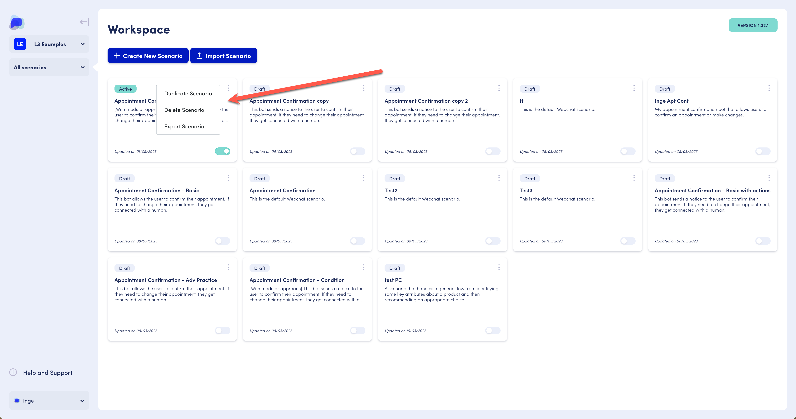

# Scenarios

## What is a scenario?

A scenario in OpenDialog encompasses the set of functionalities that make up your AI  application.&#x20;

## Accessing the scenario overview

Each workspace holds one or more scenarios. You can access the Scenario overview through the left-hand panel menu, by selecting 'Scenarios' and then 'Overview'.&#x20;

You can also do so by accessing the Scenario overview through the dedicated button 'Manage scenarios'.

<figure><figcaption>
Access the scenario overview through the left-hand menu or via the Manage Scenarios button.
</figcaption></figure>


**Note**: If your workspace has no scenarios yet, the Workspace Dashboard will indicate 0 scenarios, and the button will say 'Create scenario.'  Clicking the 'Create scenario' button will allow you to create your first scenario. More on [creating new scenarios](scenarios.md#creating-a-new-scenario) below.


## Creating a new scenario

Create a new scenario using the main area's 'Create Scenario' button.

<figure><figcaption>
Create a new scenario via the 'Create new scenario'  button or import an existing scenario via a .json file
</figcaption></figure>

Scenarios are by default, created in draft mode. To use in a live environment, set the scenario to active by toggling the switch in the bottom right corner of the scenario tile (example shown in top left corner of scenario list), and [publish](../../opendialog-platform/launching-your-application.md) it.&#x20;

## Duplicating, deleting and exporting a scenario

Click the vertical dots icon in the top right corner of a scenario tile to access the duplicate, delete and export functionality.&#x20;

When duplicating a scenario the duplicated scenario will be added to the workspace as the last one in the list. You may have to refresh your browser for it to display.&#x20;

When you export a scenario, an email is sent to your registered email address in OpenDialog. The scenario is contained in an attached .json file, which can then be imported into another workspace.&#x20;

Duplicating and exporting may take a few minutes; you will be emailed when the resulting file is ready.&#x20;

<figure><figcaption>
Example of Scenario functionality
</figcaption></figure>

## Importing a scenario

To import a scenario, you will need access to a .json file that you will upload during import. For example, you may have received a .json file as an export from another workspace or as an email attachment.&#x20;

<figure><figcaption>
Import scenario option at the top of the main Scenario Overview area.
</figcaption></figure>

Use the Import Scenario button at the top of the main area and provide the .json file. Note that there is a 10 Mb file size limit on scenario .json files.&#x20;

## How to design your scenario

<table data-card-size="large" data-view="cards" data-full-width="false"><thead><tr><th></th><th></th><th></th><th data-hidden data-card-target data-type="content-ref"></th><th data-hidden data-card-cover data-type="files"></th></tr></thead><tbody><tr><td><a href="../../the-opendialog-model/"><strong>The OpenDialog model</strong></a></td><td>Take a deepdive into the underpinning model for OpenDialog applications.</td><td></td><td><a href="../../the-opendialog-model/">the-opendialog-model</a></td><td><a href="../../.gitbook/assets/OD-basicmodel.png">OD-basicmodel.png</a></td></tr><tr><td><a href="../../conversation-designer/"><strong>Designing your application</strong></a></td><td>Create a new scenario from a template or from scratch using OpenDialog's model and best practices.</td><td></td><td><a href="../../conversation-designer/">conversation-designer</a></td><td><a href="../../.gitbook/assets/applicationdesign.png">applicationdesign.png</a></td></tr></tbody></table>
