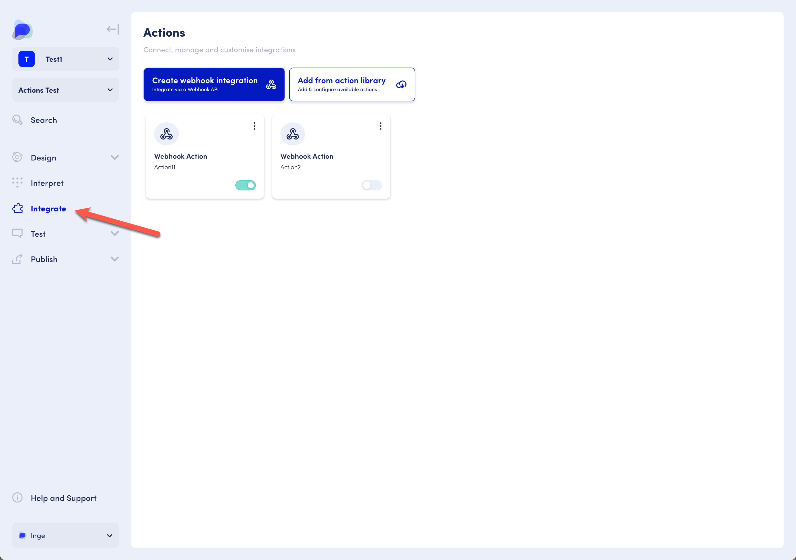
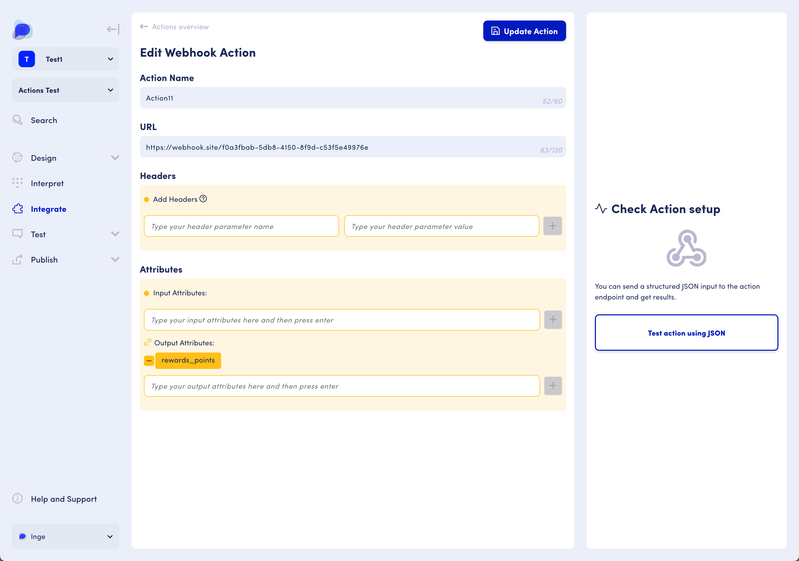
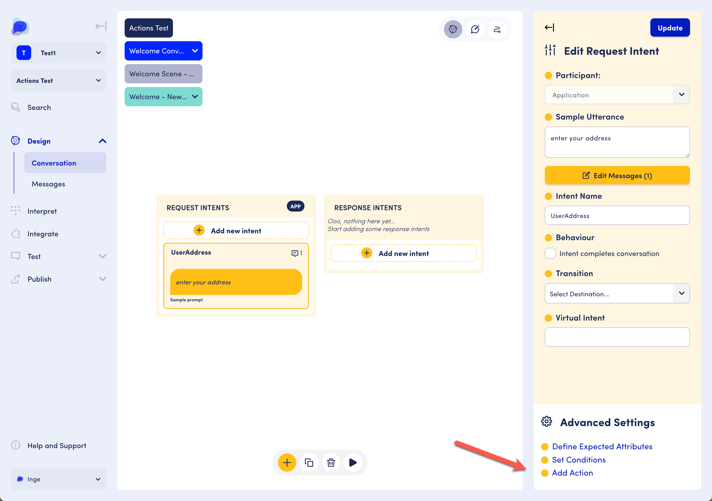
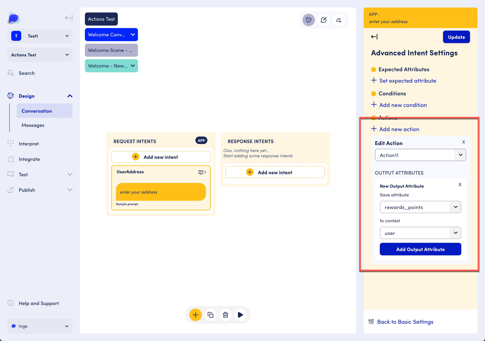

# Integrating with 3rd parties

## Introduction

Throughout the course of a conversation, we may want to communicate with systems outside of OpenDialog to send or receive data. This may be as simple as a "ping" to a URL representing a milestone in the user's journey, or an integration with an external data source which takes some input data from the conversation, and outputs some new data into the conversation.&#x20;

Actions can take input and return output. In Opendialog, both input and output are stored as values for attributes. An attribute is a single piece of data that has a name, type and value. For example, the attribute `first_name` is a string (text) that stores the user's first name. The attribute `seconds_since_last_seen` is an integer (number) and stores the number of seconds since the assistant last interacted with the user. Actions allow us to define input and output attributes as a way to pass data in and out of our applications.

Each intent in a conversation has the possibility of having an assigned action, which will be run after that intent is matched. For user intents, the action will be run directly after interpretation and matching of the user's utterance, which provides the possibility of using the expected attributes of the intent as inputs to the action. For application intents, the action will be run directly after intent conditions are evaluated, but before messages are selected and rendered, which provides the possibility of action outputs affecting which message is chosen and the attributes included within messages.

## Creating an action

Actions are listed and can be added in the Integrate menu.&#x20;

<figure><figcaption></figcaption></figure>

Each action requires a unique name, and attributes. The number of attributes can vary, and it is not mandatory to have both input and output attributes. Input attributes are sent from OpenDialog to the external data source. Output attributes are sent from the external data source to OpenDialog.&#x20;

Each action type may have additional fields that are unique to that action type. For example, the webhook action requires a URL. Please see the relevant sub-section for further guidance on the specific action type you are using.&#x20;

<figure><figcaption>
Edit or create action page
</figcaption></figure>

After you've saved your new action, make sure to activate it by sliding its toggle on the "Integrate" page.

## Adding an action to an intent

Once an action is created and activated, it can be added to an intent. To add an action or check any actions that have already been added, click "Add Action" in the Advanced Settings in the Component Setup pane.

<figure><figcaption>
Add Action in the Advanced Settings
</figcaption></figure>

To add an action, select an action from the dropdown list and save attributes to a context. Mapping the input and output attributes informs the action of where to find the input attributes and where to store the output attributes. If a mapping isn't provided for an output attribute, OpenDialog will by default store it in the `user` context.

<figure><figcaption>
Adding an action to an intent
</figcaption></figure>

## Start creating actions


[webhook-action.md](webhook-action.md)



[actions-from-library](actions-from-library/)



[conversation-hand-off](../../opendialog-platform/actions/conversation-hand-off/)



[llm-actions](../../opendialog-platform/interpreters-and-natural-language-understanding/llm-actions/)

