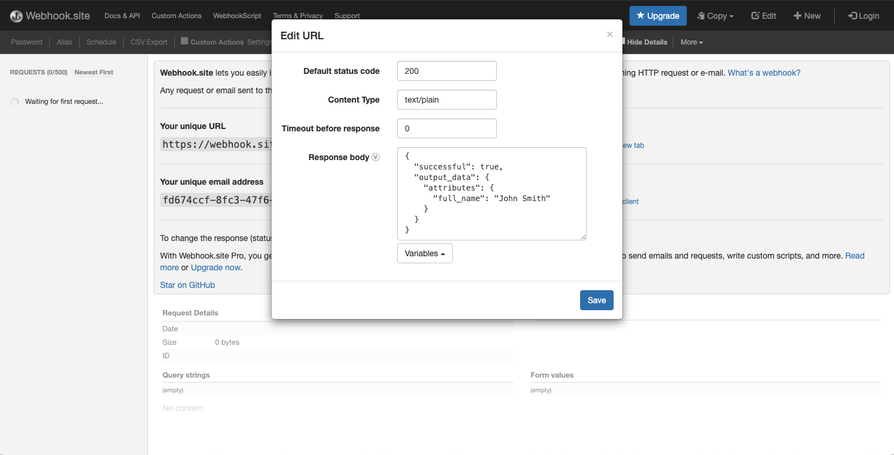
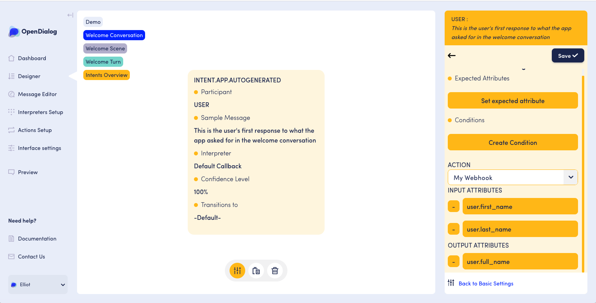
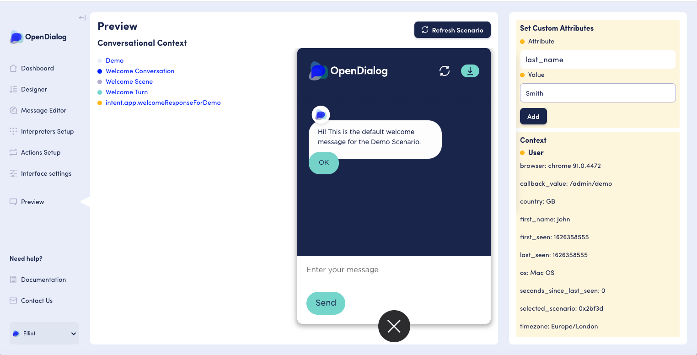
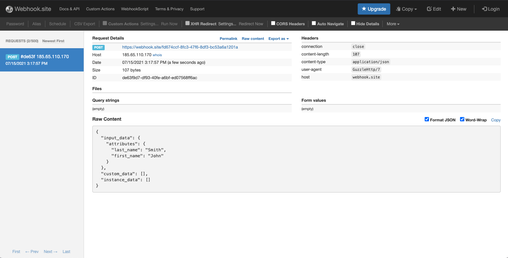

# Webhook actions

The webhook action allows you to send and receive data from an external service via a HTTP POST request to a provided webhook URL. For information on building such a service, please see the [Integrating with OpenDialog](../../developping-with-opendialog/introduction.md) section.&#x20;

Once you have a service that provides the desired functionality, you'll want to create a new webhook by following the action creation steps and set the action's URL to be the URL of your service.

.png>)

### Headers

You can add headers in the action configuration page that will be send along with the HTTP POST request.&#x20;

This could be used to send authorization tokens and other custom headers as required by the webhook.

### Mocking a webhook

If you would like to test OpenDialog's webhook action functionality ahead of developing a webhook, you can generate a mocked webhook using a service such as [webhook.site](https://webhook.site). This will provide you with a webhook URL, the ability to see the inputs sent by OpenDialog, and the ability to set a static response to be returned to OpenDialog. This can be useful to understand how the input and output attributes of an action will fit in with your conversation flows.

The following steps presume that you've created a mocked webhook on webhook.site, and that you are working with the default conversations provided when you create a new scenario, if this is not the case some steps may vary.&#x20;

This example mocks a webhook action that takes input of a first & last name, and outputs a concatenated full name.

First we'll need to visit [webhook.site](https://webhook.site) to create a new webhook for our action. We'll then need to set the static response by using the "Edit" option, and adding some JSON to the "Response body" field. The example below mocks a successful action that returns a `full_name` attribute, you can find [other examples](https://docs.opendialog.ai/developing-with-opendialog/actions/webhook-action#examples) in the developer documentation.

Once this is saved, you'll want to copy the webhook's URL (from the "Your unique URL" field) and set it as the URL for your webhook action in OpenDialog. You'll also want to specify any input and output attributes. For this example we'd have `first_name` & `last_name` as input attributes, and `full_name` as an output attribute.&#x20;

.png>)

After creating the action, you need to make it active like this:

.png>)

We then need to add it to the desired intent, along with desired context mappings for the input and output attributes. In this example we've added the action to the response intent of the "Welcome Turn". Our example uses the following context mappings:

After your intent is saved, make sure that your scenario is activated. You can now visit the "Preview" page and try out your mocked webhook action. As we set two input attributes, we'll want to add mock values for them before OpenDialog performs the action.&#x20;

We can set attributes to the user context directly by using the "Set Custom Attributes" panel in the top right; in a real OpenDialog application perhaps these attributes would be collected from user input. In this example we'll want to set the `first_name` as 'John' and `last_name` as 'Smith'.

Once you have set these mock values, we need to match the intent that the action was added to. In this example we can do that by clicking the "OK" button on the first message from the application. When the next response is returned, you should notice that the user context attributes under "Context - User" will now contain `action_status: true` and `full_name: John Smith`.&#x20;

This means that the mocked webhook action was performed. If you check your webhook.site page, you should be able to see the request that came from OpenDialog, including the two input attributes that were provided.

Well done! You've created your first action using the Webhook action in OpenDialog.
