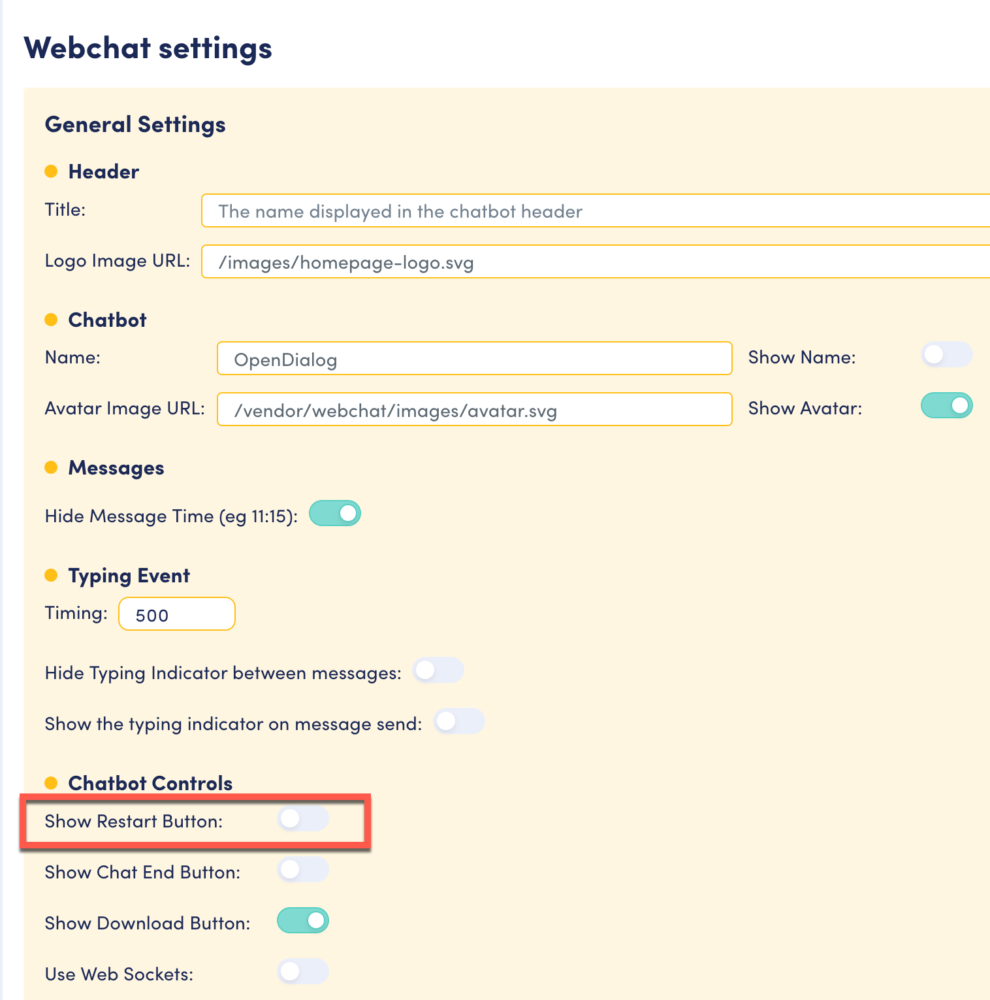
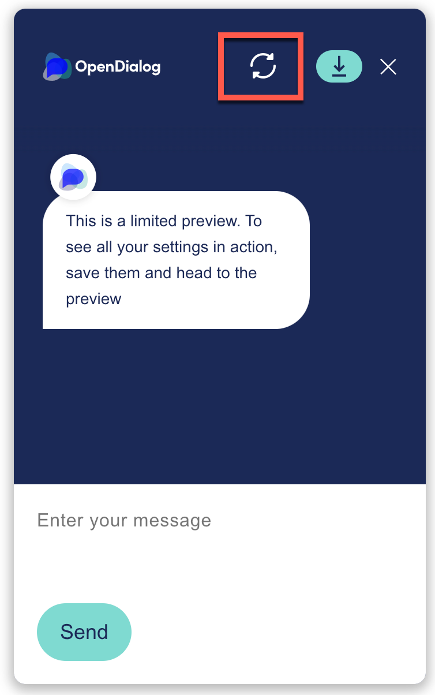
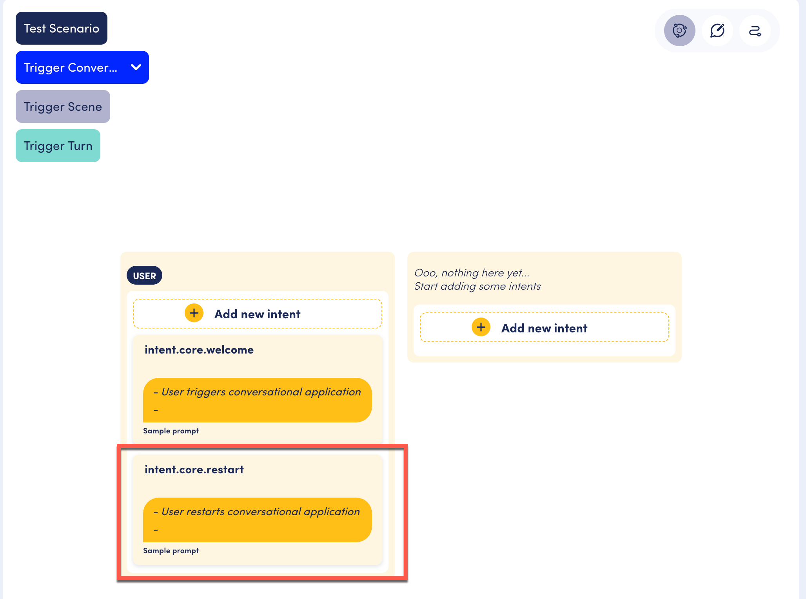

# Restart

This functionality is not activated by default; it must be activated in the Interface Settings page

<figure><figcaption>
Toggle for Restart button in settings
</figcaption></figure>

<figure><figcaption>
Restart icon in user interface
</figcaption></figure>

If the user clicks the **Restart** button at any point during the conversation, an `intent.core.restart` intent is generated. Similar to a no match, the conversation engine will look for an intent.core.TurnRestart intent in a turn in the current scene. If no intent is found, the engine will look for an intent.core.SceneRestart intent in the conversation, and if no intent is found, the engine will look for an intent.core.ConversationRestart.&#x20;

If none of these are found, the global intent.core.restart is executed. This intent is provided by default in the Trigger conversation (see screenshot)

<figure><figcaption>
intent.core.restart in the Trigger conversation
</figcaption></figure>

By default the intent.core.restart in the custom template transitions to the Welcome Turn. However, you may want to customize the the prompt to handle the restart versus a welcome for a new interaction. You can do this in a number of ways. One way is to create a separate restart turn in addition to the welcome turn and transition to that turn.&#x20;

### Contextual Restarts

Individual turns, scenes and conversations can handle restarts however they need.

Consider a scene in which we are trying to gather information about a user. Our conversational flow will be a question from the app, followed by an answer from the user. Now imagine the user made a mistake in the information they entered and hit the restart button.&#x20;

This is what a scene for this might look like:\

.png>)

The turn named `Scene Restart` can have the NLU to capture the user utterance indicating they made a mistake, and transitioning them back to the top of this scene.&#x20;

In this case, if the user restarts the flow at any point in this scene, we would want to route them back to the `Get Name Turn`(that is the first turn in this scene). To do so the scene restart intent transitions to the Get Name turn.&#x20;

.png>)


Notice the intent is named `intent.core.SceneRestart` as we want to capture all restarts within this scene


Now, if the user clicks the restart button at any point in within this scene, they will be routed straight back to the start of the scene.
