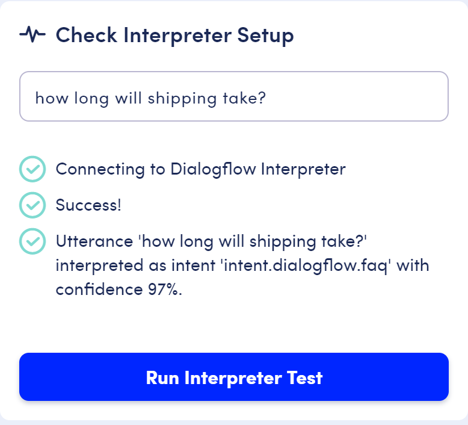
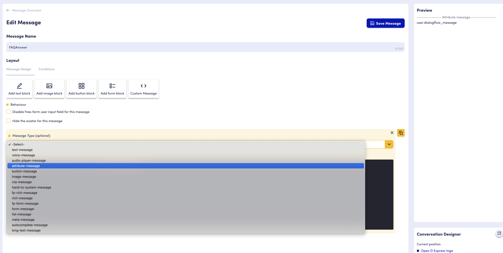
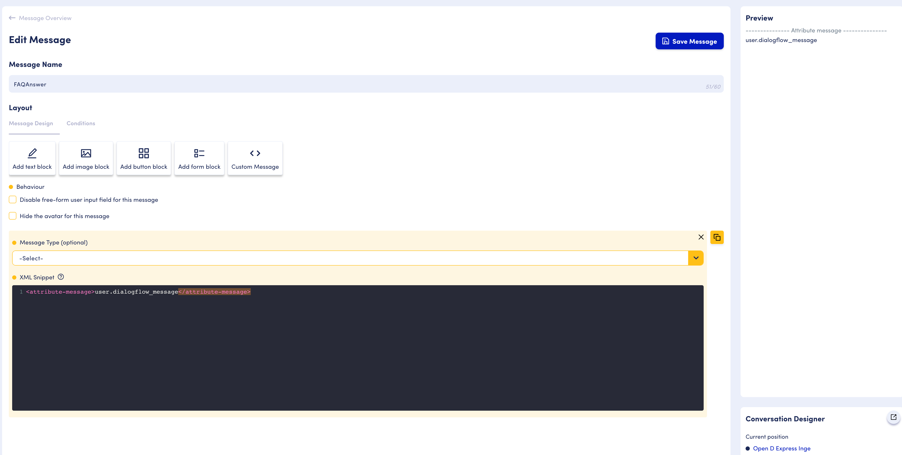

# Google Dialogflow Knowledge Base

The OpenDialog Dialogflow integration allows us to use Dialogflow knowledge bases to add FAQ capabilities with NLU in your conversational application.&#x20;

## Creating the Knowledge Base

Follow more detailed instructions in the [knowledge bases how-to](https://cloud.google.com/dialogflow/docs/how/knowledge-bases) to create a knowledge base and document.&#x20;

For this particular example, we'll create a delivery knowledge base. Navigate to the Knowledge Bases in Dialogflow and create a knowledge base that is a FAQ knowledge type. You may use the document attached below as your knowledge base for your delivery related questions and answers. Once you have uploaded the CSV and added a response, your Delivery knowledge base should be similar to the one shown below.



## Mapping Intents

Now navigate back to the interpreters section in OpenDialog and select the Dialogflow interpreter that you had setup in the previous section. Once selected you will then need to adjust the intent mapping. The incoming user intent name is `intent.dialogflow.faq` and that should be mapped  to the knowledge base intent as shown in the figure below. This mapping will convert any `Knowledge.KnowledgeBase.*` intent from Dialogflow intent the `intent.dialogflow.faq` intent in OpenDialog.&#x20;

.png>)

## Testing the Interpreter

Now that the interpreter is configured to integrate with the Dialogflow knowledge base, it can be tested via the "Check Interpreter Setup" in the bottom right. Enter an utterance such as "how long will shipping take?" and you should see that it was interpreted. It's useful to note the confidence percentage here, as this will be used shortly.

## Using the interpreter for an intent

Now that you've configured and tested your Dialogflow interpreter using the Knowledge Base you'll want to make use of it for intent matching.

You can add an FAQ turn to any scene. In this example we are adding it to the Welcome scene. The welcome scene has a welcome turn with an app welcome message.&#x20;

.png>)

Create a new turn in the called "FAQ".

.png>)

In this turn you'll create a single user request intent for the question and a single application response intent for the answer.&#x20;

First add a user request intent to match `intent.dialogflow.faq` (_this is the intent OpenDialog generates when Dialogflow successfully matches a pair_). Your sample utterance can be anything, in this case we use  `[faq_question].`

.png>)

It's important to note that the confidence level for the intent should be less than what was returned in our test. If FAQ interprets an intent with a confidence higher than our threshold, OpenDialog will disregard it. A general practice when working with the Dialogflow knowledge base is to set it to about 40%. After you've set up the intent, make sure to save it.

The intent that was just created captures the user's question. Let's now create an intent to return the answer to that question. Create an application response intent in the same turn.

.png>)

After you've saved the response intent, edit the message. Delete the text message and add a custom attribute message.&#x20;

<figure><figcaption></figcaption></figure>

Then add`user.dialogflow_message`in your XML snippet within the attribute message tags. By default all attributes are stored in the `user` context, unless they are mapped in [expected attributes](https://docs.opendialog.ai/turns-and-intents#advanced-settings). The attribute `dialogflow_message` is created by OpenDialog and will contain the answer from the matched Dialogflow Knowledge Base pair.

<figure><figcaption></figcaption></figure>

Make sure to save the message.

## Preview

Now that the interpreter is set on the user intent and an application intent has been created to return the answer, everything is in place see the Dialogflow Knowledge Base interpreter working in "Preview".

After the webchat widget loads, if you send a message such as "how long will shipping take?", you should see that an answer is returned to you. This means that OpenDialog successfully interpreted and matched the new user intent (if it didn't you'll get a no match error message), and then matched the new application intent.&#x20;

You can keep trying this with other question-answer pairs that were included in your knowledge base.

.png>)

