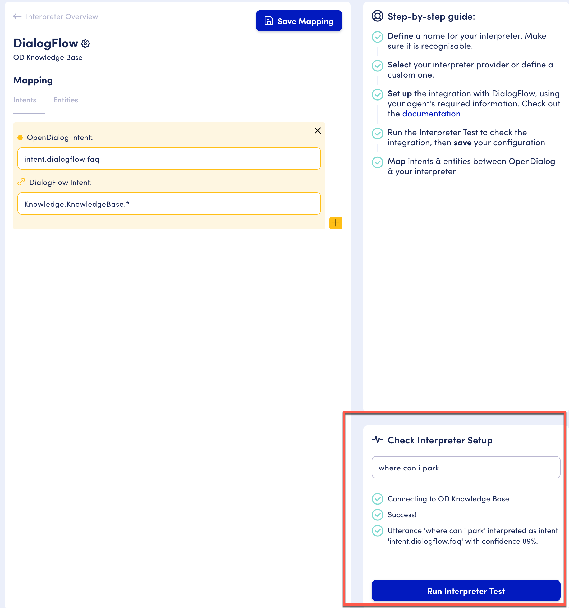
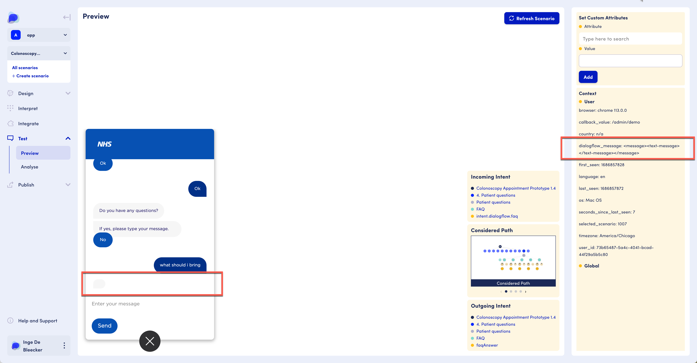

# Troubleshooting interpreters

## Steps to check when working with a knowledge base

* Make sure that your knowledge base is working in the NLU service. E.g.&#x20;
  *   .png>)
  * Test your interpreter setup in OD. Note that success in OD doesn't mean that your knowledge base is working; you must check the previous step as well
    *

        <figure><figcaption>
Run interpreter test in OD
</figcaption></figure>

    * Make sure your intent names align and use the names as shown in the image and the documentation. Check that your answer intent has an attribute message per the documentation.&#x20;
      *   

## Troubleshooting

Q: Everything seems to be working but I get an empty answer in my preview.&#x20;

<figure><figcaption>
Preview screen showing empty KB answer
</figcaption></figure>

A: The message in the context indicates that everything is working on the OD side, but in the knowledge base the answer is not retrieved. Go to your knowledge base and check that you are getting the answers using the test tool (see section above).&#x20;
