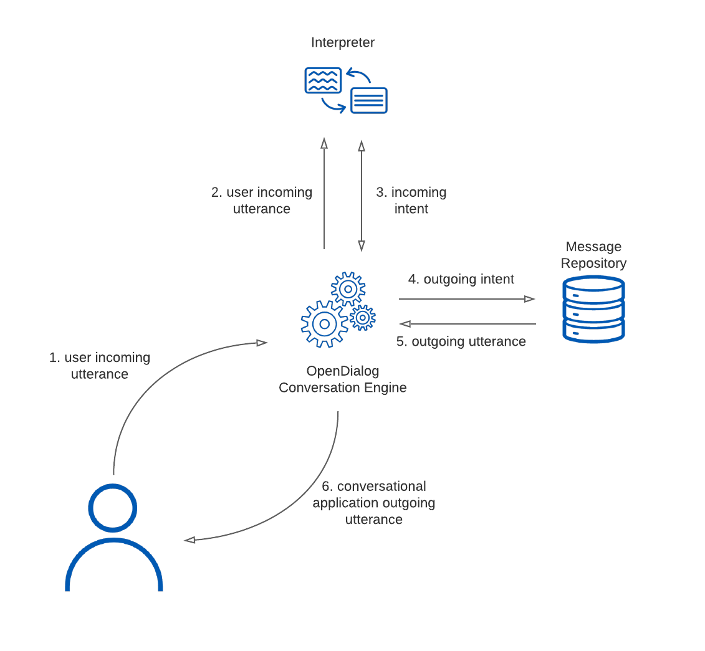

# Conversations


The 1.0 version is currently in private beta and the documentation is in beta as well - please [get in touch](https://www.opendialog.ai/contact-us/) for a demo, if you want to join our private beta or simply to sign-up to be notified when the final release will be ready. The concepts referred to here are still relevant but our no-code UI makes having to understand the underlying YAML representation much less urgent.


Conversations in OpenDialog rely on three key building blocks: **conversations**, **scenes** & **intents**. These three building blocks are in a hierarchical relationship where conversations contain scenes, and scenes contain intents. Within a single OpenDialog application there can be one or more conversations, with each conversation containing one or more scenes, and each scene containing one or more intents.

OpenDialog conversations model communication between two agents: a user and the OpenDialog application \(i.e. the bot\). In conversational design this communication is primarily modelled by a simple alternation between user and bot intents, however there is also scope for more complex patterns by using **interpreters**, **conditions** and **actions**.

Conversations in OpenDialog are described using YAML. The basic structure of a conversation is as follows:

```yaml
conversation:
  id: example_conversation
  scenes:
    opening_scene:
      intents:
        - u:
            i: intent.app.openingIntent
        - b:
            i: intent.app.openingIntentResponse
       ...
    second_scene:
      intents:
        - u:
            i: ...
        - b:
            i: ...
            completes: true
      ...
```

A conversation has an id \(`example_conversation`\) and is followed by a series of scenes, each with its own id \(`opening_scene`, `second_scene`\). Within scenes we have a series of intents exchanged by _agents_, one agent is the user \(denoted with a `u`\) and the other agent is the bot \(denoted with a `b`\).

In the above fragment, in the `openining_scene` we expect the user to say something that would be interpreted as the `openingIntent` to which the bot would reply with the `openingIntentResponse`.

A conversational description captures what the conversation application designers _expect_ to happen. It is the job of the Conversational Engine to identify which, of potentially multiple conversations, is appropriate based on what the user has said. Once a conversation has been selected we remain _within_ the conversation progressing from intent to intent and from scene to scene as long as we can succesfully keep matching the overall pattern of that conversation. If the pattern no longer holds \(i.e. the user said something that can not be matched to one of the possible upcoming intents we _crash_ out of a conversation and attempt to find an alternative match\).

## Scenes

Scenes are groupings of intents within a conversation.

Each conversation is required to have at least one scene and this scene **must** be called `opening_scene`. This lets OpenDialog know which scene to select first when entering a new conversation. The first set of incoming intents within this opening scene are called [opening intents](https://docs.opendialog.ai/docs/cdl#opening-intents).

The OpenDialog Conversational Engine will consider all opening intents across all possible conversations when attempting to decide what conversation to instantiate with the user.

```yaml
conversation:
  id: example_conversation
  scenes:
    opening_scene:
      intents:
        - u:
            i: intent.app.openingIntent
        - b:
            i: intent.app.openingIntentResponse
            completes: true
```

## Intents

Intents come in two forms: incoming & outgoing. Incoming intents are what users interacting with the application _might_ say, while outgoing intents is what the bot would say in response. 

When a user says something to the bot we have an _utterance_. The utterance goes through various interpreters that attempt to map it to an intent. Once an intent has been successfully identified we move the conversation _forward_ by confirming the user intent and then consider the response. 

After we have a user intent we identify what the appropriate outgoing intent is. This outgoing intent is then mapped to an _utterance_ or _message_ from the bot to the user. The diagram below illustrates the flow from a user utterance, to interpretation and then back to a conversational application utterance.



```yaml
conversation:
  id: example_conversation
  scenes:
    opening_scene:
      intents:
        - u:
            i: intent.app.openingIntent
        - b:
            i: intent.app.openingIntentResponse
       ...
```

It is fundamental to the understanding of how OpenDialog works to appreciate that conversations are designed using intents _both_ for incoming and outgoing utterances. In the case of incoming utterance, the utterance is interpreted and then mapped to an intent. In the case of outgoing utterances, we start from an an outgoing intent that is mapped to an outgoing message.

Multiple pairs of intents can be exchanged within a single scene. Once a dialog is within a scene only intents following the most recently matched one are considered. Consider the following example:

```yaml
conversation:
  id: example_conversation
  scenes:
    opening_scene:
      intents:
        - u:
            i: intent.app.hiHowAreYou
        - b:
            i: intent.app.allGoodHowAreYou
        - u:
            i: intent.app.notGreat
        - u:
            i: intent.app.doingGreat
        - b:
            i: intent.app.fantasticHowCanIHelp
       ...
```

In the scene above the user is greeting the bot with `hiHowAreYou`, and the bot replies with an `allGoodHowAreYou` intent. The user can then either provide a positive response \(`doingGreat`\) or a negative response \(`notGreat`\). Either one of those intents is a valid next intent for this conversation design. If one of those two intents comes through, and because there are no other conditions on the intent exchage the bot will reply with `fantasticHowCanIHelp`. A more nuanced conversation, of course, would place conditions on the bot's response based on the sentiment within the user's reply.

Intents can also connect scenes by _spanning_ across scenes. moving forward the conversation. This can be achieved by the `scene` directive.

```yaml
conversation:
  id: example_conversation
  scenes:
    opening_scene:
      intents:
        - u:
            i: intent.app.opening_intent
        - b:
            i: intent.app_opening_intent_response
            scene: second_scene
    second_scene:
      intents:
        - u:
            i: intent.app.closing_intent
        - b:
            i: intent.app.closing_intent_response
            completes: true
```

In the snippet above when the bot responds with `intent.app_opening_intent_response`, the conversation moves from `opening_scene` to `second_scene`.

Intents can also have additional directives which will be explained in the sections below.

### Opening intents

As mentioned above, each conversation must have at least one scene and this scene must be called `opening_scene`. The first incoming intents of this opening scene are known as opening intents.

```yaml
conversation:
  id: example_conversation
  scenes:
    opening_scene:
      intents:
        - u:
            i: intent.app.opening_intent
        - u:
            i: intent.app.my_other_intent
        - b:
            i: intent.app_opening_intent_response
       ...
```

In this example either `intent.app.opening_intent` or `intent.app.my_other_intent` will be selected as the first incoming intent of example\_conversation.

Out of the box, OpenDialog comes pre-configured with two such intents and conversations handling such intents are currently _expected_ for OpenDialog web-based chat to function as expected. The core opening intents are:

* `intent.core.welcome`
* `intent.core.NoMatch`

### **intent.core.welcome**

This is the default intent that will be sent by OpenDialog webchat when a user opens the chat window. If you have a different intent that you would prefer to be used, you can update this in the Interpreter Engine configuration file by changing the mapping for the `WELCOME`callback.

```text
conversation:
  id: welcome_conversation
  scenes:
    opening_scene:
      intents:
        - u:
            i: intent.core.welcome
        - b:
            i: intent.app.welcome_response
       ...
```

### **intent.core.NoMatch**

This is the intent that OpenDialog will send if it isn’t able to match a user’s utterance to any other possible incoming intent. This _no\_match\_conversation_ can be treated as the default catch-all conversation for a no match. However, if you use an intent.core.NoMatch within your own conversations those will take priority and allow you to provide more context specific no match messages back to the user.

```text
conversation:
  id: no_match_conversation
  scenes:
    opening_scene:
      intents:
        - u:
            i: intent.core.NoMatch
        - b:
            i: intent.app.no_match_response
       ...
```

### Completing intents

To allow users to move from one conversation to another, each conversation must eventually end. This can be achieved by denoting completing intents using the `completes` directive. Completing intents are intents that once matched, will end the current conversation.

```text
conversation:
  id: example_conversation
  scenes:
    opening_scene:
      intents:
        - u:
            i: intent.app.openingIntent
        - b:
            i: intent.app.openingIntentResponse
            completes: true
```

### Virtual intents

Virtual intents allow you to _simulate_ an incoming intent in absence of an actual incoming intent from a user. You are essentially asking OpenDialog to behave _as if_ the user said something, without the user having said that. This can be useful if you wish to skip requiring the user to give input for some reason or, in general, where you can confidently skip a part of the conversation because of pre-existing contextual information.

To specify a virtual intent, the `u_virtual` directive can be added to an outgoing intent containing the intent name to be simulated.

```text
conversation:
  id: create_task_conversation
  scenes:
    opening_scene:
      intents:
        - u:
            i: intent.app.orderAPizzaWithoutType
            scene: select_pizza_type
        - u:
            i: intent.app.orderAPizza
        - b:
            i: intent.app.pizzaIsOnItsWay
            completes: true
    select_pizza_type:
      intents:
        - b:
            i: intent.app.whatPizzaWouldYouLike
        - u:
            i: intent.app.PizzaType
        - b:
            i: intent.app.pizzaTypeConfirm
            scene: opening_scene
            u_virtual:
              i: intent.app.orderAPizza
```

For example in the above snippet, there is a conversation that allows a user to order a pizza. We anticipate that the user may or may not specify the pizza type directly in their utterance and capture that with two different intents \(there is a more sophisticated solution to this problem but this serves as an example for virtual intents\).

If the user intent is `orderAPizza` then then bot will reply with `pizzaIsOnItsWay` and the conversation ends there. If, however, the intent from the user is `orderPizzaWithoutType` we then move to the `select_pizza_type` scene where the bot asks the user for the pizza type and confirms it.

With a type locked in we now want to tell the user that the pizza is on its way. So we move the conversation back to the `opening_scene` and use a `u_virtual` intent to make the conversational engine respond to the user _as if_ the user had ordered a pizza with a type specified. This means we only need to have one `pizzaIsOneItsWay` intent and the `u_virtual` shortcut allows us to return to a conversational state after collecting missing information and continue the conversation as if the information was always there to start with.

### **Conversational Transitions**

Virtual intents as described above do not only have to work within a single conversation - if the outgoing bot intent they are attached to is also a `completing` intent, OpenDialog will look back at all possible opening intents from all conversations when following it.

For example, consider the following conversation in which a user would like to make a reservation. The restaurant has allows booking tables at the bar for over 18s and standard restaurant bookings if under 18

```text
conversation:
  id: introduction
  scenes:
    opening_scene:
      intents:
        - u:
            i: intent.app.make_booking
        - b:
            i: intent.app.askAge
        - u:
            i: intent.app.under18
            scene: under_18
        - u:
            i: intent.app.under18
            scene: over_18
    under_18:
      intents:
        - b:
            i: intent.app.continue
            u_virtual:
              i: intent.app.bar_booking
            completes: true
    over_18:
      intents:
        - b:
            i: intent.app.continue
            u_virtual:
              i: intent.app.restaurant_booking
            completes: true
```

```text
conversation:
  id: bar_booking
  scenes:
    opening_scene:
      intents:
        - u:
            i: intent.app.bar_booking
        - b:
            ...
```

```text
conversation:
  id: bar_booking
  scenes:
    opening_scene:
      intents:
        - u:
            i: intent.app.restaurant_booking
        - b:
            ...
```

The `introduction` conversation will first find out the users age, and then move the user into the appropriate conversation depending on the answer. This works as the outgoing bot intent in both the `over_18` and `under_18` scenes complete the current conversation and trigger a `u_virtual` intent that matches an opening intent of another conversation.

The `bar_booking` and `restaurant_booking` conversations are no longer scenes within a single conversation and can be re-used.

#### **Transitioning with Empty messages**

An intent with a `u_virtual` directive must always have an outgoing intent paired with it, however this isn't always desirable if we just want to use the `u_virtual` to transition a user to a different part of the conversation.

In these cases, you can use an `<empty-message>` with the outgoing intent that results in no message being displayed to the user.

### Repeating intents

Repeating intents enable a set of intents to loop. An incoming intent that is marked with the `repeating` directive will be matched as per usual, however after the bot has replied with its outgoing intent, the conversation will be reset to the position it was prior to the repeatable incoming intent.

```text
conversation:
  id: create_task_conversation
  scenes:
    opening_scene:
      intents:
        - u:
            i: intent.app.createTasks
        - b:
            i: intent.app.createTasksResponse
            scene: create_task_scene
    create_tasks_scene:
      intents:
        - u:
            i: intent.app.taskName
            repeating: true
            interpreter: interpreter.app.taskName
            expected_attributes:
              - id: session.task_name
        - u:
            i: intent.app.noTaskName
            interpreter: interpreter.app.taskName
            scene: end_scene
        - b:
            i: intent.app.task_created
    end_scene:
      intents:
        - b:
            i: intent.app.endTaskCreation
            completes: true
```

In the above snippet the `intent.app.taskName` intent is a repeating intent. When a user sends `intent.app.taskName`, the bot replies \(as usual\) with `intent.app.taskCreated`, however after this the conversation will then jump back to its state prior to receiving the user’s incoming intent. The next valid intents will again be `intent.app.taskName` or `intent.app.noTaskName`, and this can be repeating over and over until `intent.app.noTaskName` is sent by the user.

This allows us to design a conversation where a user keeps providing tasks that are added to some sort of list until the user decides to break out of it.

## Interpreters

When a user says something we need to _interpret_ that in order to match it to an intent. OpenDialog allows each intent to define what interpreter should be used to interpret it. Interpreters take input in the form of an utterance \(eg. text, button value, form, etc\) and provide as output a matching intent with a confidence score and optional attributes.

By default OpenDialog sets `interpreter.core.callbackInterpreter`as the default interpreter for all incoming intents. This means that if you would like the Callback Interpreter to interpret an intent, you do not need to specify it. If you would like interpretation to be carried about by a non-default interpreter, you must specify it on an outgoing intent by using the `interpreter` directive.

### Confidence

The `confidence` directive can be used to indicate a minimum confidence score that the interpreter must produce for the given intent to match. If this directive is omitted, it will default to 1 which means that the interpreter will have to be 100% certain that the given intent matches.

### Expected Attributes

The interpreted intent can also be told to store attributes from the interpretation by specifying the `expected_attributes` directive. This can take an array of attribute names prefixed by a context name. This maps to entity extraction for interpreters such as Microsoft LUIS or Google Dialogflow.

```text
conversation:
  id: example_conversation
  scenes:
    opening_scene:
      intents:
        - u:
            i: intent.app.openingIntent
            interpreter: interpreter.core.luis
            confidence: 0.75
            expected_attributes:
              - id: session.first_name
        - b:
            i: intent.app.openingIntentResponse
            completes: true
```

In the snippet above `intent.app.openingIntent` is interpreted by the built-in Microsoft LUIS Interpreter \(`interpreter.core.luis`\). In this example `intent.app.openingIntent` can include a `first_name` attribute, which the markup specifies should be stored in the context called `session`. If LUIS returned a confidence lower than 0.75, `intent.app.openingIntent` **would not** be matched and OpenDialog would instead match [`intent.core.NoMatch`](https://docs.opendialog.ai/docs/cdl#intentcorenomatch).

## Conditions

Conditions can be used to ensure that only specific intents are considered for matching. They can be specified by using the `conditions` directive, which must contain an array of `condition` objects. If multiple conditions are given for a single intent they are combined on an `AND` basis. Conditions can used on both incoming and outgoing intents, however their behaviours differ slightly.

> Conditions can also be used on conversations \(if conditions are not met then the entire conversation is not considered\) and they can be used on messages \(which we will discuss in subsequent sections\)

Conditions on incoming intents are evaluated after interpretation, which means that OpenDialog will have interpreted the user's utterance \(but not yet have matched to an incoming intent\). The conditions of these potential intents are then evaluated, with the first passing intent being selected. This allows conversation designers to specify conditions using attributes of the interpreted intents. This can be done by using the built-in `_intent` context which will be temporarily populated with the expected attributes of the intent.

For outgoing intents, conditions are evaluated first. Conditions are, currently, the only way to instruct OpenDialog to choose between a consecutive grouping of outgoing intents.

```text
conversation:
  id: example_conversation
  scenes:
    opening_scene:
      intents:
        - u:
            i: intent.app.openingIntent
            scene: appropriate_price_scene
            interpreter: interpreter.core.luis
            confidence: 0.75
            expected_attributes:
              - id: item.price
            conditions:
              - condition:
                  operation: gte
                  attributes:
                    attribute: _intent.price
                  parameters:
                    value: 10
              - condition:
                  operation: lte
                  attributes:
                    attribute: _intent.price
                  parameters:
                    value: 50
        - u:
            i: intent.app.openingIntent
            interpreter: interpreter.core.luis
            confidence: 0.75
            expected_attributes:
              - id: item.price
       ...
```

In the above snippet there are two instances of `intent.app.openingIntent`, both of which use the LUIS interpreter and expect a `price` attribute. If the `price` attribute value is greater than or equal \(`gte` operation\) to 10 and less than or equal \(`lte` operation\) to 50, then the user will be taken into `appropriate_price_scene`, otherwise they will remain in `opening_scene`.

## Actions

If you have some functionality that should occur following the succesful identification and matching of an intent, you can associate that intent within the conversation to an _action_. Actions accept _input attributes_ and can return _output attributes_. Actions themselves are agnostic to the contexts that these attributes belong to \(similar to how expected attributes work for [interpreters](https://docs.opendialog.ai/docs/conversational_markup.md#interpreters)\).

Actions can be specified using the `action` directive, which contains an object with `id`, `input_attributes` & `output_attributes` properties.

```text
conversation:
  id: example_conversation
  scenes:
    opening_scene:
      intents:
        - u:
            i: intent.app.openingIntent
            action:
              id: action.core.example
              input_attributes:
                - user.first_name
                - user.last_name
              output_attributes:
                - user.full_name
        - b:
            i: intent.app.openingIntentResponse
            completes: true
```

In the above snippet when `intent.app.openingIntent` is matched, OpenDialog will perform `action.core.example.` It takes input of the `first_name` and `last_name` attributes from the `user` context, and outputs a `full_name` attribute into the same context.

