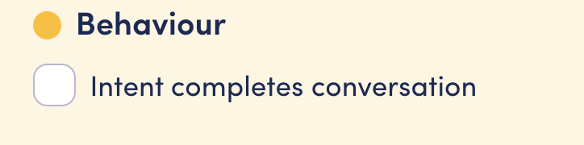

# WebChat authentication

## Basics

Any user who interacts with an OpenDialog chatbot must have a unique ID. This ID is used to save data against in the user context and to track the current position of the user in the conversation flow.

For WebChat, the user ID is used to fetch WebChat configuration, WebChat history (if turned on) and sent in with each message from WebChat so the OpenDialog conversation engine can continue where the user left off.

### Known user ID

If the OD chatbot is embedded on a page where the user is known (e.g. a page they have to log in to), the user ID can be passed in with the embed code (currently, the field is called `email` but it does not have to be an email - just a unique identifying string)

```jsx
<script>
    window.openDialogSettings = {
      url: '{url}',
      appKey: '{app_key}',
      user: {
	email: '{user_identifier}'
        custom: {
          selected_scenario: '{scenario_id}'
        }
      },
    };
</script>
```

Now every time the user logs into the page that has the embedded chatbot, the same user if will be used.

### Unknown user

If a user identifier is not passed into the embed code, the WebChat widget will either:

* Take the user ID from the browser’s session storage
* OR if not present in session storage, generate a new, unique ID

If the user ID is in session storage, the previous chat session can continue. Otherwise, a new user ID is used and the conversation starts from the beginning.

Since the user ID is stored in the browser’s session storage, it will live as long as the browser session lives. Usually, this is cleared when a user closes their browser. Once it has been cleared, although the session is technically still present in the backend, the next time the user visits the WebChat widget, a new ID will be generated.

#### Manually clearing session storage

Sometimes, you need control over clearing the session storage - for example if a user logs out of the page. This can be done with a small piece of Javascript as follows:

```jsx
sessionStorage.clear()
```

The next time the users visits the WebChat widget, a new ID will be generated.

## User types

The initial call out to fetch WebChat config will returned back the type of user based on the user ID. Each has a slightly different chat initialization flow as follows:

### New users

New users have not used the scenario before and have no chat history or data in the user context. For all `new` users, opening the WebChat widget will cause a `chat_open` event to be sent with the callback ID `intent.core.welcome`. This is the default starting intent assigned to the trigger conversation.

### Returning users

Returning users are users who have been seen before and have a conversational history, but they reached the end of their last conversation. Technically, this means they reached an intent that has the ‘completing’ behavior. This can be set on the intent edit page:

<figure><figcaption></figcaption></figure>

When a returning user visits the WebChat widget again, the `chat_open` event is sent as for new users with the `intent.core.welcome` callback ID

### Ongoing users

Ongoing users are users that have been seen before, have a conversation history, but they have not yet reached a completing state of a conversation. When ongoing users re-visit the webchat widget, a `chat_open` event is not sent so as not to affect the user’s current position.

**NB** - it is important that webchat history is turned on for ongoing users to prevent them being shown an empty webchat widget

### Forcing chat open behavior

Regardless of the user type, the opening behavior of the WebChat widget can be forced by passing the `openIntent` in the embed code.

`openIntent` can either be set to a value, which in turn will be passed as a callback ID along with the `chat_open` event, or it can be set to `null` indicating that no `chat_open` event should be sent.

This allows some level of control over chat initialisation that could be useful if for example you always want to send a welcome message to your users, even if they hadn’t completed their last conversation, or different behaviour on different pages.

Example embed code forcing no `chat_open` event

```jsx
<script>
    window.openDialogSettings = {
      url: '{url}',
      appKey: '{app_key}',
      user: {
	email: '{user_identifier}'
        custom: {
          selected_scenario: '{scenario_id}'
        }
      },
      openIntent: null
    };
</script>
```

Example embed code forcing a `chat_open` event with a callback ID of `RETURNING`

```jsx
<script>
    window.openDialogSettings = {
      url: '{url}',
      appKey: '{app_key}',
      user: {
	email: '{user_identifier}'
        custom: {
          selected_scenario: '{scenario_id}'
        }
      },
      openIntent: 'RETURNING'
    };
</script>
```

\[to be added]:

* time since last seen conditions
