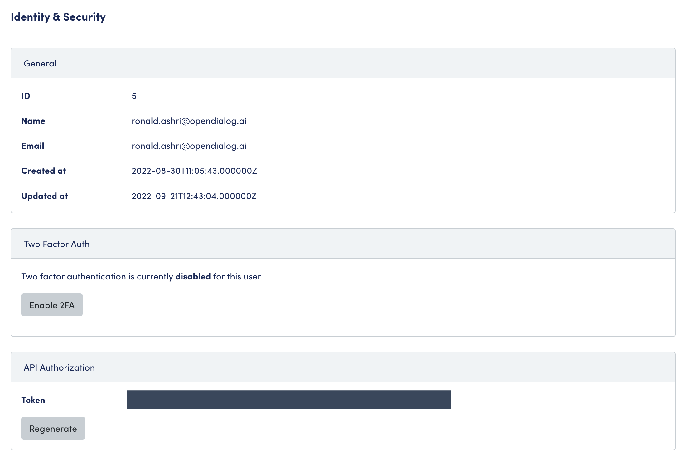

# Interaction API

## Introduction

The Interaction API makes it possible to retrieve information about interactions between the user and OpenDialog scenarios. The data is requested for over a time period (`from` , `to`) and is split by `user_id`. Example structure can be seen below.&#x20;


```json
{
    "data": [
        {
            "<user_id>": {
                "chatbot_user_data": {
                    "first_name": "",
                    "last_name": "",
                    "custom": {
                        "selected_scenario": "<scenario_id>"
                    }
                },
                "from": "2022-09-21T00:00:00.000000Z",
                "to": "2022-09-22T23:59:59.000000Z",
                "interactions": [
                    {
                        "type": "<>",
                        "date": "2022-09-21T08:19:33.000000Z",
                        "text": "",
                        "data": {
                            "value": "<>",
                            "callback_id": "<>"
                        }
                    },
                    {
                        "type": "<>",
                        "date": "2022-09-21T08:19:33.000000Z",
                        "text": "",
                        "data": {
                            "value": "<>",
                            "callback_id": "<>"
                        }
                    }
                ]
            }
        }
    ]
}
```


Please see our [Postman documentation](https://www.postman.com/opendialogai/workspace/opendialog-s-public-workspace/documentation/18689765-415a73ab-291e-43a9-bdb8-aae2eb015f3f?entity=request-18689765-d11214de-8749-48af-9521-172591cf54b3) of the API for further information.

### Bearer Token

To access the API you will need a bearer token associated with a user account in the OpenDialog Tenant you want to extract data from.&#x20;

To access your bearer token visit the Identity & Security page - accessible by clicking on your username in the bottom left-hand corner.

.png>)

<figure><figcaption><p>API Bearer Token Access</p></figcaption></figure>


