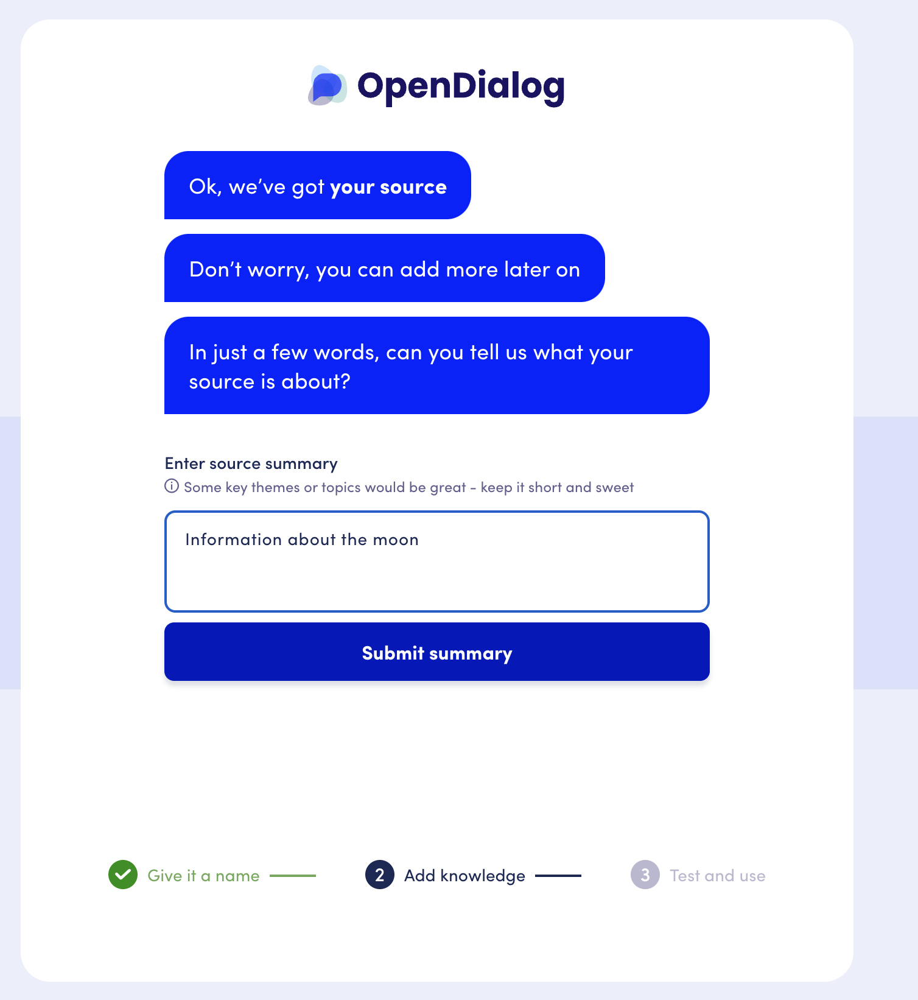
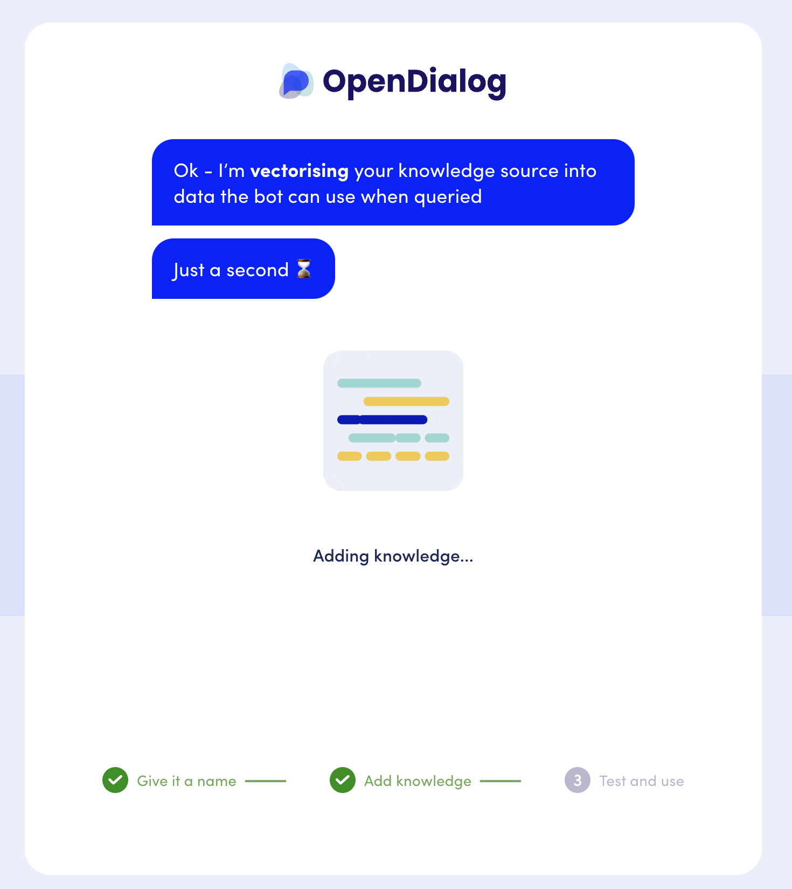
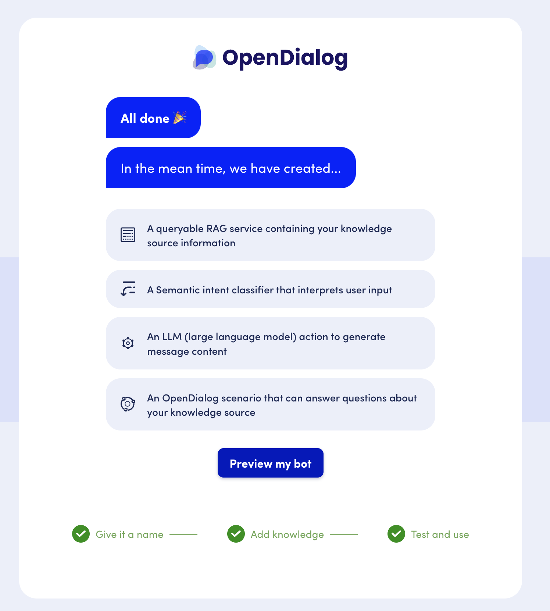
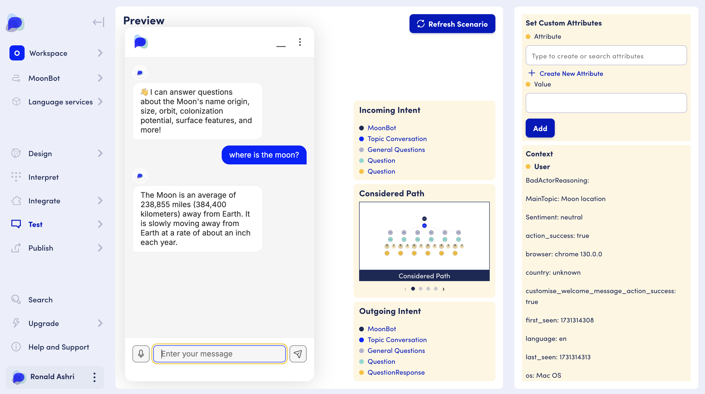

# Quick Start AI Agent

The Quick Start AI Agent is an optimised journey that really simplifies the process of creating an AI Agent. It is the fastest way to get up and running with OpenDialog.&#x20;



You will get taken to the Quick Start AI Agent process when you first login to OpenDialog or you can fire it up the  by visiting Create Scenario and then click on "Get Started Now"

<figure><figcaption>
Create Scenario Link
</figcaption></figure>

The guide will take you through 3 quick steps and in a couple of minutes you will have a fully fledged conversational AI Agent to experiment with.&#x20;

Behind the scenes OpenDialog configures a complete AI Agent scenario that you can use as a starting point for your agents.&#x20;

## Step 1 - Provide a name

<figure><figcaption>
Step 1 - Quick Start AI Agent - Provide a name
</figcaption></figure>

### Step 2 - Add a knowledge source

<figure><figcaption>
Step 2 - Quick Start AI Agent - Add a knoweldge source
</figcaption></figure>

## Step 3 - Description and vectorisation

If you upload your own knowledge source you will be asked to provide a quick description&#x20;

<figure><figcaption>
Step 3a - Quick Start AI Agent - Provide a quick description
</figcaption></figure>

With that in place you can hit vectorise and your AI Agent will be created

<figure><figcaption>
Quick Start AI Agent - Step 3b - Vectorization
</figcaption></figure>

<figure><figcaption>
Quick Start AI Agent - Step 3c - Completed
</figcaption></figure>

## Test your AI Agent

By clicking on preview you will be directed to your AI Agent and you can test it out

<figure><figcaption>
Quick Start AI Agent - Ready to be Tested!
</figcaption></figure>


**Want to take it a step further?**

Make sure to check out the video where we walk you through the process of adding additional topics of discussion to your initial setup.

