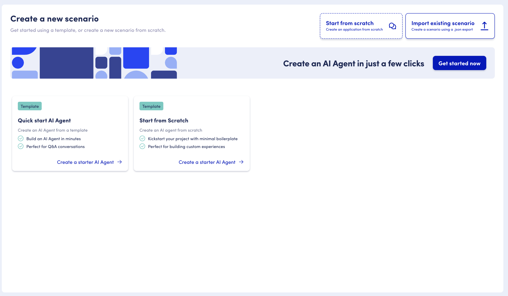
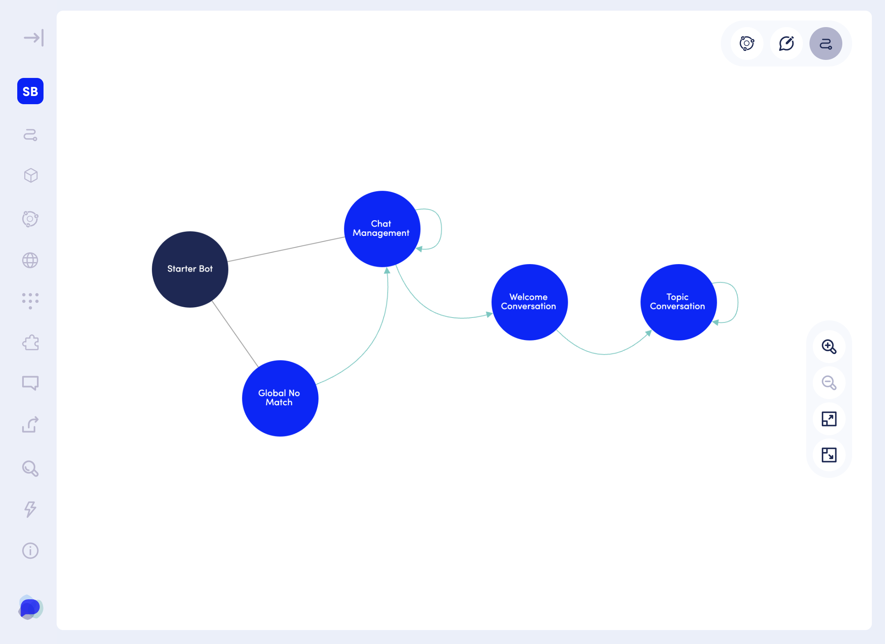

# The "Start from Scratch" AI Agent

OpenDialog offers a solid starting point for your AI Agents in the form of the AI Agent "Start From Scratch" Scenario.&#x20;

This scenario handles all the standard chat management functionality (start, restart, end, session expire), provides a welcome message and also a flexible and easy to expand Topics conversation which you can use as your own starting point.&#x20;

This is a similar scenario to the one created by the [Quick Start AI Agent](../quick-start-ai-agent.md) process but it avoids any knoweldge source or topic configuration - enabling you to start from scratch!

You can create a start from scratch scenario by visiting the Create Scenario Page and selecting Start from Scratch.&#x20;

<figure><figcaption>
Create Scenario Link
</figcaption></figure>

<figure><figcaption>
Start from Scratch Scenario
</figcaption></figure>

## Scenario Structure

<figure><figcaption>
The Start From Scratch Conversations and Flows
</figcaption></figure>

The "Start From Scratch" has four Conversations:&#x20;

* Chat Management: handles all the standard management functionality of start, restart, end and session expire
* Global No Match: A global no match conversation to deal with No Matches from our interpreters if they are not specifically dealt with in other conversations. You can learn about the No Match intent [here](../../../opendialog-platform/conversation-designer/conversation-design/conversational-patterns/building-robust-assistants/contextual-no-match-pattern.md).
* Welcome: A welcome conversation that has a single, generic welcome message
* Topic Conversation: A topic conversation that provides a generic structure for handling a multitude of different topics.&#x20;

In addition the scenario creates a Semantic Classifier that is used by the Topic Conversation - again a solid starting point for your own Classifiers.&#x20;

As you can see from the image above the entry point to the scenari is Chat Management. The context then gets redirected to the Welcome Conversation, where we send a welcome message, and we then move to the Topic Conversation where we will be dealing with any requests from the user.&#x20;


[chat-management-conversation.md](chat-management-conversation.md)



[welcome-conversation.md](welcome-conversation.md)



[topic-conversation.md](topic-conversation.md)



[global-no-match-conversation.md](global-no-match-conversation.md)



[supporting-llm-actions.md](supporting-llm-actions.md)



[semantic-classifier-query-classifier.md](semantic-classifier-query-classifier.md)

