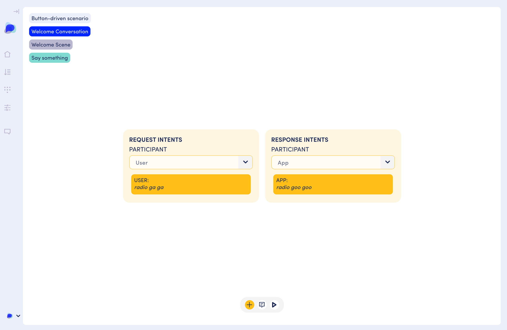
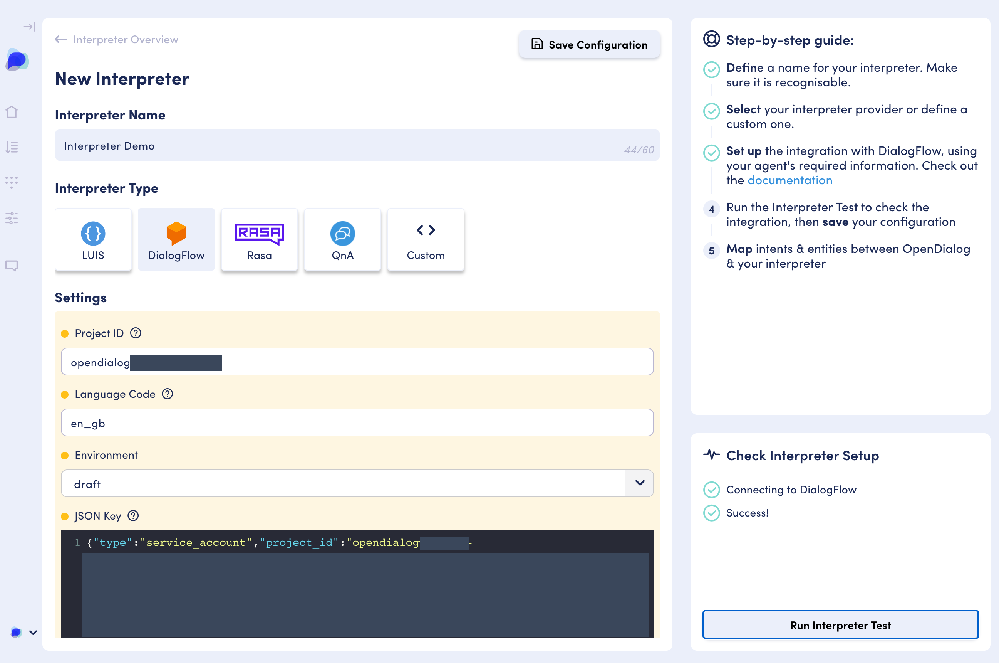

# Interpreters and Natural Language Understanding

## Introduction

Any input we receive from a user through a conversational interface is treated as an intent within the conversational flow. This includes things such as the first time a user loads the WebChat widget by visiting a page, or when they click on a button or submit a form. It also includes natural language phrases that a user may have typed in. 

Once OpenDialog _senses_ an input it generate an _utterance_ that the OpenDialog conversation engine attempts to match to an intent within the conversation. The _candidate_ intents will depend on your current conversational state and the conditions associated with those intents. For example, if you are not in an ongoing conversation only intents that are related to starting turns are going to be considered.  

The matching function between an utterance and an intent is performed by _interpreters._ A single scenario can have multiple interpreters associated with it. Interpreters are managed through the "Interpreters - NLU" section of OpenDialog.


In this section you define what interpreters are available throughout your OpenDialog instance and you can then associated those interpreters to specific sections of your scenarios. 

## Default Interpreter

The default interpreter that comes out of the box with OpenDialog is useful primarily for **button-driven conversations** and **prototyping**. 

### Button-driven \(or guided\) conversations

When we build a message with a button we can instruct the button to send the name of a specific intent to the OpenDialog conversation engine. Within the[ message markup](developing-with-opendialog/messages/message-markup.md) this intent is defined within `callback` tag. 

When the user clicks a button the WebChat widget will send to the conversation engine an event that contains the value within the callback tag. The conversation engine will then attempt to match that callback to the value of a specific intent within your scenario \(based on overall conversational state\). 

This enables us to build very flexible button-driven conversations where we don't have to change our mental model of how a conversation works. A button click is just an utterance that needs to be mapped to an intent like a natural language utterance. The only difference is that there is no ambiguity as to what the user just said. 

Let's build a small conversation to illustrate this behaviour. 

### Button-driven example

#### Create a new scenario

The first step is to create a new scenario. We will call it "Button-driven scenario".

#### Edit the welcome turn response intent

Edit the response intent of the Welcome turn to uncheck the fact that the turn completes the conversation. We are going to be creating another turn within the same scene so we want to stay within the context of the Welcome Scene. 


#### Edit the welcome response message

Head back to intents overview and click on the messages icon to enter the message editing mode. We will be adding a button to that welcome message. 



Roadmap: Currently buttons are only available through the custom blocks that drop in the XML template of a message. However, we will soon have a button UI widget to support button creation. 



Here is the XML for our message. 

```markup
<button-message>
  <button>
    <text>Drive with a button</text>
    <value>preference.guided</value>
    <callback>requestButtonDriven</callback>
    <display>true</display>
  </button>
  <button>
    <text>Drive with NLU</text>
    <value>preference.NLU</value>
    <callback>requestNLUDriven</callback>
    <display>true</display>
  </button>
</button-message>
```

We have two buttons. Each button will send a different callback `requestButtonDriven` and `requestNLUDriven` . In addition to the callback we are also sending different values `preference.guided` and `preference.NLU`. The values will be embedded within the utterance and can be extracted and stored in the user context. This allows us to collect information \(in the same way we would extract entities form a natural language phrase\) and  store it in our context to reuse it later on. You don't need to set values like this but it can be useful in a range of situations. 

#### Handling intents from buttons

Now, that we have our buttons we need to build out the conversation so that we can handle the response. As we mentioned before the model remains intent-driven throughout. When the user clicks on a button an intent will be generated that the conversation engine will attempt to match. So let's create two turns to handle each option. 


The first turn is called Button preference, and it's an _OPEN_ turn within the same scene. This means that once the interaction of the _STARTING_ Welcome turn is done this turn will be a candidate because we will remain \(contextually\) within the scene and be considering all open turns. We also create another _OPEN_ turn called NLU Preference so that we end up with the following scene. 


Now we can add intents to each turn to handle the various buttons. 


The intent name matches the value we will be sending through the callback. 


We are also capturing an expected attribute and storing it in the user context as `user.preference` - we will not use it in this example but it gives you a sense of what is possible. 


The resulting turn is as above. The user is requesting to drive with a button and we confirm that. 

If the user selects "Drive with NLU" they are taken to the NLU Preference turn. If we want to simulate NLU interactions with this default interpreter we can. The only requirement is that the user input matches direct the intent name.  

I've create a simple turn to illustrate this.



If the user types "radio ga ga" they will get the response "radio goo goo". 

The complete interactions described here are illustrated in the video below:




The default callback interpreter is essential for button driven interaction and can help with simple prototyping, but for actual NLU we need to use an NLU interpreter which we will discuss next. 

## Dialogflow Interpreter

The OpenDialog Dialogflow integration allows us to use Dialogflow intent interpretation, entity extraction and the Dialogflow knowledge bases. This means that you can use one or more Dialogflow agents as your NLU interpreters and do all the conversation design in OpenDialog. 

#### Create a Dialogflow ES agent

The first step to using Dialogflow is to create an [ES Dialogflow agent](https://cloud.google.com/dialogflow/es/docs). We are using Dialogflow as just an NLU service so we will be focussing on just training intents, extracting entities and \(if and when required\) setting up knowledge bases.

#### Create an API access key in the Google cloud console

Once you've created an agent follow the instructions here to generate an API key. 

The first step is to create a service user - we will need the Dialogflow API Admin role.


Then you can create a JSON key which will generate a file and download it to your machine. 


#### Create a Dialogflow Interpreter in OpenDialog 

We can now create an interpreter in OpenDialog that will connect to that Dialogflow agent. 


Once you've filled in the details you will be able to run a connectivity test to ensure that the API key is working correctly.  



With a success message in place you are ready to start using intents in your conversation design. 


