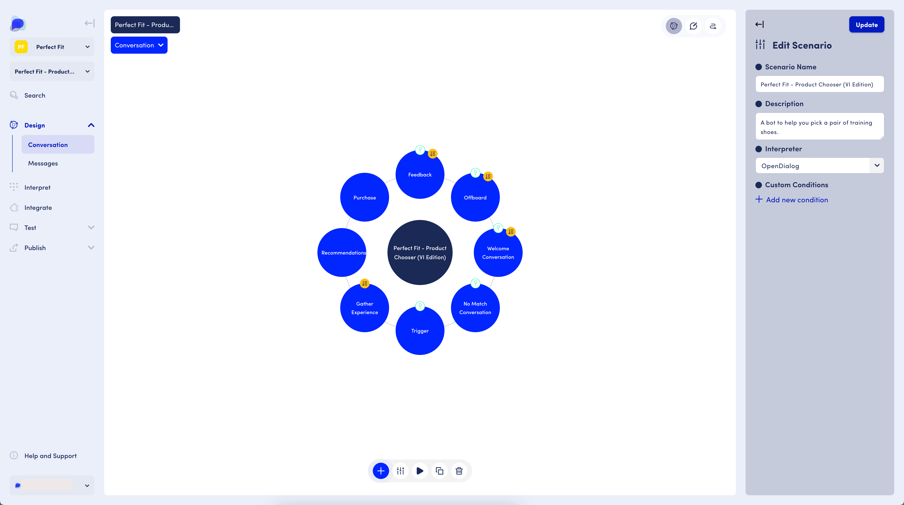

# OpenDialog Platform

<figure><figcaption>
The OpenDialog Platform Conversation Designer Interface
</figcaption></figure>

This section covers the OpenDialog model, and workspace functionality.

You will learn how to think of conversational applications in the OpenDialog way and to use the OpenDialog platform to create and manage such applications.&#x20;

Let's get started with the [Workspace](the-opendialog-workspace.md).
