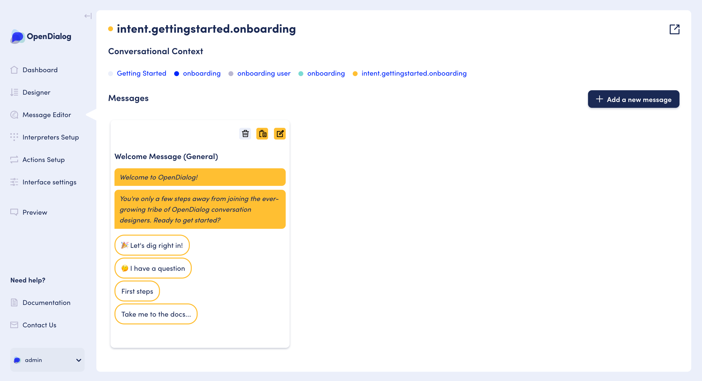

# Messages & Message Editor

We have outlined the basics of [managing messages](../getting-started-1/getting-started-with-opendialog/messages.md) and how they relate to intents within the getting started with OpenDialog section.&#x20;

We will use this section to dive deeper into how/where to find the message editor and the different messages types we currently support through the message editor UI.&#x20;


If you can not find the message type you require below, you can find a full list of supported messages not available via the UI  through "Custom Message" and an explanation of the underlying XML structure [here](../developing-with-opendialog/message-markup.md).


### 1. Finding the message editor

There are two different ways to find and then edit messages within OpenDialog.&#x20;

**Route 1:** From within the Designer. You navigate to the Message Editor by clicking on the message icon 💬  in the action bar on a Scenario, Conversation, Scene, Turn or Intent node view.&#x20;

 (1).png>)

**Route 2:** Through the 'Message Editor' link in the left-hand navigation.&#x20;

### 2. Finding specific messages

Once you've opened up the Message Editor, depending on the chosen route to enter, you will see either the full list of intents for an entire Scenario or a filtered list depending on the level you entered the editor through e.g. only intents for one Turn if you clicked through from the Turn level in the Designer.

To help with understanding which intent(s) you're viewing, at the top of the screen you can see a breadcrumb style list of links under the title 'Conversational context'. These outline which group of intent you're seeing. They are also clickable to help jump back up a level to view more intents i.e. if you're viewing a Turn you can jump back to view all Intents at the Conversation level.

.png>)

### 3. Editing a specific message

To edit a specific message you need to click on it to open up the individual intent screen (see below) that has either one message (like below) or multiple messages visible e.g. one for new users and one for logged in users _(if you're using conditions - more on that later)._

To then edit the message you click on the edit icon. You can also duplicate OR delete each message on the intent view.

.png>)

Once into the specific message edit screen, you will see the following options available to you:

* **Message name:** This is purely to help you identify specific messages in the list. So for our example of new and returning users, we might call the first 'welcome message - new user' and the other 'welcome message - returning user'.
* **Layout:** This is where you can build your message content, add conditions to your messages and set behaviours such as disabling text input and hiding the app avatar - _More on this further in the section._
* **Preview:** This will show you a preview of your message.
* **Conversation Designer:** This shows where in the Scenario this message is/is going to be located.

### 4. Designing my message

To design your message you can simply click on the different message blocks to add those to the designer. You will see each of them appear, one after each other. You can then go ahead and add your message content as required.&#x20;

On each of the blocks, you can delete it and/or duplicate it by clicking on the relevant icons.&#x20;

We will dive into the different message types that are available via the UI individually in the next section.

### 5. Message types

Below is the full list of message types that are currently available through the message editor UI. We are continually adding more and more UI widgets to make it easier for you to create smarter and more engaging conversational applications.&#x20;

* [Text message](message-type-text-block.md)
* [Image message](message-type-image-block.md)
* [Button message](message-type-button-block.md)
* [Form message](message-type-form-block.md)
* [Custom message](message-type-custom-message.md)&#x20;


If you can not find the message type you require above, you can find a full list of supported messages not available via the UI through "Custom Message" and an explanation of the underlying XML structure [here](../developing-with-opendialog/message-markup.md).


### 6. Message Conditions

Continuing our example above, where we want to show different messages to users depending on whether they are a new user or a returning user. To do this we would us Conditions to tell the system which message it should show depending on the value of attributes saved against the user.

For our example, then we would set the 'Attribute' to `seconds_since_last_seen` , 'Context' to `user`, 'Operation' to `Equals` and the 'Value' to '`0`' - meaning only show this message if the user has not been seen yet.

.png>)

Where as for the returning user, we would change the 'Operation' to be `Greater than`. Meaning only show this message if the user has been seen before.

.png>)

Conditions are really powerful for enabling personalised experiences for users. The key functionality that drives Conditions are Attributes and you find out more about them[ here](../developing-with-opendialog/attributes-and-contexts/).&#x20;
