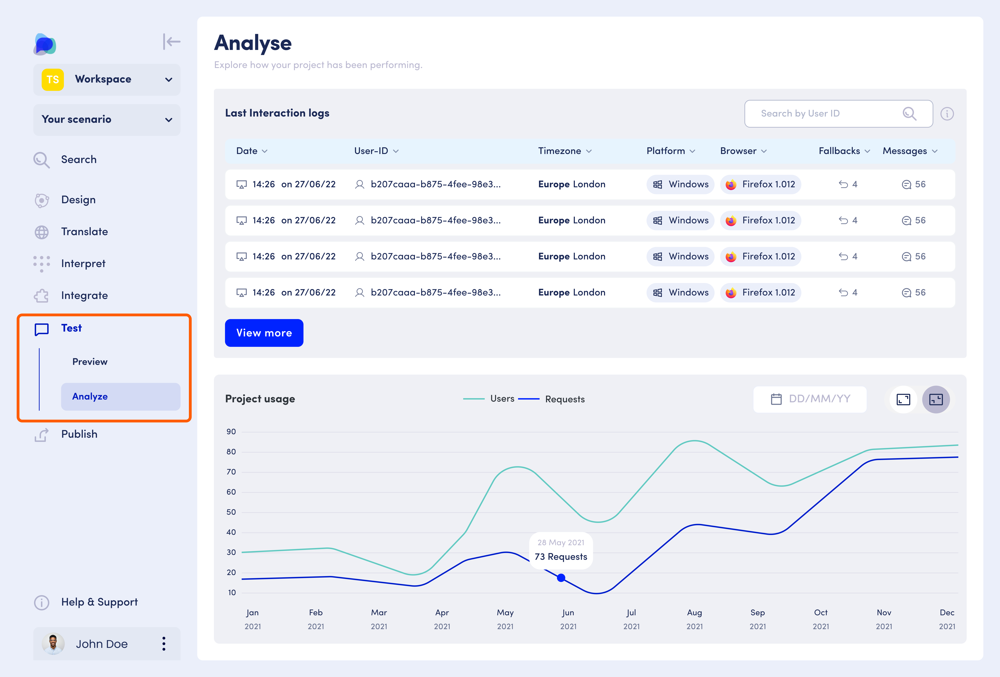
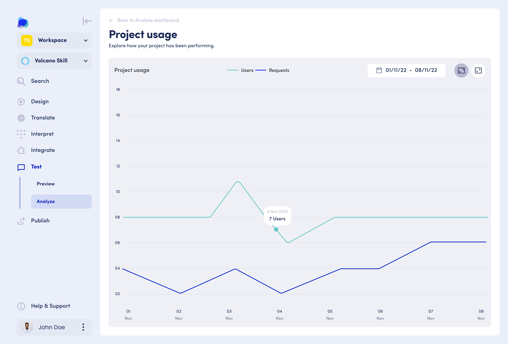
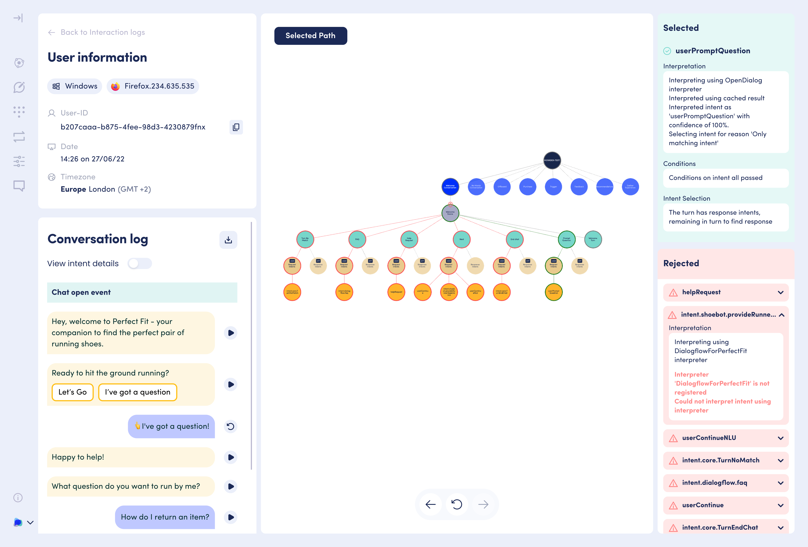

# Monitoring your application

This section outlines how to monitor how users interact with your conversational application and how to spot trends in project usage.

The OpenDialog Analyse dashboard gives you an overview of the latest interactions with your application and a bird-eye overview of project usage over time.

<figure><figcaption>
The OpenDialog Analyse dashboard gives you an overview of the latest interactions with your application and a bird-eye overview of project usage over time.
</figcaption></figure>

### **The basics**

Analyse lets you visualise your application's conversational data set, which you can use to improve your conversational application where needed.

It allows you to answer the following questions:

* How many conversations are happening by how many users?
* What is happening in the conversations?
* Which conversations had errors and where?
* What was the logic that led to specific conversational paths & errors?

Analyse provides you with a visualisation of the application's interaction logs, project usage over time, detailed conversational history per user, flow visualisation and dialogue management insights.

### **Analyse in action**

#### Actionable insights

Viewing specific conversations and their logic, you can make informed decisions and improve your application's user experience.

#### Application health

By viewing the number of fallbacks and filtering conversations based on them, you can check your application's health and identify improvement areas.

#### Diagnose & improve discovery

By viewing the number of users that started a conversation and the number of conversations per user, you can diagnose any discoverability & desirability issues and fix them.

#### Monitor ROI

By visualising usage trends, you can see the evident uptake or downturn in the number of users and expand or improve the application's use case accordingly.

### **Where to find**

Analyse allows you to explore how your application has been performing. It is, therefore, part of the testing suite of a given scenario.

To access the Analyse feature for a given scenario in your workspace:

Go to your workspace overview (Scenarios)

Select the scenario for which you would like to explore the performance

Use the left-hand menu and expand the Test section using the down-ward arrow

Select Analyse in the Test menu

<figure><figcaption>
You can find Analyse, in the Test section of your scenario menu.
</figcaption></figure>

### **Structure**

Analyse has two main components: Interaction logs and project usage.

The <mark style="color:purple;">**interaction logs**</mark> are listed and filtered by date, with the most recent ones appearing at the top. Each interaction log can be expanded for review of specific conversations.

The <mark style="color:purple;">**project usage**</mark> graph visualization shows both the number of users and the number of requests for any given date or range of dates. The project usage view can be expanded for a more focused and in-depth visualization.

### **How to use**


An introduction video on how to use OpenDialog's Analyse feature


#### Project usage

The project usage functionality allows you to visualize project usage trends over time.

<figure><figcaption>
Expanded view of project use over the course of a week
</figcaption></figure>

You can expand or minimize the project usage graph to your needs using the Expand/Collapse icons in the top right corner of your screen, depending on how focussed you wish the view to be.

Project usage can be viewed for a specific day, week, month or other selected date range via the date picker in the top right corner. This allows you to hone in on specific date ranges and check your conversational application's usage for that time.

This can be particularly useful, for example, if you have made specific changes to where your users can find your application, the call-to-action, or the conversational experience at a given time, and you wish to visualisze and communicate its impact on the number of users.

#### Interaction logs

The list of interaction logs allow you to visualize a list of conversations had by specific users, at a specific time and it's related data. Available data points per interaction log are `date & time` , `user-ID` , `timezone` , `platform` , `browser` , `number of fallbacks` in the conversation, and `number of messages` . Each of these can be used as filters for the interaction logs. We will specify the use of a few of them below.

In addition, you can use the date picker on the top of the screen to select conversations for a specific date range, or search the interaction log for a specific user-ID thanks to the user-ID search field in the top right corner.

<figure><figcaption>
List of interaction logs
</figcaption></figure>

<mark style="color:purple;">Date & time</mark> gives you an indication of the timestamps of users interacting with your application. Filtering by this field allows you to visualise the most recent conversations first or, on the other hand, the oldest conversations. In addition, the timestamp can help you identify a specific conversation for a user, in case you need to review it.

<mark style="color:purple;">User-ID</mark> indicates the user's unique user-ID which can help you identify a specific user. OpenDialog automatically generates a user-ID for each start of your application, if one is not provided. However, this user-ID can also be user-specific like user e-mails if your scenario is set up with this information.

You can also filter by <mark style="color:purple;">fallback</mark> to visualize which logs contain more fallbacks versus which ones did not. It will be interesting to dig further into those conversations with many fallbacks to identify areas of improvement for your conversational model or your language service.

The <mark style="color:purple;">number of messages</mark> will indicate how many exchanges a user had with your application or, on the contrary, how few. This can indicate users' engagement with your application and its capacity to retain users and help them accomplish their goals.

You can click through each item in the interaction log list to visualize its detailed conversation logs.

#### Detailed conversation logs

The detailed conversational logs for each item in the interaction logs are composed of four sections: the user details, the conversational log history, the conversational flow visualization and the conversational logic logs for each exchange between the application and the user.

<figure><figcaption>
Detailed conversation log, including user information, conversational history, conversational flow visualization, and conversational logic.
</figcaption></figure>

<mark style="color:purple;">**User information**</mark> gives you a quick summary of the interaction log item you are viewing. You also have the option to copy the User-ID from here to search for further interaction logs by this same user in the interaction logs list.

The <mark style="color:purple;">**conversation logs**</mark> contain the entire conversational history for this interaction log, tracking back all user and application exchanges. You can use the 'play' button to visualize the individual exchanges and their logic in the middle panel of the screen. You can also view the intent details for each message by using the 'View intent details' toggle at the top of the Conversation Log section. If you see any issues with the displayed message, you can thus click on the linked intent and go edit the selected message.

The considered <mark style="color:purple;">**conversational paths**</mark> are displayed in the middle panel for the selected user-application exchange. You can play through them via the Play button on the conversational logs or walk through them step by-step to review the conversation engine logic by using the arrows at the bottom of the screen. This helps you to understand what incoming and outgoing intents, and messages were selected by the conversation engine and why.

Finally, the right-hand panel displays the <mark style="color:purple;">**conversational logic**</mark> behind the selected conversational paths, displaying the available, selected and rejected intents and the in-depth reasoning behind each decision made by the conversation engine. This is particularly useful to debug conversations and, for example, to better understand why certain user utterances might have caused an unexpected answer. The detailed conversational logic contains information regarding the [interpretation](opendialog-platform/interpreters-and-natural-language-understanding/) of the intents via the interpreters set up for your scenario, the passing of  on conversational components, the reasoning behind intent selection, transitions between conversational components and what are attributes are being saved during that interaction.&#x20;

### **Frequently asked questions**

**I need more granular data. How can I access this information?**

If you need more granular data, you can contact us via support@opendialog.ai.

**I do not see the conversational flow visualization. Is this normal?**

Conversational flow visualization is currently unavailable for exceptionally large scenarios. We are working on alternative visualizations to cater for those as well.

**I want to access the analytics data via an API rather than the OpenDialog application. How can I do this?**

The [Interaction API](developing-with-opendialog/interaction-api.md) enables retrieving information about interactions between the user and OpenDialog scenarios. The data is requested for over a time period ( `from` , `to` ) and is split by `user_id` . You can check out the Interaction API documentation through this [link](developing-with-opendialog/interaction-api.md).

**I got a warning message for the conversational flow visualization indicating 'No Request ID provided'. What does this mean?**

This can happen if the event storage was not active or turned off when the user made a request. In the future, you should not encounter this any more as this is related to the roll-out of the Analyse feature.
