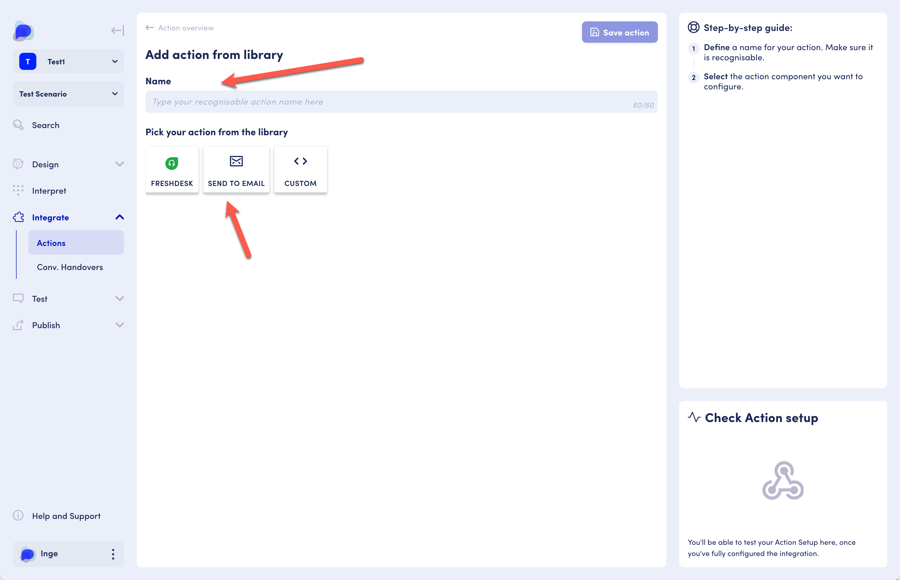
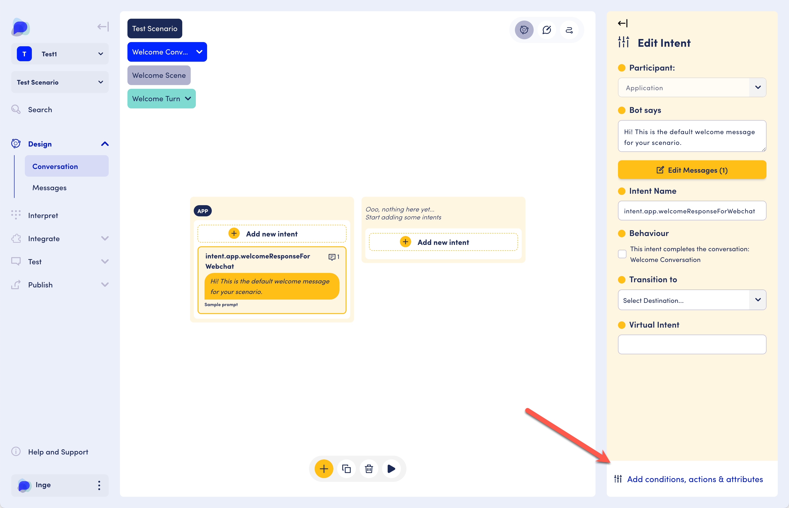

# Send to Email Action

### The basics

The "send to email" action lets you send an email containing static information and attribute values.  This is useful to notify a party that an interaction with the chatbot has occurred and to share the details.&#x20;

### What you'll need

All you need to set this up is an email address to send the email to. Note that the action only sends to a single email address. &#x20;

### Where to find

<figure><figcaption>
Select the action library to add pre-defined actions like the send to email action
</figcaption></figure>

To set up the send to email action for a given scenario in your workspace:

Go to your Workspace overview, select Manage Scenarios (Scenarios)

On the scenario overview, select the scenario for which you would like to add a send to email action.

Use the left-hand menu and click on the Integrate menu item.

Use the 'Add action from library' button.

### Structure

Once you click on "Add from action library", give the action a name of your choice.&#x20;

Select "Send to Email".

<figure><figcaption>
Send to email action
</figcaption></figure>

Add an email address, subject line and body.&#x20;

You can use attributes in your message. Do make sure these attributes have values, e.g. you can set attribute values in buttons, or attribute values may be passed on through integrations. For more on attributes and values, visit the [Contexts and attributes](../../../core-concepts/contexts-and-attributes/) section.&#x20;

<figure><figcaption>
Send to email details
</figcaption></figure>

Save the action.&#x20;

Activate the action.

<figure><figcaption>
Activate the action
</figcaption></figure>

### Using the action

In the designer, go to the intent that you want to action to be triggered from.&#x20;

Click on "Add .. actions, ..." at the bottom of the component pane.&#x20;

<figure><figcaption>
Add conditions, actions and attributes
</figcaption></figure>

Select the action from the dropdown.&#x20;

<figure><figcaption>
Select the action from the dropdown list
</figcaption></figure>

The action is now functional. Test it by using the preview. The email will be sent to the email address you specified.&#x20;
