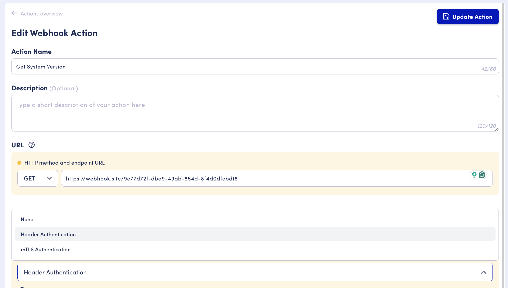
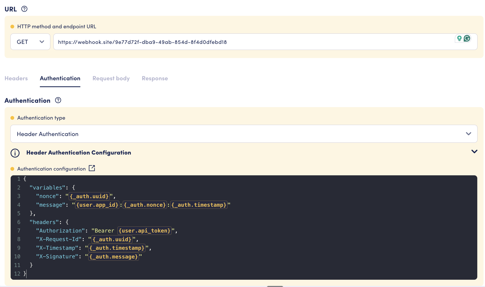
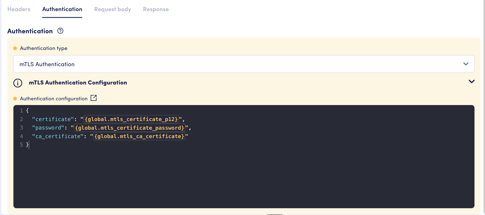

# Webhook action


This is the recommended way to call an external API with OpenDialog.


Webhook actions allows you to make calls to an external APIs via HTTP protocol.&#x20;

You can create new webhook action by visiting your scenario -> Integreate -> Actions -> Create webhook integration:

<div><figure><figcaption></figcaption></figure> <figure><figcaption></figcaption></figure></div>

## Configuring webhook action

### Overview

<figure><figcaption><p>New webhook page</p></figcaption></figure>

1. **Action Name**: Enter a descriptive action name.
2. **Description** (optional): Add contextual information to clarify the function and necessity of this action.
3. **HTTP Verb Selection**: Choose an HTTP method for the URL (GET, POST, PUT, DELETE, PATCH).
4. **URL**: Enter the complete URL, including the scheme, domain, path, and parameters.
5. **Headers**: Specify the headers to send with your request.
6. **Request Body**: Set up the request payload if required. Currently only `application/json` is supported (the `Content-Type: application/json` header is added automatically).
7. **Response**: Define how to process response payload. Only mapping for `application/json` responses is supported for now.
8. **Testing Panel**: You can test your webhook once the name, method, and URL are configured.

### Basic configuration

<figure><figcaption><p>Example of basic configurations of webhook action</p></figcaption></figure>

* **Name**
  * Required;
  * Up to 60 characetrs;
* **Description**
  * Optional;
  * Up to 120 characters;
* **HTTP Method**
  * Single-choice select with options GET, POST, PUT, DELETE, PATCH
* **URL**
  * Must be a valid URL to your API resource
  * It supports OD attribute syntax [like in messages](../../conversation-designer/message-design/using-attributes-in-messages.md) with context and filters. You can use it to parametrise host name, path segment or query parameters. Resulting value is automatically URL encoded. Fore example:\
    `https://yourapi.com/api/{api_version}/users?userId={user_id}`

### Headers configuration

<figure><figcaption><p>Example of headers configuration of webhook action</p></figcaption></figure>

Configure key-value pairs for your headers. Value field also supports the OD attribute syntax, allowing users to insert dynamically resolved data into the header value, offering powerful flexibility for authentication, correlation tracking, or transmitting system-specific metadata within the webhook call.

### Request configuration

<figure><figcaption><p>Example of payload configuration for webhook action </p></figcaption></figure>

Put a JSON payload which should be sent with your request.&#x20;

OD attribute syntax is supported, but you have to put them in double-quotes.



:white\_check\_mark: Do

```json
{
    "firstName": "{first_name}"
}
```





:x: Don't

```
{
    "firstName": {first_name}
}
```



Attribute types are preserved when the action is executing, so your number, boolean etc. attributes will be sent accordingly.

### Response configuration

<figure><figcaption><p>Example of response configuration for webhook action</p></figcaption></figure>

In the "Status and Response Mapping" section, configure how to store and map output from the webhook. Each mapping is grouped by status code categories:

* **1xx**: Status codes from 100 to 199;
* **2xx**: Status codes from 200 to 299;
* **3xx**: Status codes from 300 to 399;
* **4xx**: Status codes from 400 to 499;
* **5xx**: Status codes from 500 to 599.

Within each group, configure the following individually:

**action\_success**

Determines what constitutes a successful execution of your action. This sets the attribute `<action_name>_action_success`.

Value must be set to one of the following:

* `TRUE`
* `FALSE`
* JMESPath expression pointing to a boolean property from a JSON payload.

Default values:

* `TRUE` for groups 1xx, 2xx, 3xx;
* `FALSE` for groups 4xx, 5xx.


Note: Webhook actions will not automatically follow redirects in response to 3xx status codes.


**Output attribute mapping**

Under the `action_success` mapping, you can specify output attributes for your webhook action. These attributes are populated into the `user` context by default and can be accessed in your conversation design using the `{attribute_name}` or `{user.attribute_name}` syntax.&#x20;

For a simple use case, just put the property name from your response JSON next to the desired OD attribute name. To store a nested property, use dot notation (e.g., `user.profile.name`).&#x20;

For more complex mapping and response transformations, use [JMESPath](using-jmespath-expressions.md).

**Store raw response**

You can store the whole response as a string by toggling "Store raw response" and selecting a string attribute to contain this value.

### Authentication configuration

<figure><figcaption><p>Select an authentication type in the Authentication tab</p></figcaption></figure>

The **Authentication** tab lets you secure outgoing webhook requests. OpenDialog supports two authentication types: **Header Authentication** and **mTLS (mutual TLS)**.

Authentication runs after the request is fully prepared, which means auth headers can reference outgoing request data — such as the URL or body — via the [`_webhook` context](../../../core-concepts/contexts-and-attributes/contexts.md#_webhook). See the [`_auth` context](../../../core-concepts/contexts-and-attributes/contexts.md#_auth) for the full list of auto-provided values and variable chaining options.

#### Header Authentication

Header Authentication lets you add one or more headers to the outgoing request, with values resolved at runtime using the full OpenDialog attribute syntax. It also supports defining intermediate **variables** — values computed from other attributes or `_auth` variables — which can then be referenced in header values.

<figure><figcaption><p>Configuring Header Authentication with variables and headers</p></figcaption></figure>

The configuration is provided as JSON with two fields:

- **`variables`** (optional) — a map of variable name to template string. Variables are resolved lazily and can reference any context attribute or other `_auth` variables.
- **`headers`** (required) — a map of header name to template string. Each value is resolved using the same attribute syntax as messages and URLs.

The following values are automatically available in every Header Authentication execution without any configuration:

| Variable | Description |
| -------- | ----------- |
| `{_auth.uuid}` | A unique UUID v4 generated for this request |
| `{_auth.timestamp}` | Current Unix timestamp in seconds |
| `{_auth.timestamp_micro}` | Current Unix timestamp with microsecond precision |

**Example configuration:**

```json
{
    "variables": {
        "nonce": "{_auth.uuid}",
        "message": "{user.app_id}:{_auth.nonce}:{_auth.timestamp}"
    },
    "headers": {
        "Authorization": "Bearer {user.api_token}",
        "X-Request-Id": "{_auth.uuid}",
        "X-Timestamp": "{_auth.timestamp}",
        "X-Signature": "{_auth.message}"
    }
}
```

In this example, `message` is built from `app_id`, the request nonce, and the timestamp — all resolved at the point authentication runs. The `X-Signature` header then references that computed value.


You can reference the outgoing request data in your variables and headers using the `_webhook` context. For example, `{_webhook.body}` gives you the request body as it will be sent — useful for building signatures that cover the payload.



Note - Circular references between variables will cause authentication to fail. For example, if `var_a` references `{_auth.var_b}` and `var_b` references `{_auth.var_a}`, the request will not be sent.


#### mTLS Authentication

mTLS (mutual TLS) authenticates the webhook request using a client certificate, establishing two-way trust between OpenDialog and your API. You'll need a P12 (.p12 / .pfx) certificate and its password.

<figure><figcaption><p>Configuring mTLS Authentication with a certificate from the global context</p></figcaption></figure>

The configuration is provided as JSON with three fields:

- **`certificate`** (required) — the base64-encoded P12 certificate content, or an attribute reference such as `{global.my_certificate}`
- **`password`** (required) — the certificate password, or an attribute reference
- **`ca_certificate`** (optional) — a base64-encoded CA bundle for server verification, or an attribute reference. If omitted, standard system CA verification is used.


We recommend storing certificate content and passwords in the [Global Context](../../../core-concepts/contexts-and-attributes/contexts.md#global) rather than pasting them directly into the configuration. This keeps sensitive values out of the action config and makes them easier to rotate.


**Example configuration:**

```json
{
    "certificate": "{global.mtls_certificate_p12}",
    "password": "{global.mtls_certificate_password}",
    "ca_certificate": "{global.mtls_ca_certificate}"
}
```

To prepare your certificate:


**Convert your P12 certificate to base64:**

On macOS / Linux, run:

```bash
base64 -i your-certificate.p12
```

Copy the output and store it as a Global Context attribute named `mtls_certificate_p12`.


### Testing your webhook

<figure><figcaption><p>Use testing panel on the left to run a test for your webhook</p></figcaption></figure>

Once you fill in your action name, URL, and HTTP method, the testing panel will become available, allowing you to run a test execution of your action.

**Inputs block**

<figure><figcaption></figcaption></figure>

Any input attributes in the URL, headers, and request body sections will become available to fill in. These temporary values will be used during your tests.

**Outputs & Attributes block**

<figure><figcaption></figcaption></figure>

You can see if your action worked as expected in the Outputs section. A green check will indicate if the action was executed successfully, and the response status code will be displayed next to it. In the Attributes section, you will see three default output attributes plus any output attributes you've defined in the "Response" tab:

* `<action_name>_action_success`: A true/false value indicating whether your action was successful or not. You can customise this value in the "Response" tab for each status code group.
* `action_success`: Same as above; this is a reusable default attribute which will be overridden by the next action you have in your actions pipeline.
* `<action_name>_status_code`: An integer value with the HTTP response status code.

**Response block**

<div><figure><figcaption></figcaption></figure> <figure><figcaption></figcaption></figure></div>

Use this section to view detailed information about your response, including exact values of your headers, URL, and body that were sent. Additionally, it shows the response headers and raw response body received by the webhook.

Use the pop-out icon next to the "Response" section to view this in a full-page modal for more convenience.

## Using your webhook in conversation

Once you've saved your webhook action, it will appear on the "Actions" page. For convenience, a small chip with the HTTP method will be displayed in the bottom-left corner of the action card. Legacy webhook actions will be displayed with the subtitle "Legacy Webhook Action" and can be used as usual.

<figure><figcaption></figcaption></figure>

Attach your webhook action as usual to an intent in the conversation designer.

<figure><figcaption></figcaption></figure>

When the conversation reaches this intent, all your defined actions will be executed.


