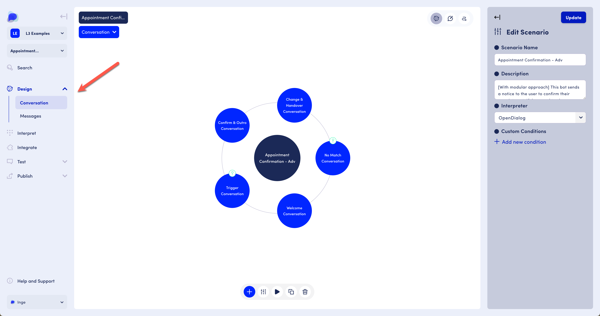
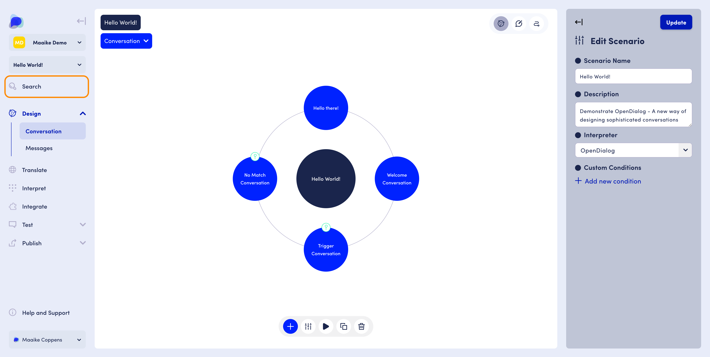
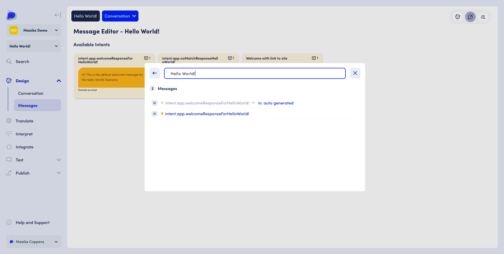

# Conversation Design

The Design functionality includes the Conversation designer and Messages editor.&#x20;

When you click on a scenario in the scenario list in your workspace (as shown in the previous page), the scenario opens by default in the Conversation Design tab.&#x20;

<figure><figcaption>
Conversation Designer interface
</figcaption></figure>

Conversation designers spend a lot of their time in the Conversation Designer putting the conversation structure in place.&#x20;

The Conversation Design interface includes 3 panes with a number of controls and access to platform functionality in the sidebar:

<figure><figcaption>
Details of the Conversation Designer interface
</figcaption></figure>

Conversation Designers can use OpenDialog Search to find an intent, a message, or a group of messages that contain the exact phrases or words they are looking to edit.

You can access the 'Search' functionality in the main scenario menu, which searches for content throughout Intents and Messages.&#x20;

<figure><figcaption>
Search across Intents and Messages using the search functionality in the main scenario menu
</figcaption></figure>

 

<figure><figcaption>
Type a query in the search bar and get an immediate list of the conversational components you can click on to edit
</figcaption></figure>

Building the structure for an assistant is similar to information architecture in the field of UX: there are a number of ways to structure the information, and some may work better than others.&#x20;

To help out with some commonly used structures, which are often referred to as "patterns" or "design patterns" we provide a catalog of OpenDialog patterns, including a pattern for help, no match, FAQ, etc. These patterns are described in more detail in the next pages.&#x20;
