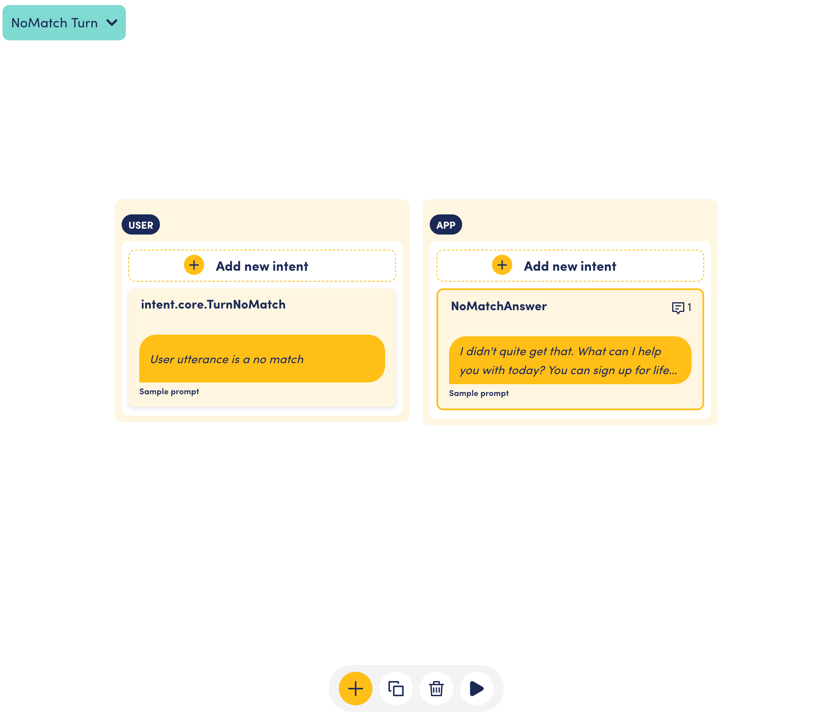

# Contextual and Global No Match

### What the contextual no match is used for

This pattern helps us deal with situations where the assistant did not understand the user input, and couldn't move the conversation forward because of this breakdown.&#x20;

The goal for any no match interaction is to (a) inform the user that the system did not capture the user's intent, (b) possibly provide some information that may be helpful to the user, and (c) provide a prompt or ask a question to help get the user back on track.&#x20;

An example:&#x20;

`...`

`Assistant: How long do you want to get the life insurance for?`&#x20;

`User: Well, my sister lives with us and I don't know for how long.`&#x20;

`Assistant: I didn't quite get that. 20-year and 30-year term life insurance policies are the most popular on the market. How long would you like your life insurance to be for?`&#x20;

`User: Let's go with 20 years.` &#x20;

`...`

&#x20;In this example, the assistant (a) informed the user that they had trouble understanding what the user meant ("I didn't quite get that"), the assistant (b) then provided some information that users commonly ask for at this point in the conversation ("20-year and 30-year..."), and then asked the original question again ("How long would you like...". &#x20;

### Implementation

The conversation engine is built to accommodate no match where we define it, e.g. at the turn, scene, conversation or global level. When a user intent can not be matched to any turn in a scene, the conversation engine looks for a turn with the intent.core.TurnNoMatch intent. If this intent is not defined in any turn within a scene, the engine will look for a scene with an intent.core.SceneNoMatch intent. If this intent is not defined, the engine looks for a conversation with an intent.core.ConversationNoMatch intent. And if this intent is not defined, the engine will look for a global intent.core.NoMatch intent as a last resort. This global intent is defined by default in the custom template provided in the platform when creating a new scenario and is shown in the screenshot below.&#x20;

<figure><figcaption>
Global no match turn with intents from custom template
</figcaption></figure>

This no match mechanism is a key feature that allows us to build robust conversations with the OpenDialog platform.&#x20;

In practice, the most common places in a scenario where you would define no matches are at the turn level, as in the example above and at the global level as a last resort catch-all. &#x20;

The screenshot below shows an example of a no match turn in a scene.&#x20;

.png>)

Per the screenshot below, within a no match turn, the user intent captures the user utterance and the app intent provides information and a way to continue the conversation.&#x20;

<figure><figcaption>
Intents in no match turn
</figcaption></figure>
