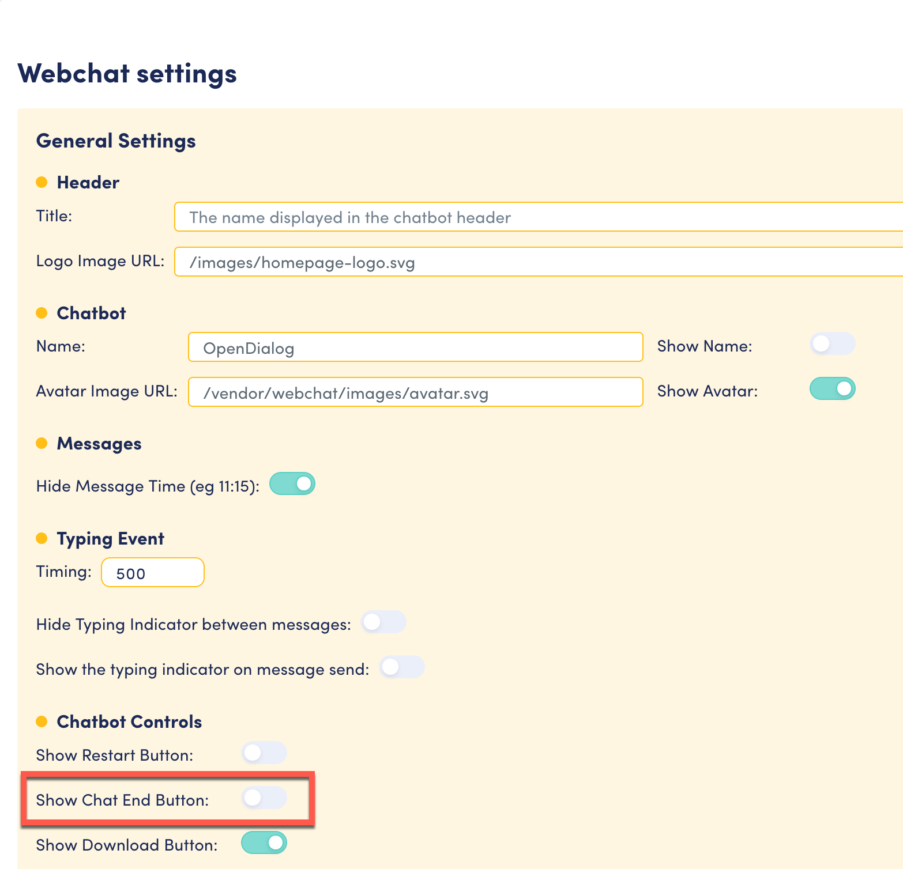

# End chat

This functionality is not activated by default; it must be activated in the Interface Settings page:

<figure><figcaption>
End chat toggle in interface settings
</figcaption></figure>

<figure><figcaption>
End chat link in user interface
</figcaption></figure>

Clicking on the **End Chat** button generates an intent to end the chat. Similar to no match and restart, the conversation engine will look for an intent.core.TurnEndChat intent in a turn in the current scene. If no intent is found, the engine will look for an intent.core.SceneEndChat intent in the conversation, and if no intent is found, the engine will look for an intent.core.ConversationEndChat.&#x20;

If none of these are found, the global intent.core.endChat is executed.&#x20;


Note the End Chat is not handled out of the box; you will need to set this up in your scenario.&#x20;


