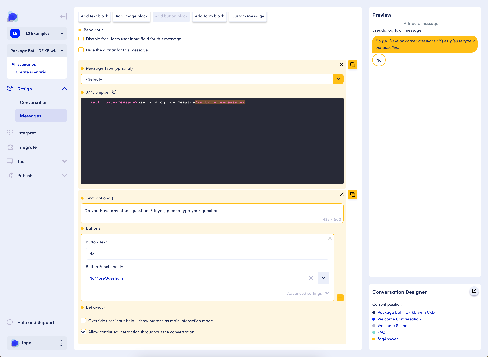

# Contextual FAQ

For a video-based example please refer to the OD Academy Core Concepts course, module 3 lesson 4. If you need access to the course, please email academy@opendialog.ai.&#x20;

### What it is used for

The contextual FAQ pattern allows the user to ask questions that are relevant to the task they are completing. For instance, image the following conversation as a user signs up for a life insurance policy:

`...`&#x20;

`Assistant: Great! I'll ask you some questions to set you up with the policy that best fits your needs. [...]`

`Assistant: How long would you like your life insurance for?`&#x20;

`User: I'm not sure. What do most people go for?`&#x20;

`Assistant: 20-year and 30-year term life insurance policies are the most popular on the market. The amount of time you need depends on the financial obligations your family would face in the event of your death.`

`What term would you like to go for?`&#x20;

`User: 20 years`&#x20;

`Assistant: Ok. Let's move on to ...`&#x20;

In the example above, the user does not answer the policy duration question. Instead, they ask a question of their own and the assistant (FAQ) provides an answer. Once the assistant has answered the question, the assistant asks the user the original question again, e.g. What term would you like to go for. This is called re-prompting.&#x20;

_Note that in a real scenario we could e.g. offer the user a calculator to better help them answer their question. We've simplified the interaction for the sake of the example._&#x20;

### Implementation

_Note: as an example, the screenshots in this section illustrate adding an FAQ turn to the welcome scene so that FAQ is available within that scene. You need to add FAQ turns **to each scene in which you want the FAQ to be available.**_&#x20;

We add an FAQ turn to the scene:

<figure><figcaption>
Package Bot FAQ Welcome Scene
</figcaption></figure>

The FAQ turn consists of a user intent to capture the user's question and an app intent that shares the FAQ answer with the user and contains the re-prompt.

<figure><figcaption></figcaption></figure>

Depending on the NLU service provider, the name of the intents may be predetermined. For instance, when using DialogFlow KB, the user intent name is "intent.dialoflow.faq".

The app intent must contain a specific reference. This reference is also dependent on the NLU service provider that is used. Again using Dialogflow KB as an example, the app intent needs a custom message with XML that indicates the attribute-message with value "user.dialogflow\_message" as shown in the screenshot below.&#x20;

The screenshot below shows and example of a reprompt ("Do you have any other questions..."). The reprompt helps to move the conversation forward and can be designed to fit your needs. In this case, the system asks whether the user wants to ask another question. An alternative could be to ask the original system question again.&#x20;

<figure><figcaption>
Screenshot showing XML for DialogFlow KB
</figcaption></figure>

### A single FAQ or multiple FAQs?

Since the contextual FAQ pattern is added to each scene where the user may have questions, it is possible to create separate FAQs for each instance. For instance, an FAQ for questions specific to the policy (used in a policy scene), another FAQ for questions about the terminology used in the medical section of the insurance policy quote journey (used in the medical questions scene), etc... But it is also possible to keep all FAQs for the entire scenario in a single FAQ knowledge base and use that throughout all scenes.&#x20;

There is no clear right or wrong way to choose between a single FAQ or multiple FAQs. In general, it is easier to use a single FAQ throughout, as it only requires setting up a single interpreter for instance and hence there is no need to keep track of the names of multiple interpreters, and which FAQ covers what types of questions.&#x20;

### Conclusion

The contextual FAQ pattern allows users to ask questions about the task they are completing. We refer to it as "contextual" because the user can ask a question within the context of what they are currently doing; they do not need to go look for answers somewhere else, but can get those answers within the conversation they have with the assistant.&#x20;

### Additional information

For information on intent names and XML to use for different NLU service providers, please consult the reference information on [interpreters](../../../../interpreters-and-natural-language-understanding/). For instance, creating and linking a external knowledge base can be found in the [Google Dialogflow Knowledge Base](../../../../interpreters-and-natural-language-understanding/interpreters/available-interpreters/dialogflow-interpreter/google-dialogflow-knowledge-base.md) page.


In this section we've described the conversational flow for the FAQ pattern. To make this pattern operational in your assistant, the FAQ needs to be set up in the NLU service provider's environment and the NLU interpreter needs to be set up in the OpenDialog platform.  &#x20;


