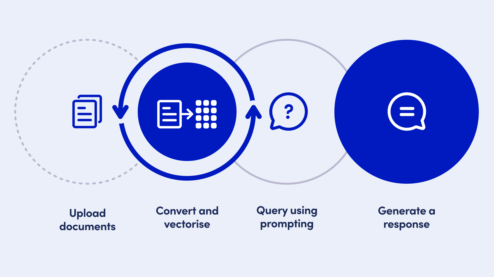
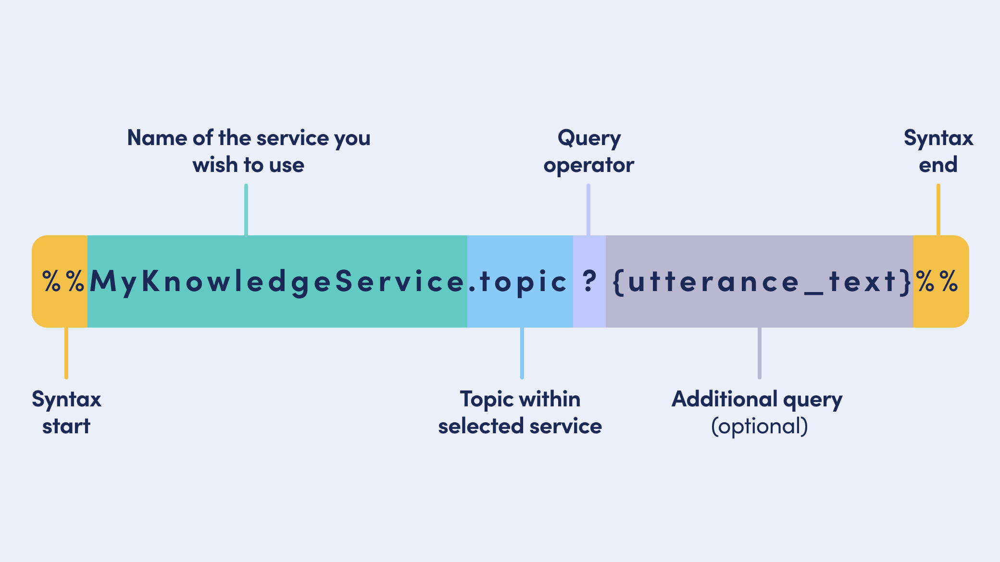
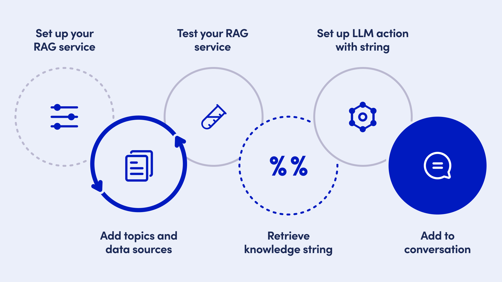

# Openings

&#x20;Conversation openings are a standard way of starting a conversation.

This section and the next pages describe the parts of an opening and examples of openings. In the OpenDialog platform, the opening is implemented in the Welcome conversation.

## **Openings are important**

Every aspect of conversation design is important and the overall goal is to provide an engaging and intuitive user experience.

The opening however, is particularly important for a number of reasons:

* User's familiarity with the virtual assistant as a channel to communicate with a brand. Many users have used chatbots in the past; according to [one source](https://www.tidio.com/blog/chatbot-statistics/) 88% of respondents had at least one conversation with a chatbot in 2022. While that is encouraging, it doesn't mean that all users are familiar enough with assistants to feel entirely comfortable with them. Think about how comfortable many users now are with websites and mobile apps. That wasn't always the case however. Most users are only just starting to become comfortable with virtual assistants
* User's perception of virtual assistants and willingness to use them has been improving. (need reference). However, many users have had poor experiences with conversational assistants and may be hesitant to use them, instead favoring other channels
* The opening is the start of the conversation, and sets the tone for the interaction. As such, there is a lot of focus on getting this part right. There is a visual aspect to text-based interactions that matters, but the language and dialogue itself are critical, along with the personality and tone

A user's first impression goes a long way towards their continued use.

## **Transactional versus relational mode**

When someone is in a **transactional mode**, they are motivated to get to the actual transactional need quickly. As a result, they may skip parts of a common opening sequence to jump right into the first topic.

Here is an example of a bot in transactional mode:

`< user launches bot on a retail website >`

`Bot`` `_`: Welcome! Here's what I can help you with: order status, store hours, and a shopping assistant.`_

In this example, the conversation opens with a short greeting, and the assistant then jumps straight to offering help, i.e. the transactional need.

For contrast, some bots (and people in general) prioritize relational work in openings, operating in a **relational mode**. Here is an example of a bot in relational mode, taken from the mental health app Woebot:

`< user launches bot in the mental health app Woebot >`

_`Bot: Hi, I’m Woebot`_` ``What should I call you?`

`User: Joseph`

_`Bot: I’m excited to get to know you, Joseph!`_

_`Bot: While you might not be feeling your best lately…`_

_`Bot: I wanted you to know I have the tools to help you feel better. We can work on this together.`_

Here, the conversation opens with a greeting (“Hi”), a self-identification (“I’m Woebot”), a wave (“ “), and a name request (“What should I call you?”). After giving a name (“Joseph”), the bot expresses enthusiasm for building the relationship, empathy for the user’s emotional state, background on the bot’s abilities (“tools to help you feel better”), and an emphasis on the collaborative nature of the work (“We can work on this together”). Woebot is doing conversational work to establish a relationship between the user and the character.

This relationship is central to the mission of Woebot, using mental health tools in the context of a therapeutic relationship to improve the user’s well-being. This conversation opening in relational mode reflects much of what happens in human-human conversation openings. Identification of the participants in the conversation is common in openings, saying who each person is, including their name, role, affiliation or more.

In short, relational mode is the full conversational experience; transactional mode is an expedited form that skips some of the relational work to jump straight to the task.

**Considerations for openings**

To understand conversation openings then, it’s key to determine to what extent they need to be included, if at all. If the context suggests a transactional mode, the opening can be greatly reduced, or (perhaps) skipped. Skipping the opening is a way of establishing transactional mode (p457, [Dempsey](https://crl.acrl.org/index.php/crl/article/view/16525), “Are You a Computer?”). Behaving this way could be seen as rude or as efficient, depending on circumstances. It generally suggests that you don’t expect to see each other again. Such a transactional interaction is a way of avoiding a full conversation.

A conversation partner may respond to a transaction bid by accepting the transactional mode and simply answering the transaction request. On the other hand, you may want to shift the mode to a relational one, redefining the relationship. This can be done by adding in more opening items, or by being more verbose in the opening items. A transactional bot may choose to add more relational components. However, one must consider the audience and their appetite for a possible switch; as much as a purely transactional approach may seem rude, a switch to a relational approach may seem cumbersome and as getting in the way of completing the task. It is important to get user feedback on the opening prompt to maintain the balance between a transitional versus a relational approach. This will be different for each assistant, task, and brand.

Transactional versus relational mode sounds like a binary, but it’s actually more of a continuum. The more relational work you do in an opening, the more you are in relational mode. Do you have greetings, identifications, background and footing, and how-are-you’s? More relational. Do you have a greeting only? Less relational. Do you start with the first topic, the reason-for-the-call? Least relational, i.e. transactional.

## **User-initiated versus assistant-initiated**

Conversations could be triggered by either a user action or by the bot itself. If a user launches a web page, they may not be aware there is a bot waiting for them. In this case, the bot may initiate the conversation by launching a chat window. Bot-initiated conversations could also come from notifications or contextual triggers (e.g. “it’s time to do your daily check-in”). In many cases, however, the user will be the one initiating the conversation. In this case, the user could start with relational moves like greetings (“Hi!”), well-wishing, and so on. The user may also jump straight to the transactional need, much like talking to Alexa or Google Assistant to e.g. set an alarm. No need to say hello, just say “Alexa, set an alarm for 6pm”.

If the user starts in relational mode, using greetings and identifications, the bot can match that. If the user starts in transactional mode, e.g. asking “what’s my account number”, the bot can simply complete the transaction, e.g. answering the questions.

### **User info: new versus returning versus frequent (and beyond)**

Conversation openings also vary depending on the history between the user and the bot. A conversation is likely to open differently if it is the first time the user has ever talked to the bot (a new user) versus if the user has talked to the bot before (a returning user). At a simple level, the conversation opening can make reference to the shared context, e.g. the user’s name, previous activities, user preferences, and more. For example, it can be useful to

follow up with the user about a previous interaction, or welcome them back. The contextual intelligence (how long it’s been since they last talked) can help build the relationship and establish the bot’s credibility.

A simple contrast between new and returning users still glosses over a huge amount of variation in how the conversation might open (cf. Maaike Coppens). A returning user that talked to the bot once before has different conversational expectations than a returning user who has been talking to the bot daily for months. The depth of context between bot and user affects the opening, and that depth can grow along a continuum of complexity.

There may be a lot of variation in how much you know about individual users. Some users may be pretty unknown, while you may have a lot of information about others. This user information could come from a long user history (i.e. a returning user), but it also could be supplied via an API, from a separate registration process, from contextual information like geolocation, and more. You may know a lot about a new user because the info is passed along, and you may know little about a returning user because the data isn’t saved! That said, having a user’s name, their preferences, their purchase history, their conversational style, and more can all affect how to open a conversation.

## **The end of the opening**

The end of the opening occurs when the conversation moves on to the first topic. In telephone conversations, this is called the reason-for-the-call, the time when the participants get down to business. Shifting from preliminaries to the first topic is the marker that the conversation has moved from the opening to the body of the conversation.

**Examples of transactional openings for text-based assistants (Inge added this WIP)**

The linguistic analysis in the previous pages suggests a number of aspects for an opening. On this page, we will take that information as input, craft a list specific to virtual assistants, and more specifically focus on transactional openings.

Typical items in an opening are:

1\. **Greeting,** e.g. "Hello", "Welcome"

2\. **Self-identification,** the assistant introduces themselves, e.g. "I am Leo, your Lowe's automated assistant."

3\. **What the assistant can do** for the user, e.g. "Here's what I can help you with". The options appear as buttons. In general, it is advisable to provide a list of items the assistant can help with rather than providing an open-ended "How may I help you" which may lead to user responses that the assistant is not equipped to handle

4\. **Instructions on how to interact** with the assistant, e.g. "Type "menu" if you need to start over."

5\. **Consent**, if applicable, such as consent to a Privacy Statement, Terms of Use or consent to use personal information, e.g. in health care

6\. **Authentication**, if applicable, to determine whether a user is a returning or new user. This can be used early in the greeting to determine which options to display. If the options remain the same, it is recommended to authenticate only when needed in order to reduce the barrier of entry

7\. **Personalization**, if access to this information is available, use of the user's first name in the greeting, e.g. "Hello, Avery"

8\. **Relevant prior information** for known or returning/authenticated users. E.g. an appointment confirmation assistant informs the user of the appointment in question as part of justifying why the assistant is contacting the user (e.g. through SMS). E.g. when a returning user engages with an assistant, the assistant may take the opportunity to suggest relevant information (example Bank of America's Erica below)

This list above is a great starting point. Items 5 through 8 come with certain conditions and the exact items to include in the greeting will depend on the specific context in which the assistant is used.

Consider an assistant on a website support page. That assistant may have been introduced elsewhere on the page, something like "Use the virtual assistant to get quick answers to your questions". The context is the support page, so the topics the assistant handles are support type topics. The "quick answers to your questions" bit may even imply that this is an alternative to searching the support knowledge base. Given this context, the opening in the assistant itself can be reduced quite a bit. At a minimum, the opening explains what the assistant can do. Even though the context on what the assistant can help with has been set, it is always a good practice to list the most common types of requests as options. The greeting will likely be added as well; it's a short item and it's quite natural to greet a user, especially since the assistant is another channel the user is switching to. A greeting helps with that transition.

In situations where authentication is possible, consider creating a more elaborate opening for new users, and a most concise one for returning users, assuming that returning users access the assistant on a regular basis, and have built up familiarity with the assistant and options.

On this page we focus on the types of items in an opening. We are not focusing on the wording of the items, but the personality and tone (described in the Best Practices section) influence what words are used, and influence the verbosity or brevity of the actual prompts.

**Examples**

Lowe's is a home improvement store. The automated assistant opening contains the majority of items in the list. Authentication is not necessary yet; the assistant can help with a number of actions that don't need customer authentication. Once a customer is authenticated, presumably after selecting "My Orders", personalization can be applied as well.

Numbers refer to the numbered list above.

Lowes.com

Okta's OktaBot uses a more transactional style. The bot greets the user. The self-identification is more implicit in the header and above the prompt. The bot goes straight into authentication to then show the relevant options.

 

Erica is the assistant for Bank of America. Erica is integrated in the mobile app, and has been featured for a number of years, so the need for self-identification is less of a priority.

Erica greats the user, and since the assistant is integrated in the app, access to the first name is available for personalization.

Next Erica actually shows "new insights": a list of things that may interest me as a user, before showing the options 

**More examples**

.png>)

Variants of a generic example with a greeting and options:

A: Hello! How may I help you? \[show 2 - 5 buttons with most commonly requested topics]

A: Welcome! Here’s what I can do for you. \[show 2 - 5 buttons with most commonly requested topics]

A generic example that explicitly suggests the option to type in other requests:

A: Welcome! What can we help you with today? For something else, please type in the space below. \[show 2 - 5 buttons with most commonly requested topics]

Examples with user authentication that allows a level of personalization:

A: Welcome back, {user.first\_name}! How can I help you today? \[Order Status], … other options Because the user is authenticated we provide options specific to authenticated users first.

One step further: A: Welcome back, {user.first\_name}! Are you contacting us about your open order or something else? \[My open order] \[common option 1] \[common option 2], …

Example with reason for contacting the user embedded in opening:

A: Good afternoon, {user.first\_name}. I am Avery, the Car Service shop assistant. You have an appointment for an oil change scheduled for the day of tomorrow, Friday 14 May at 8 AM. \[Confirm] \[I need to change this]

**Additional Information**

**Resources and Links**

Academic literature

Sequencing in Conversational Openings

Constructing reason-for-the-call turns in everyday telephone conversation

Interactional prosody: High onsets in reason-for-the-call turns

Librarian chat openings

Telephone Calls: Unity and Diversity in Conversational Structure Across Languages and Cultures https://josephctylerwords.medium.com/

**Research Highlights**

Openings are likely to vary by culture, with participants in different countries having different norms. For example, in one country it may be common to skip greetings and in another callers may ask for the identity of the answerer. This could be a result of things as simple as the reliability of the phone system or whether or not people have caller-ID. The familiarity of the participants may also affect the length of the opening sequence. found

One study

that relative strangers had longer openings, while close connections used greetings and how-are-you sequences but skipped other parts.

The conversation channel can also affect openings. If the channel makes clear who the participants are (with perhaps a linked profile), then the identification/recognition portion may be skipped.

The opening pattern above has been described for “normal” conversation. Institutional forms of talk can look different, where interviews, for example, tend to start with extended preliminary talk (Heritage 2002). This extended monologue may be more for third parties than the interactants themselves. Interviews often open with the host stating the state of affairs, sharing a headline, which sets the context for the following discussion. Interviews tend to skip greetings or how-are-you’s, though they do include identifications. Interviews are structured ahead of time for the benefit of a media audience, while conversation is dynamically created in the moment. Like interviews, sometimes bots start with an extended monologue, sharing legal disclaimers, disclosing capabilities, or other context-setting. If this context is for the user’s benefit, i.e. it provides relevant background info, it makes sense to include it. But be careful, since these preliminaries can add friction to actually starting the interaction.
