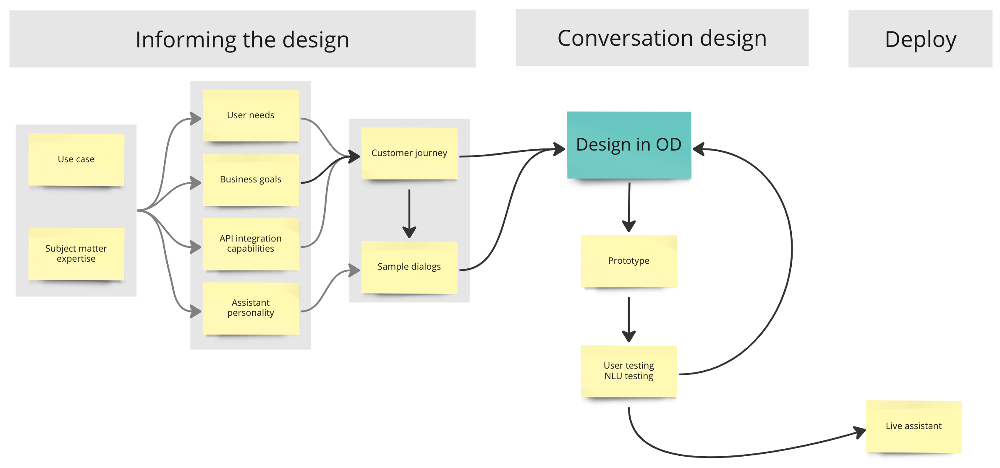

# Best practices&#x20;

Creating great conversational experiences is critical to the success of the conversational assistant and the brand. Surveys provide us with insights that drive this point home:

> 73% of survey respondents reported they would not use a bot again after a bad experience.\*

And&#x20;

> 64% would switch to a competitor after just one bad experience.\*\*

To create great conversational experiences we need to be informed before we start designing. The term "informed design" was coined in the area of education and "enables students to enhance their own related knowledge and skill base before attempting to suggest design solutions.\*\*\*"&#x20;

Similarly, in conversation design, we enhance our knowledge and skill base before we start designing. We require an understanding of the use case, the subject matter, the business goals and how success will be measured. We need insights into the user's needs, wants and expectations. And we need to define the personality and tone for the assistant. &#x20;

Armed with all this knowledge, we can then create the journey and sample dialogs for the assistant, and implement this in the OpenDialog platform.&#x20;

And once a prototype is created, we can test it, get user feedback, and improve the experience.&#x20;

Following this process ensures that the conversational experience is engaging and useful. Because, remember, any poor experience  a user has with an assistant will have a negative impact.&#x20;

We will review each step of the process in detail in the next pages. &#x20;

<figure><figcaption></figcaption></figure>

## Role of LLMs

Large language models can play a useful role in building conversational experiences but they are not the end-all-be-all.&#x20;

Depending on the type of activity, LLMs can play a certain role in the work of the conversation designer and the teams. Some roles we will be referring to in this section:&#x20;

* Brainstorming partner (term used by OpenAI CEO):&#x20;
* get ideas about how users expect to use a certain product or service. What may be important to users, etc. This is not&#x20;
* Tutor: educate on subject matter expertise, e.g. requirements in regulated industries that influence the user experience (possibilities)
* Co-designer:&#x20;
  * dialog composer
  * sample dialog generation
  * sample utterance generation
  * generate ideas for user or stakeholder interview questions (research design)
* Analysis:&#x20;
  * competitive feature analysis&#x20;
* Summarizer:
  * summarize lengthy knowledge base answers for a better experience in the chatbot channel (shorter answers are preferred)

## References

\*[https://medium.com/salesforce-ux/conversation-design-is-the-future-of-ux-8e52f4793cfc](https://medium.com/salesforce-ux/conversation-design-is-the-future-of-ux-8e52f4793cfc)

\*\*[https://aws.amazon.com/blogs/apn/what-do-consumers-really-think-of-automated-customer-service/](https://aws.amazon.com/blogs/apn/what-do-consumers-really-think-of-automated-customer-service/)

\*\*\*[https://www.hofstra.edu/PDF/Tec\_Informed\_Design\_Tech\_Teacher.pdf](https://www.hofstra.edu/PDF/Tec\_Informed\_Design\_Tech\_Teacher.pdf)

