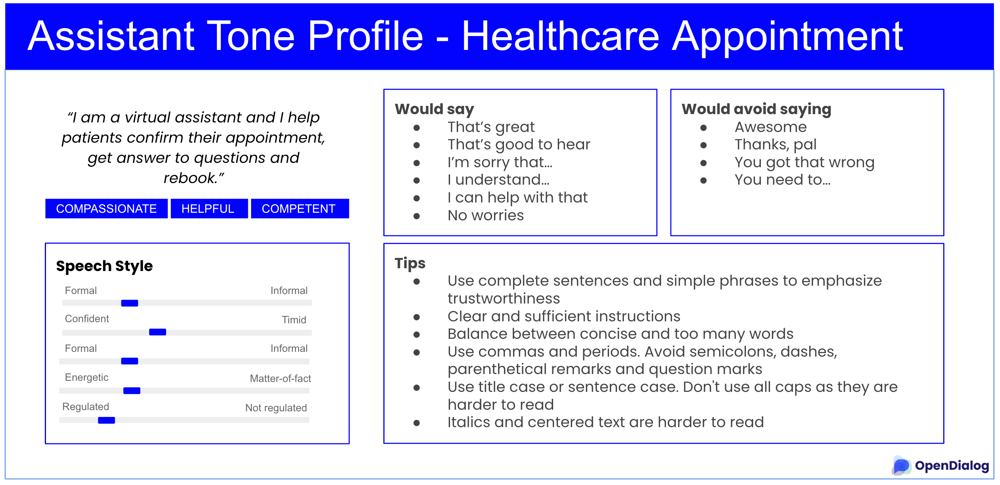

# Assistant personality

## What

The language and tone used by the assistant uses exhibit a personality that we can attribute to the assistant. It has been established that personality and tone are critical in establishing trust with users and communicating in an engaging manner. As a result, it is important to carefully craft the assistant's personality and tone   This personality needs to represent the brand accurately and cater to the target audience as the personality and tone of the assistant are critical in establishing trust with users and communicating in an engaging manner.&#x20;

“Personality” refers to the set of characteristics that your assistant exhibits. These characteristics need to be in line with your brand, the tasks the assistant undertakes with the user and your users’ needs. For instance, an assistant's personality could be described as "playful, insightful and surprising".

“Tone” is the way in which the assistant speaks to a user. We use the dimensions of tone to define the characteristics of the personality. The tone for the personality in the example above can be defined as casual, enthusiastic and energetic. A casual tone uses contractions such as “it’s” rather than the more formal “it is”. An enthusiastic and energetic tone spurs the user on, e.g. “let’s get moving!”.&#x20;

#### Personality

To determine personality for the assistant, we look at the product and brand principles and what type of assistant we are building.&#x20;

To get access to the product and brand principles, reach out to your marketing and sales departments. If principles haven’t formally been established yet, conduct interviews across the organization to gather information.&#x20;

While every organization has their own personalized brand principles, there are some commonalities based on the type of assistant (e.g. customer service assistants are helpful and friendly) and based on the industry (e.g. customer-facing healthcare assistants tend to be patient-centric, caring, knowledgeable).&#x20;

Next determine what type of assistant you are building. Is the assistant: &#x20;

* An assistant - completes tasks
* A peer - collaborates
* An advisor - gives recommendations
* A coach - instructs and trains using compassion
* A challenger - consciously builds others up

#### Tone

Next define the tone of voice for the assistant. Tone is the way the assistant speaks to the user. It influences how the user feels about and reacts to the assistant’s messages. .

To define your assistant’s tone, draw on any existing brand and product documentation, and add brainstorming sessions as needed. Per Nielsen Norman Group (see references), the 4 primary tone dimensions are:&#x20;

* Funny versus serious
* Formal versus casual
* Respectful versus irreverent
* Enthusiastic (energetic) versus matter-of-fact

Per Nielsen Norman Group (see references): “... different tones of voice on a website have measurable impacts on users’ perceptions of a brand’s friendliness, trustworthiness, and desirability. Casual, conversational, and enthusiastic tones performed best.” At an intuitive level, this may apply to chatbots as well.&#x20;

#### Outcome: Assistant tone profile

Personality and tone can remain abstract concepts unless we translate that into actual language examples. A voice chart gathers the personality and tone information, and makes us think about details such as the vocabulary, grammar and verbosity that will reflect the personality and tone.&#x20;

<figure><figcaption>
Sample assistant tone profile
</figcaption></figure>

The personality and tone template is available here

## Tone blueprints

The personality and tone of an assistant varies depending on the type of task, industry, brand voice etc. However, we can rely to some extent on blueprints, especially for healthcare and financial services.&#x20;

Due to the nature of healthcare, many assistants will be nurturing, caring, helpful, kind. There is a focus on informing and projecting trustworthiness. The tone is often more formal, more serious, but that isn't always the case. For example, a mental health assistant for college students will use a less serious, more informal tone given the target audience. And because the assistant is a more like a coach, they may exhibit more energy than an assistant who helps patients confirm surgery appointments at a hospital.&#x20;

Likewise, the tone in the financial sector tends to reflect trustworthiness, and professionalism, clarity, and often a certain level of expediency in completing tasks or progressing through steps of a task. The goal is to provide clear and concise information in a neutral manner. The content may be less verbose compared to the healthcare sector.&#x20;

## Consider LLMs

At first sight, LLMs may seem like a great option for getting personality descriptions, tone and examples. The LLM output however tends to be very generic. It can be a good starting point, especially when no internal supporting materials are available. To really reflect the brand and the situations however, human input is critical.&#x20;

## Templates

Include assistant tone profile.&#x20;

\
