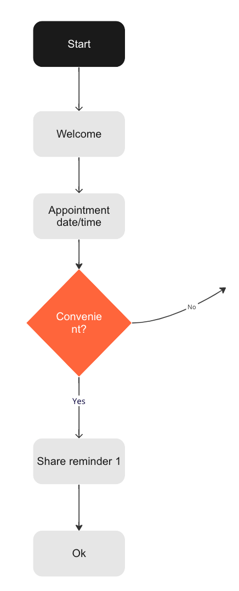

# Conversation structure

With a customer journey map/diagram and sample dialog in hand, we can now take the final step towards creating a structure to implement in the OpenDialog platform. Specifically, we map journey steps to conversation components, and define any sub-journey steps as scenes.&#x20;

The sample dialogs then help us define the turns and intents.&#x20;

This step is the "glue" between the work we've done so far to inform the design, and the actual design in the platform.&#x20;

As an example, consider the following diagram:

<figure><figcaption>
Extract of a diagram
</figcaption></figure>

Mapping this to conversations and scenes could look like this:&#x20;

<figure><figcaption>
Extract with conversations and scenes
</figcaption></figure>

With the added level of detail, it becomes more straightforward to start implementing the structure in the OpenDialog conversation designer.&#x20;

