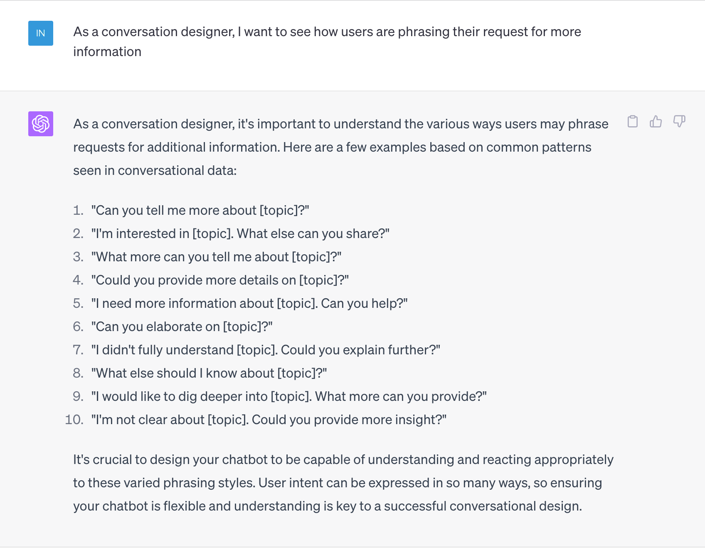
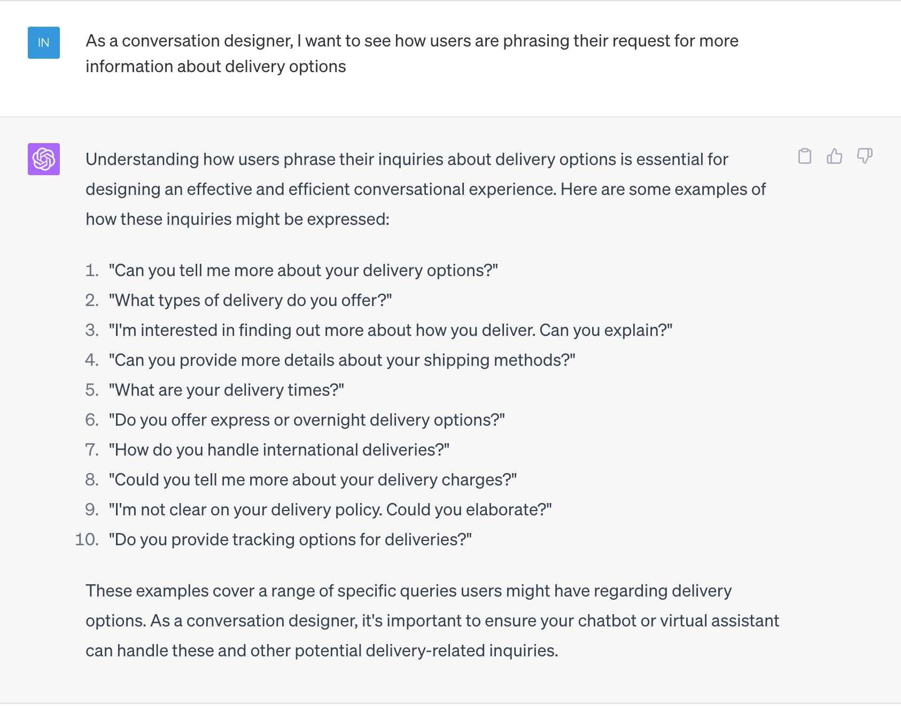
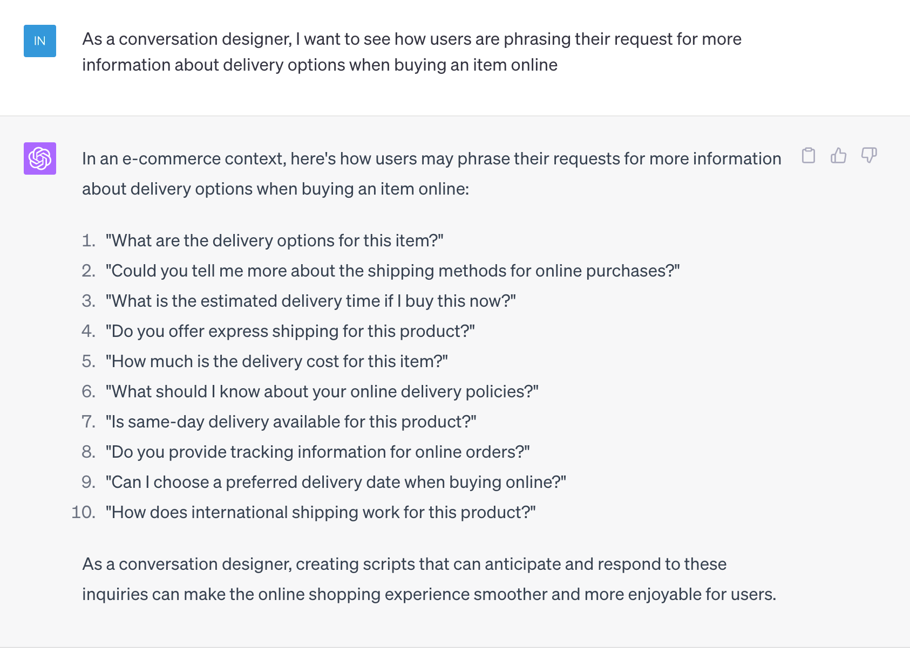

# NLU modeling

If your conversational experience includes natural language in addition to buttons, your application needs to integrate with an NLU service such as Microsoft Azure Language Studio, Google DialogFlow or Amazon Lex, or OpenAI to name a few.&#x20;

NLU modeling may be part of the conversation designer's task, or an AI/ML data scientist or AI trainer may be taking on this task.&#x20;

## Use LLMs

If you are using a "traditional" NLU service (as opposed to an LLM), you will need sample utterances to train each intent. There are a number of ways to gather sample utterances. One of the options is to use an application such as ChatGPT.&#x20;

Consider sample utterance generation as a brainstorming exercise with ChatGPT. Try a few different ways of prompting. For instance, set up a narrow prompt, but also try a broader prompt. While the broader prompt may yield fewer suitable sample utterances, it may expose utterance content or structure to further consider.&#x20;

For instance, if we want sample utterances in the domain of "getting more information". We can start by asking for sample utterances around getting more information, and we can subsequently narrow down to sample utterances for a specific topic (e.g. delivery information), and further specify types of items or categories, and online versus brick and mortar purchases.&#x20;

The example below shows that the incremental yield is not always a guarantee; in this case adding the online aspect did not yield significantly more value. However, it is important to continue to experiment with prompts as the yield can vary greatly depending on the specific use case. The prompts in the examples below as only an illustration. &#x20;

<figure><figcaption></figcaption></figure>

<figure><figcaption></figcaption></figure>

<figure><figcaption></figcaption></figure>
