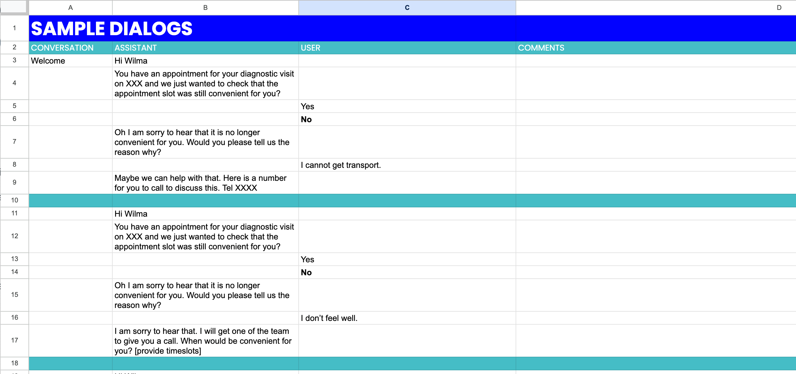

# Sample dialogs

## What

A sample dialog is an example of what a conversation between the assistant and the user could look like for a particular topic. It’s one possible path from start to end of a conversation.&#x20;

Create one or several sample dialogs based on the use case to help you get started with the conversation design implementation.&#x20;

Here's an example of a sample dialog:

<figure><figcaption>
Example of a sample dialog
</figcaption></figure>

## Consider LLMs

LLMs can be helpful in creating sample dialogs. It is important to engineer the prompt to reflect the details of the use case, the context, etc.&#x20;

## Templates

An example of a sample dialog is available here: [Sample Dialog Template](https://docs.google.com/spreadsheets/d/1A\_W4DADyEu3TZwelWEQtvNYYOKEmcIMZbXjp79sZGWU/edit?usp=sharing)
