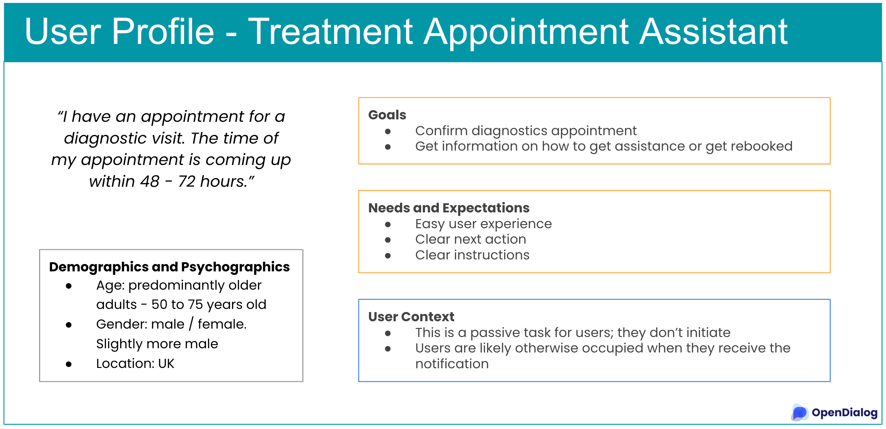

# Outcome: user profile

The outcome of any primary and secondary research needs to be analyzed and summarized to be useful as an input to design. One way to summarize the information is to create a user profile. The user profile is similar to a user persona description, but more focused on information that's relevant to the use of the product specifically. If you wish, you may use user personas instead.&#x20;

Here is an example of a user profile.&#x20;

<figure><figcaption></figcaption></figure>

Depending on the complexity of the user interaction with a product, it may be useful to summarize other insights, in addition to the user profile. A live handoff of this information from the UX research team to the designers is preferable.&#x20;
