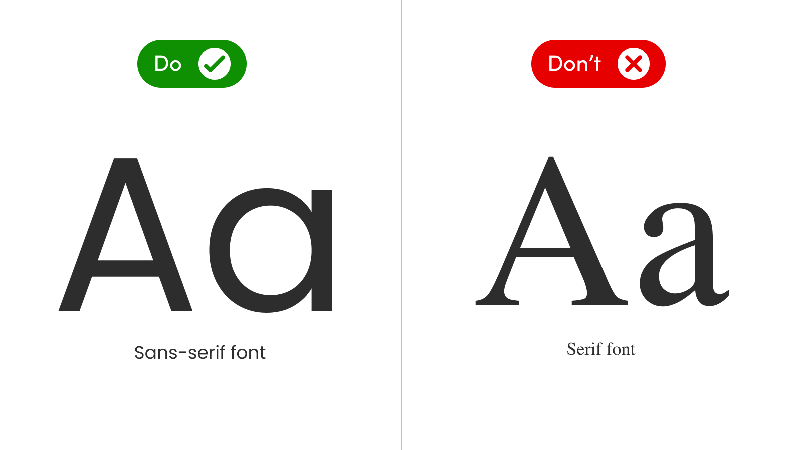
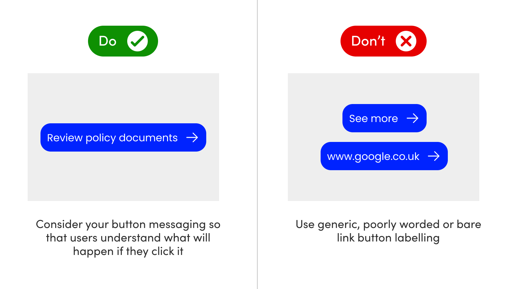

# Accessibility

**Ensuring your chatbot meets AA accessibility standards is a duty that must be undertaken by both Open Dialog and our clients.**&#x20;

While the code and user experience meet the necessary AA criteria, work must be done to ensure that the bot interface settings and message types also meet the required criteria.&#x20;

By default, our out-of-the-box chatbot meets AA standards. Therefore, any changes you make to its design (colour, font, message contents) should be checked against these criteria to ensure AA compliance in your regulated industry.&#x20;

To make this easier, we have collated a list of _do's and don'ts_ to help you build your bot, with confidence. &#x20;

## Typography

### **Always use a sans-serif typeface in your chatbot.**&#x20;

<figure><figcaption></figcaption></figure>

A sans-serif font such as Arial, Helvetica or Tahoma provides maximum readability to your customers. Fonts like Times New Roman, Garamond, or a custom/bespoke font will provide poor legibility (especially for those with visual impairments) and should be avoided.&#x20;

## Images

### **All images require an alt tag, excluding** [**those that are decorative**](https://www.w3.org/WAI/tutorials/images/decorative/)**.**&#x20;

<figure><figcaption></figcaption></figure>

When creating an alt tag, it's best practice to describe the information, not the picture. For example, the alt text for an image of a person typing on a computer could be "Woman optimizing website for SEO" or "Woman researching free blogging platforms," depending on the topic of the conversation. This means screen readers can provide context to customers who may not be able to perceive the image clearly.&#x20;

### **There are also times when an alt tag is not required.**&#x20;

<figure><figcaption></figcaption></figure>

In this example, the image provides no meaningful information and can be considered 'decorative'. Therefore, **you do not need to add an alt tag**. Open Dialog will automatically add a 'Null' state, meaning assistive technologies will ignore announcing the alt tag, ensuring you are compliant.&#x20;

### **Avoid flashing images**&#x20;

<figure><figcaption></figcaption></figure>

If you choose to use gifs or moving images, avoid those that flash or appear to strobe in any way to ensure you maintain AA accessibility standards. If the image is pertinent to the conversation (i.e. isn't classed as decorative) ensure you also include an alt tag.&#x20;

### **Avoid text in images where possible, and use alt tags when not**&#x20;

<figure><figcaption></figcaption></figure>

Where possible text burned into images (i.e. when an image is saved with text as part of the pixel data) should be avoided. There may be times when it's not possible to avoid this. In such cases, use the alt tag to describe the information.&#x20;

This is also true if you are using images with graphs or pictorial information, and alt tags should once again be used.&#x20;

## Colour

### **Abide by AA colour contrast specifications**&#x20;

<figure><figcaption></figcaption></figure>

Choosing the right colour contrast levels can be tricky, as there are layers to this level of compliance. The most important elements such as text, buttons and other information should be a minimum of 4.5:1 contrast level.&#x20;

In turn, those elements then need to score 3:1 contrast against any background elements.

In the left-hand image example above, the customer message has been set with white text on a blue background - which measures 7.8:1 colour contrast. The background of the message then contrasts at a level of 6.7:4 against the background; so in both cases, this is a successful pass.&#x20;

In terms of the chatbot message, this measures 13:1 for the text against the background, and then 3:1 for the button background and the chat window background. Again, a successful test on both accounts.&#x20;

In the right-hand example, we can see that every colour setting produces an accessibility failure, with no one value displaying the required criteria.&#x20;



### **Consider Dyslexia and colour vision**&#x20;

Choosing the right colours for neurodivergent customers is also an important part of designing the interface of your chatbot.&#x20;

Typically, these types of customers prefer:&#x20;

* Use of dark-coloured text on a light (not white) background
* Avoid green and red/pink, as these colours are difficult for those who have colour vision deficiencies (colour blindness)
* Avoid stark colour usage i.e. Black #000000 text on White #FFFFFF

### **Other considerations**&#x20;

It's also good practice to review your chatbot in greyscale to ensure any actions (such as clicking a button) are perceived with ease. This can be done with many free extensions for the browser of your choice.&#x20;

## Content

### **Avoid generic buttons and link labels**&#x20;

<figure><figcaption></figcaption></figure>

Button labels should describe what the customer can expect if they click them. Using a generic phrase like 'See more' or 'Discover now' is inaccessible, and doesn't give customers any context over what they can expect. &#x20;

We recommend using plain and simple language where possible, and where there is an implied action, support that action with a verb. For example, a button that allows a customer to review their car insurance documents could say 'Review now' or even 'Policy documents' - however it fails to capture what the customer can expect to see or what they need to do in the context of their customer journey. A better option would be 'Review policy documents' which is more explicit and action-based.&#x20;

Lastly, you should also avoid adding bare URLs such as www.google.co.uk as the button labels. This includes shortened URLs such as 'Bitly'.&#x20;

### Use example content within placeholder text

<figure><figcaption></figcaption></figure>

When used sparingly (placeholders are not essential for accessibility compliance) placeholder text can be beneficial for customers.&#x20;

For example, when asking a customer to 'Enter your email address', including the placeholder 'e.g. user@domain.com' provides them with further context on what type of information they need to provide and the correct format.&#x20;

For more complex requests such as 'What is your policy number', a supporting placeholder that follows the policy number format 'e.g. PL-123-4567-AB' would help customers locate and enter the correct information you are requesting from them.&#x20;

Avoid repeating the same instruction as the field label within your placeholder text. This is likely to confuse customers and increase the risk of task failure.&#x20;

## **Reading age**

Using a low reading age helps people with reading disabilities to understand your content, while also allowing authors to publish difficult or complex Web content with ease.&#x20;

For example, instead of 'Precipitation' use 'Rain' or 'Snow' instead. The easier you make it for customers to read and understand the content, the more likely they are to complete a task and not require your support.&#x20;

Keep messages as concise as possible to avoid overwhelming or confusing customers. Heavily verbose messages take more time to read and comprehend, therefore using short messages, breaking content up into separate messages, and keeping messages succinct will benefit every customer.&#x20;

There will be times when you need to use language that might be considered advanced reading level, such as within insurance policy documents. If the text cannot be made more readable, then supplemental content is required such as plain English explanations, or other support materials.&#x20;

You should also avoid jargon or slang that a customer might not understand, such as 'YOLO'.

Use _emojis_ sparingly, and include them at the end of sentences to avoid breaking up a message and its context.&#x20;

## Message speed&#x20;

<figure><figcaption></figcaption></figure>

Showing too many messages too quickly can be difficult for some customers to keep track of and comprehend, specifically if English is not their first language. It's better to slow things down a little and give them some space to read.&#x20;

The conversation designer allows you to adjust the speed at which messages are shown to users within the interface settings. Increasing the timing will add more pauses between messages, meaning you can better support customers and provide more time to follow and understand the conversation more easily.&#x20;

## **Accessibility declaration**

To achieve AA accessibility standards, your site _must_ have an accessibility statement which not only complies but directly relates to the site. While this is not the duty of Open Dialog, it's worth noting the importance of its inclusion.&#x20;

