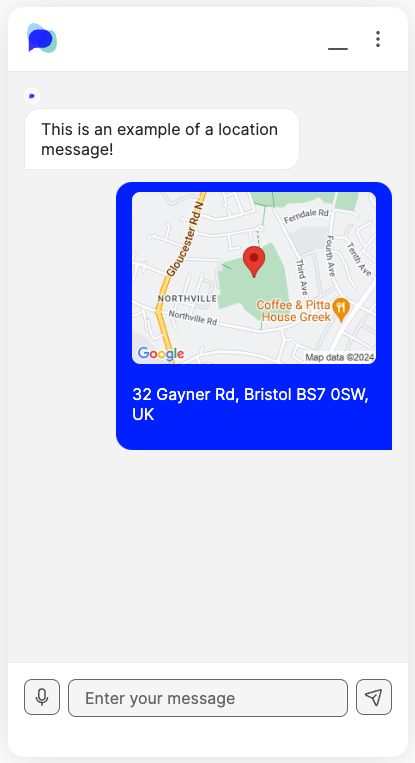

# Location Message

## What is a location message?

A location message is a message type that allows you to ask the user for their location. The user will then be able to open up a map and submit their location, or drag the map to whatever location they want to submit

<div align="center" data-full-width="false">

<figure><figcaption><p>A user can click the button at the bottom to open a map </p></figcaption></figure>

 

<figure><figcaption><p>Example of the map view where a user can select their location</p></figcaption></figure>

 

<figure><figcaption><p>An example of a message when a user has submitted their location</p></figcaption></figure>

</div>

## When to use location messages

A location message is best used when you need to get the users exact location, for example when having them input their personal data such as address. It could also be used if the user is having a problem, such as a car breakdown, and needs to share where they are in order to get help.

## How to create a location message

### Via the custom message in Message Editor

Navigate to the [Message Editor](../message-editor.md) and create a _Custom Message._ Copy the [XML snippet](location-message.md#xml-snippet) at the bottom of this page into the black box, or select `location-message` from the drop down, and your chat message will appear in the Preview panel.&#x20;

Fill in the template with the [properties](location-message.md#properties) of your particular message and when you are happy with it make sure to save your message and test it in the Test Preview chat window.&#x20;

<figure><figcaption><p>How to create a location message in the custom message block</p></figcaption></figure>


* Open your OpenDialog application
* Select the Scenario that you wish to edit
* Select Design from the left hand panel and select Messages
* Go into the message that you want to add a message block to
* Add a 'Custom Message' block
* Select 'location message' from the drop down
* Add in your own text to the fields you want to customise
* To preview your message, go to the Preview section


#### XML Snippet

```xml
<location-message>
    <text>text</text>
    <callback>callback</callback>
    <attribute_name>location</attribute_name>
    <api_key>google_maps_api_key</api_key>
</location-message>
```


The location message type sets an attribute called \<location>&#x20;

If you want to use a different attribute name, this is possible you must register this attribute name via the dynamic attributes page first, before using it in the location message XML.&#x20;

If you do not register this new attribute first, this will cause the message to fail and you will get a no-match in your conversation.


## How to use location messages




**Saving a message:** Always remember to hit 'Save Message' before closing or navigating away from the edit screen.


## Storing, Retrieving and Displaying Location Information

Location information is stored in an attribute of type Location. If you haven't configured a new attributes then you could use a built-in attribute called Location (which is also of type Location). Alternative you can create a new attribute and set the type to Location.&#x20;

<figure><figcaption><p>Creating an attribute of type attribute</p></figcaption></figure>

Once you've create the new attribute set that attribute name in the XML mentioned above.&#x20;

Once a user has submitted some location information this is stored in an attribute of type _Location._ The structure of the information stored is as the example below:

```
user_address: {
    "formatted_address":"31 Ufford St, London SE1 8LJ, UK", 
    "postal_code":"SE1 8LJ", 
    "line_1":"31", 
    "line_2":"Ufford Street", 
    "province":"England", 
    "country":"United Kingdom", 
    "lat":51.50252510000001, 
    "lng":-0.1060668 
}
```

The attribute is called _user\_address_ in this case.&#x20;

In order to display some of this information back to the user (for example, in order to ask them to confirm it), you can access the various fields in the following format from within a message

```
Ok - we have your new address as {user.new_address['formatted_address']}. 
Is this correct?
```

<figure><figcaption></figcaption></figure>

Please pay attention to how _formatted\_address_ is enclosed in single quotes and square brackets. You can access any of the components of the address in the same way.&#x20;

## How to construct a location message

When structuring a message, you are able to use multiple different message blocks together to create the message that you are looking for. However, when it comes to ordering and structing these, there are some rules that need to be followed. To learn more about this, please head to the [Constructing Messages ](../constructing-messages.md)page for more information.


For all message types, a key element to take into consideration is **Accessibility**, especially for messages that include customisation with multimedia types such as buttons, images and links. For all information on accessibility within OpenDialog, please click [here](../../designing-accessible-chatbots.md).

