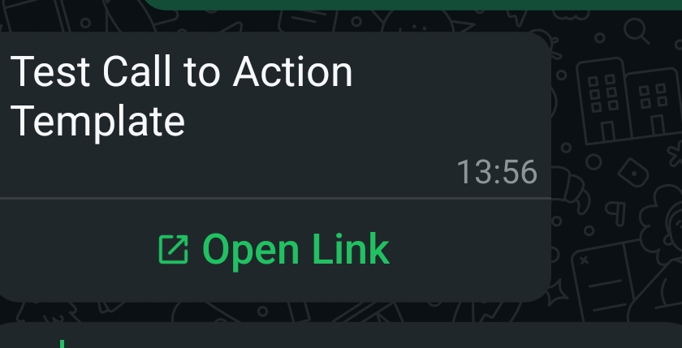
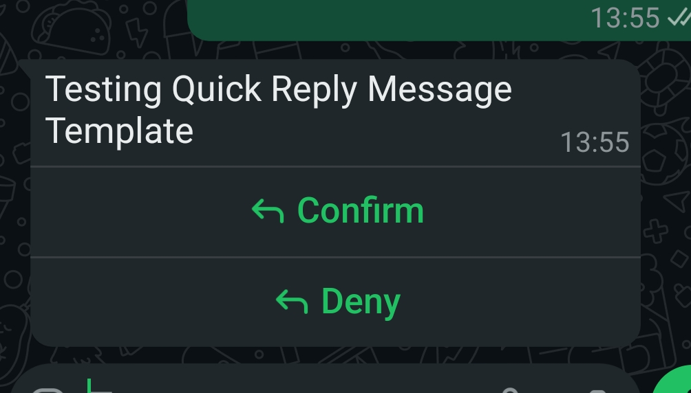

# Twilio Content Template Message

### What is a Twilio Content Template Message

A Twilio Content Template Message is a type of message that allows you to send structured content, such as images, buttons, and text, to users via the Twilio platform, when building multichannel Scenarios. It is particularly useful for sending rich media messages that enhance user engagement.

This message holds a reference to the Twilio Content Template that is used to render the message. The Content Template can be referenced by its unique identifier, `sid` or by the `name` of the template. The message can also include additional parameters that are passed to the template for rendering. [Here's the relevant Twilio documentation for Content Templates](https://www.twilio.com/docs/content/overview).

<div><figure><figcaption><p>An example of Call to Action template</p></figcaption></figure> <figure><figcaption><p>An example of Quick Reply template</p></figcaption></figure></div>

### When to use a Twilio Content Template Message

You should use a Twilio Content Template Message when you want to create a multi channel Scenario in OpenDialog that requires sending rich media content or structured messages to users, using Twilio's sub account. This type of message is ideal for scenarios where you want to:

* Send rich media content to users, such as images, videos, or buttons.
* Create interactive messages that allow users to take actions directly from the message.
* Enhance user engagement by providing a more visually appealing and informative message format.
* Send messages that require a structured format, such as notifications, alerts, or promotional content.
* Utilize Twilio's capabilities to deliver messages across various channels, including SMS, WhatsApp, and more.

### How to create a Twilio Content Template Message

#### Via the custom message in Message Editor

Navigate to the [Message Editor](../message-editor.md) and create a Custom Message. Copy the [XML snippet](twilio-content-template-message.md#xml-snippet) at the bottom of this page into the black box, or select `twilio-content-template-message` from the drop down, and your chat message will appear in the Preview panel.

<figure><figcaption><p>How to create Twilio Content Template Message in the custom message block</p></figcaption></figure>


* Open your OpenDialog application
* Select the Scenario that you wish to edit
* Select Design from the left hand panel and select Messages
* Go into the message that you want to add a message block to
* Add a 'Custom Message' block
* Select 'twilio content template message' from the drop down
* Add in your own text to the fields you want to customize


#### XML Snippet

```
<twilio-content-template-message sid="some-template-id" name="some-template-name">
    <variables>
        <variable name="body" value="This is the body of the message"/>
        <variable name="button_1_text" value="Button 1 text"/>
        <variable name="button_1_value" value="Button 1 callback"/>
    </variables>
</twilio-content-template-message>
```

#### Parameters

| Name        | Type   | Description                                                                                                                                                                                                                                                                                                                                                                                                                                                                                                                                    |
| ----------- | ------ | ---------------------------------------------------------------------------------------------------------------------------------------------------------------------------------------------------------------------------------------------------------------------------------------------------------------------------------------------------------------------------------------------------------------------------------------------------------------------------------------------------------------------------------------------- |
| `sid`       | string | The unique identifier of the Twilio Content Template to use for rendering. Required if `name` is not present.                                                                                                                                                                                                                                                                                                                                                                                                                                  |
| `name`      | string | The name of the Twilio Content Template to use for rendering. Required if `sid` is not present.                                                                                                                                                                                                                                                                                                                                                                                                                                                |
| `variables` | object | <p>A collection of variables to pass to the template for rendering.<br>In this example, <code>body</code> is a parameter of the message body.<br><code>button_1_text</code> is the text of the first button.<br><code>button_1_value</code> is the value of the button when clicked. Similar to Open Dialog's <a href="button-message.md">Button Message</a>, it can be a callback to an intent.<br>This field is optional, but variables number must match the number of parameters that you have defined in the Twilio content template.</p> |

### Supported Twilio Content Templates Types

1. [Twilio Text Content](https://www.twilio.com/docs/content/twilio-text)\
   This is the standard Twilio text content message. You don't need to use template for this as the standard Open Dialog [text message](text-message.md) will suffice.
2. [Twilio Quick Reply Content](https://www.twilio.com/docs/content/twilio-quick-reply)\
   This is the standard Twilio button actions message for a quick reply. It is similar to Open Dialog's [button message](button-message.md), but it only supports button actions and no external links. You can parameterize the message with parameters like the body of the message, button text, button action.
3. [Twilio Call to Action Content](https://www.twilio.com/docs/content/twilio-call-to-action)\
   This is similar to a button message, but it provides options to open external link, call a phone number, copy promo code.
4. [Twilio Card Content](https://www.twilio.com/docs/content/twiliocard)\
   This allows for media to be sent in a message.
5. [Twilio Carousel Content](https://www.twilio.com/docs/content/carousel)\
   This allows for a multiple cards in a horizontally scrollable carousel.<br>

