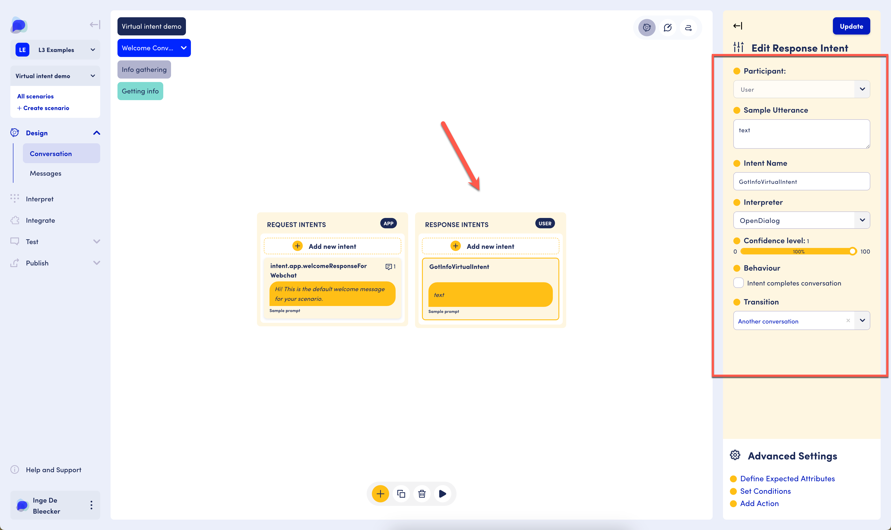

# Subsequent Messages - Virtual Intents

It is possible to share a number of messages in a single app intent, and [it is recommended to chunk content into bite-size pieces for legibility](messages-best-practices.md).&#x20;

<figure><figcaption>
3 pieces of information in a single app intent
</figcaption></figure>

However, in some cases the information shared with the user does not all logically fit in a single intent, turn and conversation. Imagine you've asked the user about delivery information in an ecommerce assistant, and now that you have received all the needed information, the assistant wants to confirm they have received all the information and wants to move on to another topic. This other topic is part of a different conversation, scene, and turn and no user interaction is expected or required in between these two pieces of information:&#x20;

&#x20;

<figure><figcaption>
Information the assistant shares with the user - no user interaction
</figcaption></figure>

The above would seem to violate the app - user - app -... order that must be adhered to in OpenDialog. In a case such as this, we use a virtual intent. A virtual intent is a user intent that never surfaces to the user. It does the work of a user intent behind the scenes, but the user does not interact with the assistant, nor are they aware of the intent's existence.

The app intent indicates in the component pane that they want to use a virtual intent.&#x20;

<figure><figcaption>
App intent that uses a virtual intent
</figcaption></figure>

The user intent looks and feels just like any other user intent, and transitions to the next app intent.&#x20;

<figure><figcaption>
User intent
</figcaption></figure>

As a result, two app intents can be displayed one right after the other, without any user interaction or user awareness.&#x20;

