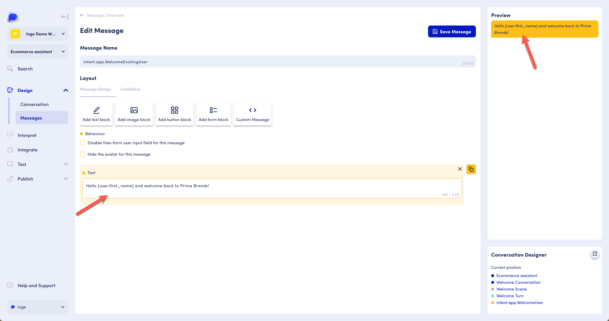

# Using Attributes in Messages

If you are not familiar with the concept of attributes, [read more](../../../core-concepts/contexts-and-attributes/about-attributes.md) or consider the video-based OD Academy lessons. To sign up, email academy@opendialog.ai.&#x20;

Attributes can be used in any message to customize the content. For example, the user's name can be added in the welcome message to personalize the experience.

<figure><figcaption><p>Edit Message screen</p></figcaption></figure>

### Notation

Attributes are added to messages using curly braces `{}.`and Inside the curly braces we first add the context name (very often and by default the context is "user"), next we add a period (`.`) and then the attribute name. For example, the attribute `first_name` stored in the `user` context looks like this:

```
{user.first_name}
```

If the value of `first_name` is John, the message will display as "Hello John and welcome back to Prime Brands."

Note - If the attribute has no value or does not exist in the context given, the attribute reference is removed from the final message.&#x20;

### Message editor&#x20;

<figure><figcaption><p>The attribute input field can be accessed within the message editor section of the conversation designer</p></figcaption></figure>

To access the Attribute Management feature within the message editor for a given scenario:

* Go to your workspace overview (Scenarios)
* Select the scenario you would like to update
* Select the message section under 'Design' in the left-hand menu
* Select the message you would like to edit
* Click within the 'Text' block for your chosen message
* Activate Attribute Management by inputting an opening curly brace `{`


For more information around using, creating and finding attributes within the message editor, follow this link to the[ Attribute Management](../../../core-concepts/contexts-and-attributes/attribute-management.md#message-editor) documentation


### Attribute Filters&#x20;

It may be necessary to filter or modify the value of an attribute before it is used in a message. To help with this, OpenDialog provides a number of built-in filters to use when referencing attributes in the message editor.

Filters are applied to attributes using a pipe (`|`) and they can be chained together with the result of a filter being passed through into the next filter. For instance:&#x20;

```
{ user.age | number_to_words | uppercase_first }
```

The above takes the value of the `age` attribute in the `user` context, converts the number to words and adds an uppercase the first letter. If `age` was 30, the value placed in the message would be 'Thirty'.

#### Available Filters

**String filters**

* `uppercase` - uppercases all letters in the string
* `uppercase_words` - uppercases the first letter of each word in the string
* `uppercase_first` - uppercases only the first letter in the string
* `lowercase` - lowercases the entire string

**Number Filters**

* `speltnumber_to_words` - turns a number into its word. eg 1 => 'one'
* `ordinal` - returns the ordinal of the number. eg 1 => 1st
* `ordinal_words` - returns the ordinal spelt out. eg 1 => 'first'

**Collection Filters**

* `count` - returns the number of items in a collection type attribute
* `where [field] [value] [operation?]` - filters out elements based on a field and a value, such as `{ history.utterances | where participant user }` to get all of the user utterances in the conversation history
* `range [start] [number]` - returns a subset of the collection, such as `{history.intents | range -3 2 }`conv to get the second and third from last intent names in the conversation history.
* `last` - returns the last element of the collection.

**Conversation Object Filters**

* `select [field]` - selects a name or description from a conversation object, such as `{ conversation.current_conversation | select name }`. These attributes can be found within the [Conversation context](../../../core-concepts/contexts-and-attributes/contexts.md).

For video lessons and hands-on practice with these concepts, consider signing up for the OpenDialog Academy lessons by emailing academy@opendialog.ai.&#x20;
