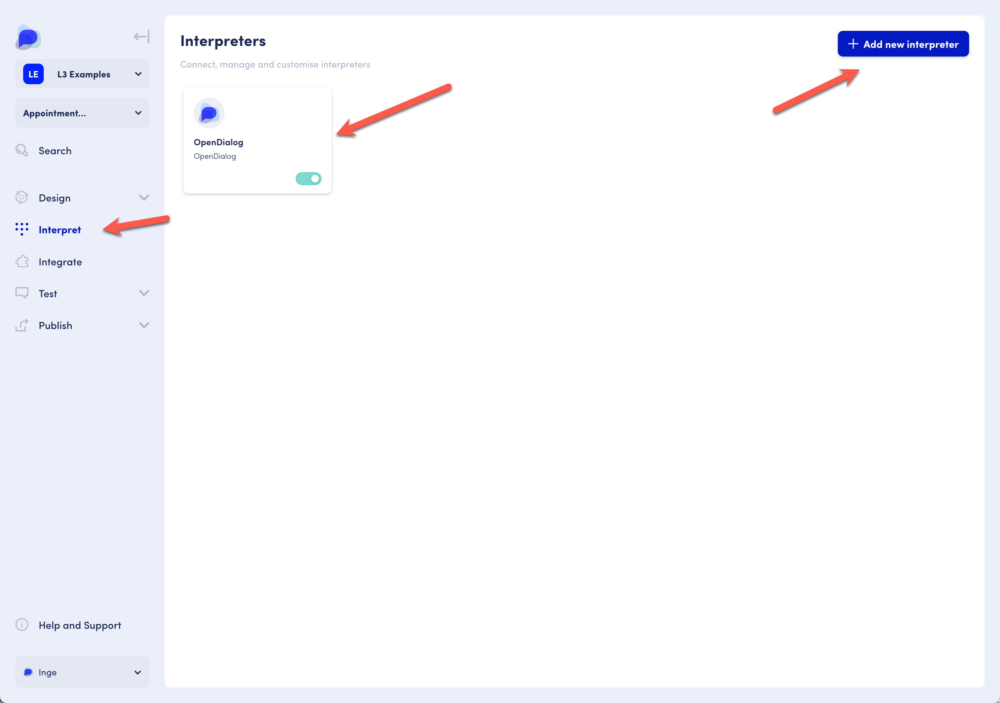
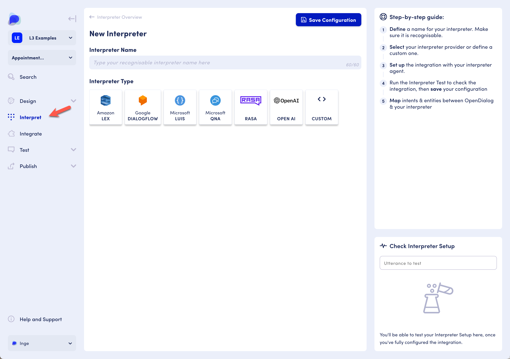

# Interpreters

An interpreter matches an utterance with an intent. For instance, the utterance "What will the temperature be like today?" can get matched to a "temperature" intent.&#x20;

OpenDialog comes with a default interpreter.

In addition, we can set up interpreters to connect to NLU services from providers such as Google’s DialogFlow, Amazon’s Lex, or use a preset Language Service.

Interpreters are managed through the "Interpret" menu. There are steps to set up the integration between OpenDialog and the NLU service, and to provide a mapping of intents between the two so they can work together. &#x20;

A single scenario can have multiple interpreters associated with it.&#x20;

<figure><figcaption>
Interpreters overview page
</figcaption></figure>

<figure><figcaption>
Adding a new interpreter page
</figcaption></figure>

Once an interpreter is available and set to active, it can be referenced in the conversation structure at the component level.&#x20;
