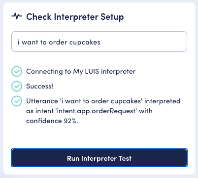

# Microsoft LUIS interpreter

The OpenDialog LUIS integration allows us to use LUIS intent interpretation and entity extraction.

## Creating a LUIS application

Please see [these steps](https://docs.microsoft.com/en-gb/azure/cognitive-services/luis/luis-how-to-start-new-app#sign-in-to-luis-portal) for instructions on signing into the LUIS portal, creating an authoring resource and creating a new LUIS application. Once the application is created you'll need to find the application's app ID, app URL and subscription key.

**APP ID**

You can find the app ID by selecting "Manage" on the "Settings" page under "Application Settings" and "App ID".

**APP URL and Subscription key**

You can find the app URL and subscription key in the "Manage" section on the "Azure Resources" page.&#x20;

* APP URL is the value next to "Endpoint URL"
* Subscription key next to "Primary Key"

## Creating the LUIS interpreter

Now you'll need to create the LUIS interpreter in OpenDialog. On the "Interpreters Setup" page, select "Add new interpreter". Here you'll need to choose a unique name for the interpreter and select the LUIS type.&#x20;

You'll then be able to input the app URL, app ID and subscription key that were found in the LUIS portal (the other fields can be left as default for now).

For the moment, you can ignore all the other settings. You can now save the interpreter by clicking on 'save configuration' and train the LUIS application.&#x20;

## Training the LUIS application

You can train the LUIS application to understand intents from user input, as well as to extract entities. For this example we'll set up a simple intent with an entity.

In your LUIS application select "Build" to get to the intent listing screen, then select "Create" to add a new intent. For this example, add an intent called `intent.app.orderRequest`. This will be trained to understand a product order request from a user.

Once the intent is created you'll need to provide some training utterances. Add an utterance such as "I want to order cupcakes", along with some others. For each example, type it in the text field under "Example user input" and hit the enter key to add it.&#x20;

Once added you'll want to highlight the product name (eg. "Cupcakes") to mark it as an entity.&#x20;

On the first time, select "View in entity pane", add a new "product" list entity. Then re-highlight the word, select the "product" entity and add the product name as new sublist.

This means that when this intent is interpreted, LUIS will attempt to extract the desired product too.

You can add as many training utterances and entities as you like.

Once you're happy with the training utterances and entities, click "Train" in the top right. The model may take a few seconds or minutes to train. Once it's complete click "Publish" and select the "staging" slot for now. This will make the latest trained version of your application available to OpenDialog.

You can now return to the LUIS interpreter in OpenDialog to complete its configuration.&#x20;

## Configuring the interpreter

In this example, LUIS has been trained to extract an entity called "product"; by default OpenDialog will attempt to store this value in a string (text) attribute of the same name: "product". Sometimes this will be suitable, however in some situations you may wish to map to a different attribute (_such as if you're using a built-in LUIS entity, or if the entity name conflicts with an internal OpenDialog attribute_).

To demonstrate this, the interpreter can be configured to do so by setting up an entity mapping from the LUIS entity named "product" to the OpenDialog attribute "customer\_product". Once you've created the mapping, make sure to save it.

## Testing the interpreter

Now that the interpreter is configured to integrate with our LUIS application, it can be tested via the "Check Interpreter Setup" in the bottom right. Enter an utterance such as "i want to order cupcakes" and you should see that it was interpreted as the intent trained earlier. It's useful to note the confidence percentage here, as this will be used shortly.

If it matches the 'None' intent instead, then you'll need to review the training utterances that you provided in the LUIS application and make sure that they cover the utterance you tested. If you make a change in LUIS this will require you to re-train the model and re-publish it to the staging slot.

If the test returns an error, please review the LUIS settings that you used to configure the interpreter.

## Publishing your interpreter

You will need to publish your interpreter before you can use it in your Scenario. To do this you need go to the interpreter landing page (`<instance-name>.cloud.opendialog.ai/admin/interpreters`) and then activate the interpreter by turning the slider green.

## Using the interpreter for an intent

Now that you've configured and tested your LUIS interpreter you'll want to make use of it for intent matching.

**The following steps presume that that you are working with the default conversations provided when you create a new scenario**, if this is not the case some steps may vary depending on your scenario's design.

In your scenario, locate the "Welcome Turn" within the "Welcome Conversation". By default this turn includes a single application request intent, and a single user response intent which matches the user clicking the default "OK" button. Add a second user response intent here to match the `intent.app.orderRequest` intent that was trained in LUIS.

It's important to note that the confidence level for the intent should be less than what was returned in our test. If LUIS interprets an intent with a confidence lower than our threshold, OpenDialog will disregard it.

After you've set up the intent, make sure to save it.

## Preview

Now that the interpreter is set on the intent, everything is in place see the LUIS interpreter working in "Preview".

After the webchat widget loads, if you send a message such as "i want to order cupcakes", you should see that the welcome message is re-sent to you. This means that OpenDialog successfully interpreted and matched the new LUIS intent (if it didn't you'll get a no match error message). To the right, under "Context" and "User" you should see a new "customer\_product" attribute with a value of "cupcakes". You can keep trying this with other entities that you trained LUIS for. Remember that if you update LUIS intents or entities, you'll need to re-train and re-publish the model.

Well done, you've now got your LUIS instance integrated with your conversational application.&#x20;
