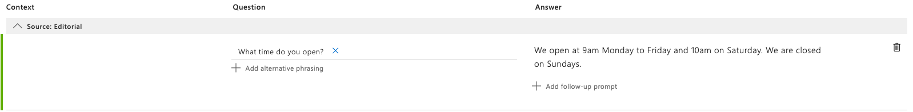
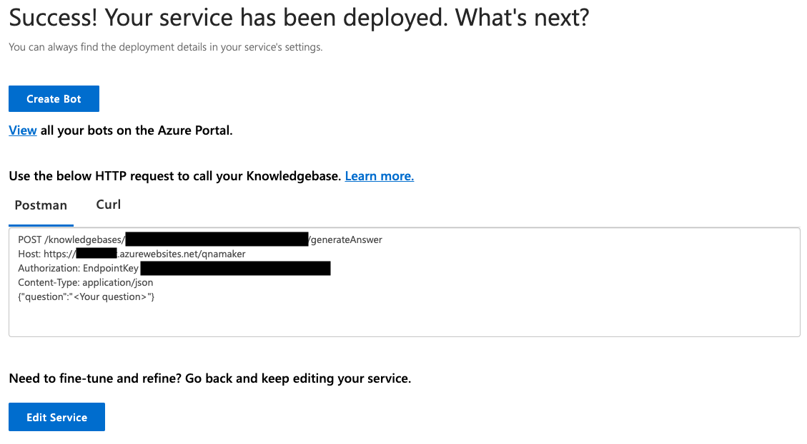
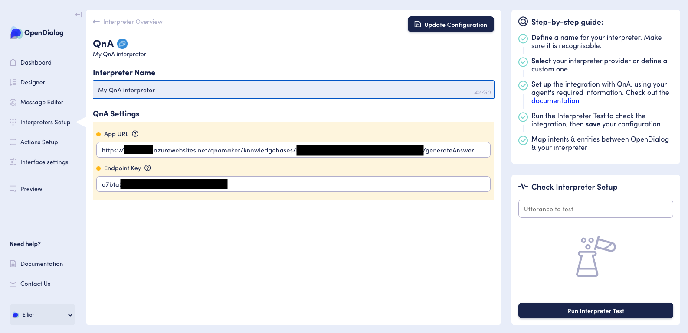
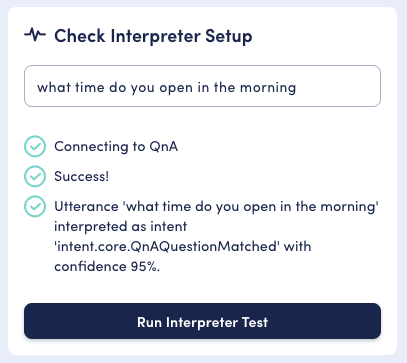
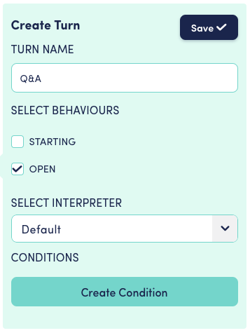
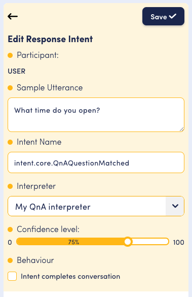
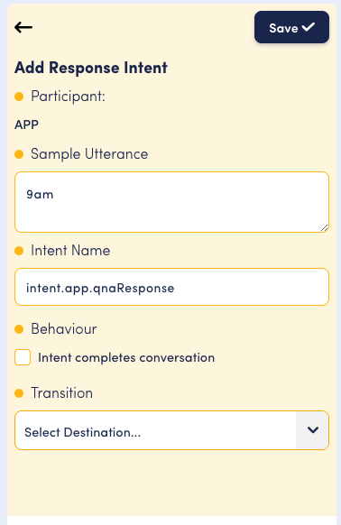
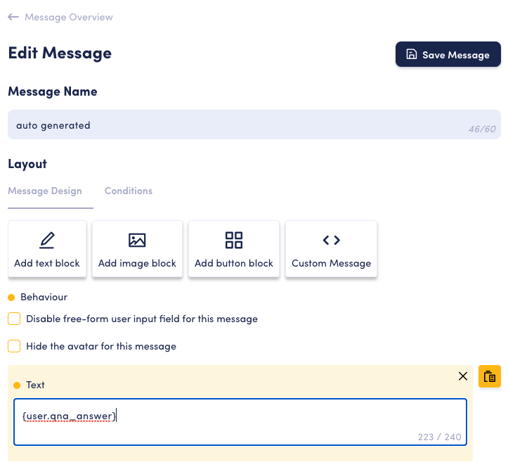
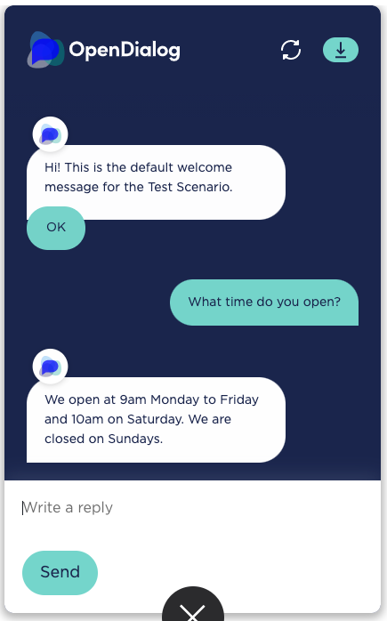

# Microsoft QnA interpreter

The OpenDialog QnA integration allows us to use QnA knowledge bases.

## Create a QnA knowledge base

Please see [these steps](https://docs.microsoft.com/en-us/azure/cognitive-services/qnamaker/how-to/manage-knowledge-bases?tabs=v1#create-a-knowledge-base) for instructions on signing into the QnA portal, creating an QnA resource and creating a new QnA knowledge base.

## Train the QnA knowledge base

You can train the QnA knowledge base to understand questions from a user, and match the appropriate answer. For this example we'll set up a simple question and answer pair.

In your QnA knowledge base select "Add QnA pair" to add a new question and answer pair. For this example, add a question of "What time do you open" with an answer of "We open at 9am Monday to Friday and 10am on Saturday. We are closed on Sundays.".

You can add as many training pairs as you like.

Once you're happy with the training pairs, click "Save and train" in the top right. The model may take a few seconds or minutes to train. Once it's complete click "Publish" and publish the knowledge base.

There are two key credentials to make note of after you publish your knowledge base; the app URL and the endpoint key. After publishing you should see some details for making a HTTP request to the published knowledge base.&#x20;

1. **APP URL** is the combination of the host URL (next to the "Host:" field) and the endpoint (next to "POST"), it will be something similar to "https://\[your-qna-service].azurewebsites.net/qnamaker/knowledgebases/\[id]/generateAnswer".&#x20;
2. **Endpoint key** is found after "Authorization: EndpointKey".

## Create the QnA interpreter

Now you'll need to create the QnA interpreter in OpenDialog. On the "Interpreters Setup" page, select "Add new interpreter". Here you'll need to choose a unique name for the interpreter and select the QnA type. You'll then be able to input the app URL and endpoint key that were found in the previous step.

You can now save the interpreter.

## Test the interpreter

Now that the interpreter is configured to integrate with the QnA knowledge base, it can be tested via the "Check Interpreter Setup" in the bottom right. Enter an utterance such as "what time do you open in the morning" and you should see that it was interpreted as the intent trained earlier. It's useful to note the confidence percentage here, as this will be used shortly.

If it matches the 'None' intent instead, then you'll need to review the training pairs that you provided in the QnA knowledge base and make sure that they cover the utterance you tested. If you make a change in QnA this will require you to re-train the model and re-publish it.

If the test returns an error, please review the QnA settings that you used to configure the interpreter.

## Publishing your interpreter

You will need to publish your interpreter before you can use it in your Scenario. To do this you need go to the interpreter landing page (`<instance-name>.cloud.opendialog.ai/admin/interpreters`) and then activate the interpreter by turning the slider green.

## Use the interpreter for an intent

Now that you've configured and tested your QnA interpreter you'll want to make use of it for intent matching.

**The following steps presume that that you are working with the default conversations provided when you create a new scenario**, if this is not the case some steps may vary depending on your scenario's design.

In your scenario, locate the "Welcome Turn" within the "Welcome Conversation". By default this turn includes a single application request intent, and a single user response intent which matches the user clicking the default "OK" button. For the purposes of this example, we'll be ignoring the "OK" button and therefore the user response intent in this turn should be delete. It is important to delete this intent as it will allow the conversation's cadence to flip from bot-then-user, to user-then-bot, which better suits the question-answer experience.

Navigate to the "Welcome Scene" and create a new turn in the called "Q\&A".

In this turn you'll need to create a single user request intent for the question and a single application response intent for the answer.&#x20;

First add a user request intent to match `intent.core.QnAQuestionMatched` (_this is the intent OpenDialog generates when QnA successfully matches a pair_).

It's important to note that the confidence level for the intent should be less than what was returned in our test. If Q\&A interprets an intent with a confidence lower than our threshold, OpenDialog will disregard it. After you've set up the intent, make sure to save it.

The intent that was just created captures the user's question, however an intent will also need to be created to return the answer to that question. Next create an application response intent in the same turn.

After you've saved the response intent, select it and click the yellow messages button in the action bar.

Once in the message editor, you should see an autogenerated message with the contents of the intent's sample utterance. As we would like to use the result of the QnA interpretation here, this message needs to be updated.

Click the yellow edit button in the top right of the autogenerated message to edit it.&#x20;

At the bottom of the screen, update the text message contents to `{user.qna_answer}`. By default all attributes are stored in the `user` context, unless they are mapped in [expected attributes](https://docs.opendialog.ai/turns-and-intents#advanced-settings). The attribute `qna_answer` is created by OpenDialog and will contain the answer from the matched QnA pair.

Make sure to save the message.

## Preview

Now that the interpreter is set on the user intent and an application intent has been created to return the answer, everything is in place see the QnA interpreter working in "Preview".

After the webchat widget loads, if you send a message such as "what time do you open", you should see that the trained answer is returned to you. This means that OpenDialog successfully interpreted and matched the new QnA user intent (if it didn't you'll get a no match error message), and then matched the new QnA application intent.&#x20;

You can keep trying this with other question-answer pairs that you trained QnA for. Remember that if you update QnA pairs, you'll need to re-train and re-publish the model.

Well done, you've now got your QnA instance integrated with your conversational application.&#x20;
