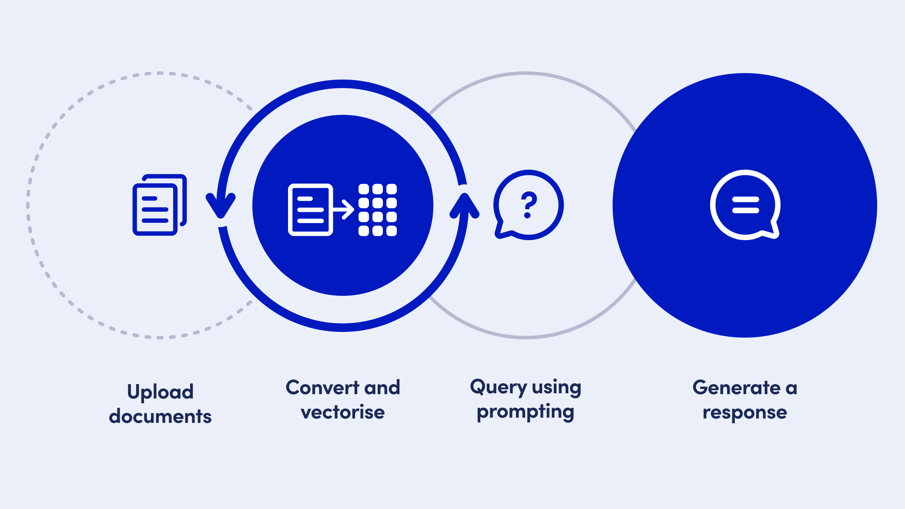
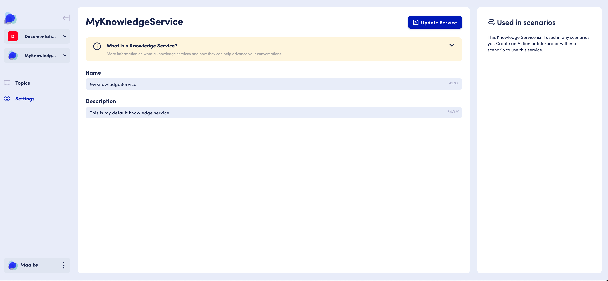
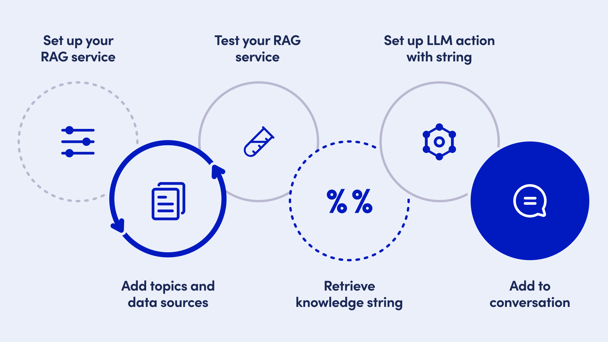
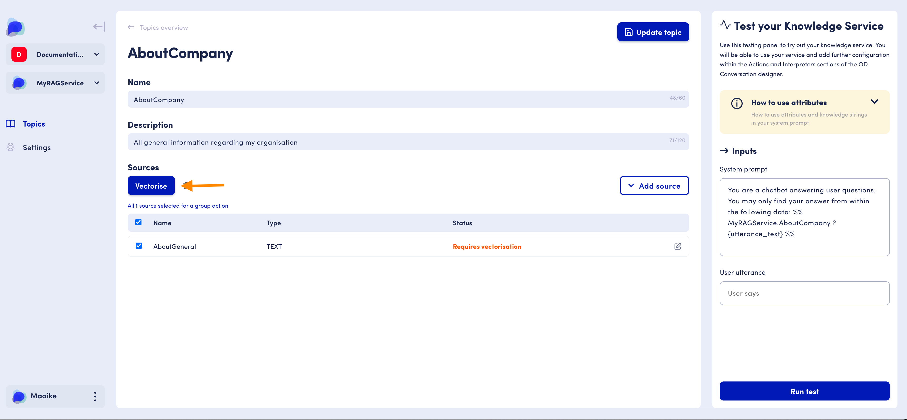

# Retrieval Augmented Generation

## The Basics

Retrieval Augmented Generation is an advanced system that combines information retrieval with natural language processing techniques  to generate  contextually relevant responses, based on a semantic search over a vectorised knowledge base.&#x20;

The OpenDialog RAG service allows you to&#x20;

* upload & manage your own documents, data and information
* convert it into numerical representations  through vectorisation
* query your data via tailored prompting&#x20;
* generate contextually relevant responses to user queries


<figure><figcaption><p>Simplified diagram of the Retrieval Augmented Generation process</p></figcaption></figure>

## In Action

#### Use your own data

#### Dynamic content generation&#x20;

#### Up-to-date response

By relying on up-to-date information from retrieval mechanisms, the system can provide more accurate and current responses.

## Where to find

OpenDialog's RAG service allows you to manage your content for  use in your AI application. In addition, the OpenDialog RAG feature provides an overview to manage your different knowledge sources, sorted by relevant topic.&#x20;

To access the RAG service feature  in your workspace:


* Go to your workspace overview by logging in or clicking on the OpenDialog logo
* Select 'Manage language services'
* See the language services dashboard
* View the already created RAG services in the labeled RAG services cards
* Create a new RAG service by using the Create language service button


<figure><figcaption><p>Access the ability to add a RAG service via the Language Services feature</p></figcaption></figure>

## Structure

The OpenDialog service consists of two main components : the settings of your RAG service, and the topics component.


In some cases, throughout the product you might find that RAG services are referenced to as Knowledge services. These are the same.


The <mark style="color:purple;">**RAG service settings**</mark> section allows you to name  and provide a description for your RAG service to easily recognise it in the Language Services Dashboard. Once it is being used in your applications, you can also visualise the scenarios that are actively using this particular RAG service.

<figure><figcaption><p>Access the RAG service settings components via the left-hand menu</p></figcaption></figure>

The <mark style="color:purple;">**Topics**</mark> section allows you to define, manage, edit and test the main semantic topics of your RAG service.

<figure><figcaption><p>The topics overview provides you with an overview of your different topics, and the ability to manage them</p></figcaption></figure>

To action the generation of responses based on your RAG service, you will need to use an additional feature of OpenDialog: [<mark style="color:purple;">**LLM Actions**</mark>](../llm-actions/).  The setup of a topic in your RAG service will generate a knowledge string that you can reference in your LLM Actions prompt, to ensure that the generated answer uses the knowledge sources you have provided.

## How to use

### Overview

<figure><figcaption><p>Overview of the steps within OpenDialog to setup and use a RAG service</p></figcaption></figure>

\[Video tutorial coming soon]

### Vocabulary

#### RAG

Retrieval Augmented Generation is an advanced system that combines information retrieval with natural language processing techniques  to generate  contextually relevant responses, based on a semantic search over a vectorised knowledge base.&#x20;

#### Topics

In the context of a Retrieval-Augmented Generation (RAG)  service, a "topic" refers to a specific subject area or theme around which information is organised, retrieved, and generated. Topics help in structuring the knowledge base and guiding the retrieval mechanism to fetch relevant information, which the language model then uses to generate responses.

#### Topic Sources

All of the information that your RAG service topic relies upon is stored in topic sources. The data saved in each of these Topic Sources can be provided in one of several formats: uploading a document, linking to a website, or simply written in as text.&#x20;

When a topic is queried, behind the scenes, all of the topic sources belonging to that topic will be sifted through to find the segments most relevant to the query.

#### Knowledge strings

A knowledge string is a piece of syntax you will use to reference a specific RAG service, and one of its topics within an LLM action, or for testing purposes in the test panel.

### Set up your RAG service

<figure><figcaption><p>From the Language Services dashboard, view your created RAG services or create a new one</p></figcaption></figure>


* On the language services dashboard, click the Create New Service button
* Select the '**Create Knowledge-base**'  card for creating a RAG service
* Get taken to the RAG service setup page
* Name your new RAG service (names should not contain spaces or special characters)
* Add a description to your RAG service
* Click 'Create service' button to finish creating your service


<figure><figcaption><p>RAG service setup page</p></figcaption></figure>

### Add your topics and relevant data sources

Once you have created your [RAG ](retrieval-augmented-generation.md#rag)service setup, you will get taken to the [Topics](retrieval-augmented-generation.md#topics) page. This page will be empty when first creating your service. You can start setting up your topics, by clicking on the Add topic button in the top right corner of the middle panel of your screen.

<figure><figcaption><p>Select the 'Add topic' button from the top right hand corner of your screen</p></figcaption></figure>

#### Setting up your topics


* In the Topics screen, Click on Add topic
* Define a topic name (should not include spaces or special characters)
* Add a description to your topic to easily identify it in the topics table
* Click the Create topic button in the top right corner of the middle panel of your screen
* This will trigger the 'Add sources' section to appear


<figure><figcaption><p>Provide a name, description to your topic and create it by clicking on the create topic button</p></figcaption></figure>

#### Adding topic sources

Once you have created a topic, you can start adding your documents, data and information to it by using the 'Adding sources' section.


* Click on the 'Add sources' button to start adding sources to a topic
* View a dropdown of the different available source types (URL, .pdf and text)
* Select the source type of your data


<figure><figcaption><p>Add your information sources to a topic using the 'Add source' dropdown</p></figcaption></figure>

<mark style="color:purple;">**Adding a text source**</mark>

Once you have selected text, the text upload modal will pop up. From here you can add your text source name (so that it is easily recognisable from within the topic sources table) and a space where you can add your text source.&#x20;


* Select Text from the add source dropdown
* View the 'Add text source' modal
* Add in your plain text source
* Select 'Upload source' once you are finished



Currently the only option for adding topic sources is Text. However the ability to upload URL and Document sources will be coming in our next release.


#### Vectorise your topic sources

When you add topic sources to your knowledge service topics, they get stored to the topic sources table. From within the topic source table, you can see all of the topic sources that you have added.&#x20;

Your topic sources now need to be converted to their numerical representation, using vectorisation.&#x20;


* Select the topic sources you want to vectorise using the checkbox next to them (or the checkbox in the title line to select all)
* Click on the vectorise button
* View the vectorisation status



<figure><figcaption><p>Select your topic sources to start vectorisation</p></figcaption></figure>

A topic source can be in one of the following vectorisation statuses :

* <mark style="color:orange;">**Requires Vectorisation**</mark> :  your topic source has not yet been vectorised since its last upload or edit. Your topic source might also be put in this status when it has become obsolete or when the RAG settings have changed. Select the topic source and click the vectorise button to start the process.&#x20;
* <mark style="color:yellow;">**Vectorisation in progress**</mark> : your topic source is currently being vectorised. Depending on the size of your topic source, this might take a few minutes.
* <mark style="color:green;">**Vectorised**</mark> : your topic source is vectorised and ready to be used by an LLM
* <mark style="color:red;">**Vectorisation failed**</mark> : the vectorisation process of the selected topic source has failed. Verify your settings, and retry.

### Test your RAG service

Once you have vectorised your different topic sources for a given topic, you can now start testing the responses that will get generated based on this information and a user query, using the test panel. &#x20;


* Go to the third panel on the right-hand side of your screen
* Add a user utterance to test with
* Click on 'Run test'
* View results - scroll down to see the full results


<figure><figcaption><p>Testing your knowledge service using the test panel</p></figcaption></figure>

### Retrieve your knowledge string

You can use your RAG service in your AI application by referencing it through a [knowledge string](retrieval-augmented-generation.md#knowledge-strings) in other services, like LLM Actions.  In order to do so, you need to retrieve or construct the relevant knowledge strings.&#x20;

<figure><figcaption><p>Syntax structure of a knowledge string</p></figcaption></figure>

#### Retrieving a knowledge string

The easiest way to retrieve your knowledge string is by going into the test panel of a specific topic.  The default system prompt already has your pre-formatted knowledge string in it.  You can simply copy/paste it for use in an LLM action.

**Example**:&#x20;

```
%%MyKnowledgeService.topic?{utterance_text}%%
```

#### Constructing a knowledge string from scratch

You can construct your knowledge string from scratch, and use it elsewhere in the OpenDialog platform by typing `%%` followed by your knowledge string syntax.

To use your RAG service from within a system prompt you should use the special syntax `%% [service].[topic] %%` to reference the data you want to use. For example if you have a knowledge service called 'countries\_ks' and you want to reference the 'capital\_cities' topic data you would use `%% countries_ks.capital_cities%%`.&#x20;

You should also add a query to only return the topic data that is useful to the user's question. To do this, the syntax is\
`%% [service].[topic] ? [query] %%`


If you omit to add the additional query, the LLM will systematically return the full information of your topic source without making it relevant to the user query.


#### **An example knowledge service string, used in a system prompt:**

`"You are a chatbot answering user questions. You may only find your answer from within the following data: %% countries_ks.capital_cities ? France %%`

### Set up an LLM action referencing a RAG service

In order to use the knowledge from within a specific RAG service to generate responses in your OpenDialog application, you will need to:&#x20;


* Create an[ LLM action](../llm-actions/) for response regeneration, referencing your RAG service as part of the system prompt, using a [knowledge string](retrieval-augmented-generation.md#retrieve-your-knowledge-string)
* Add the LLM action to the relevant application intent in your conversation design
* Add the relevant output attributes of your LLM action in the outgoing message, using the Message Editor.&#x20;


#### Using a knowledge string in your LLM action

In your LLM action, go to the 'Prompt configuration' tab.&#x20;


For more information on LLM actions, please check the [**LLM Actions**](../llm-actions/) section of the documentation.



Write your system prompt, including the reference to your RAG service where relevant.

For example:

```
You are a helpful customer service assistant. 

The user will provide you with questions
related to the organisation, its founders, its originis and its vision. 

Your goal is to provide a relevant response to their queries.  

Construct your response using the following data: 
%%MyKnowledgeService.AboutCompany?{utterance_text}%%
```


Make sure to never forgot the closing `%%` syntax, otherwise your  data will not get referenced and the LLM will provide a general, non-relevant response.


### Add your RAG-based LLM Action to your conversation design

## Settings

## FAQ
