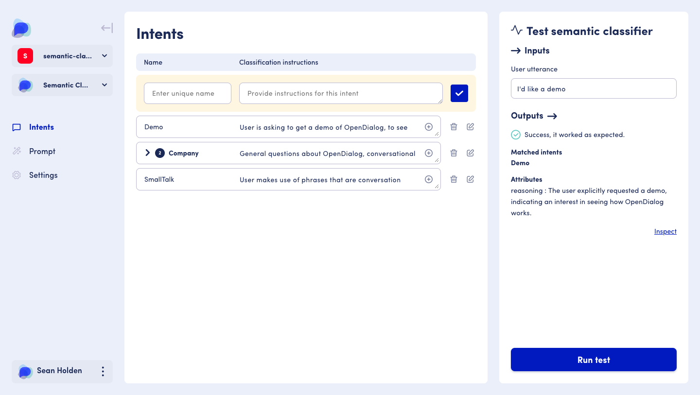
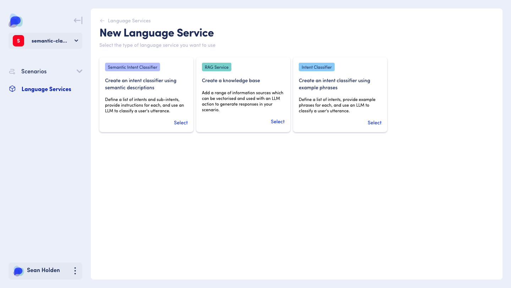
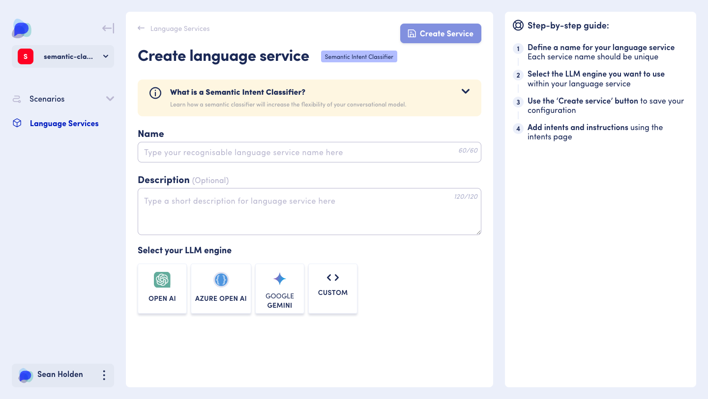
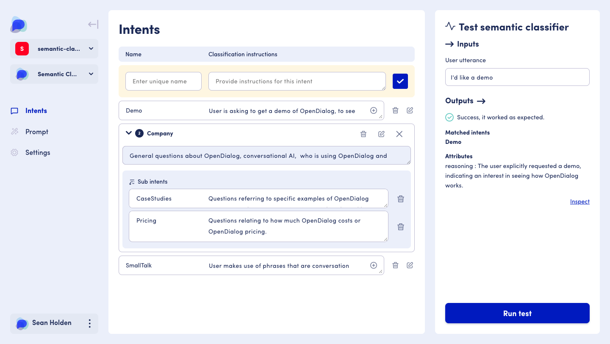
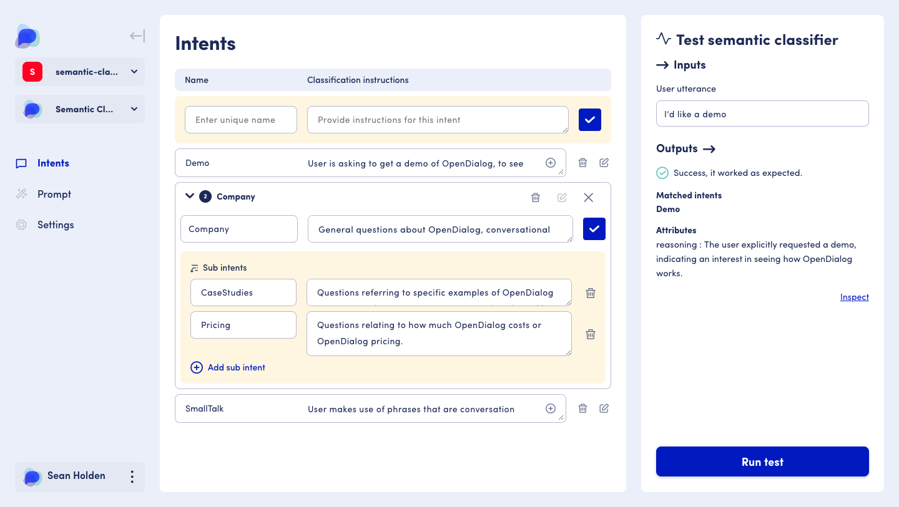
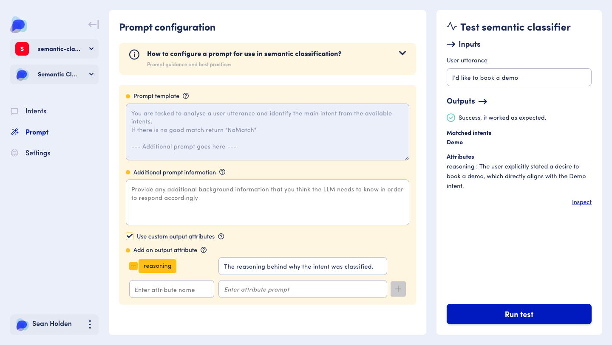
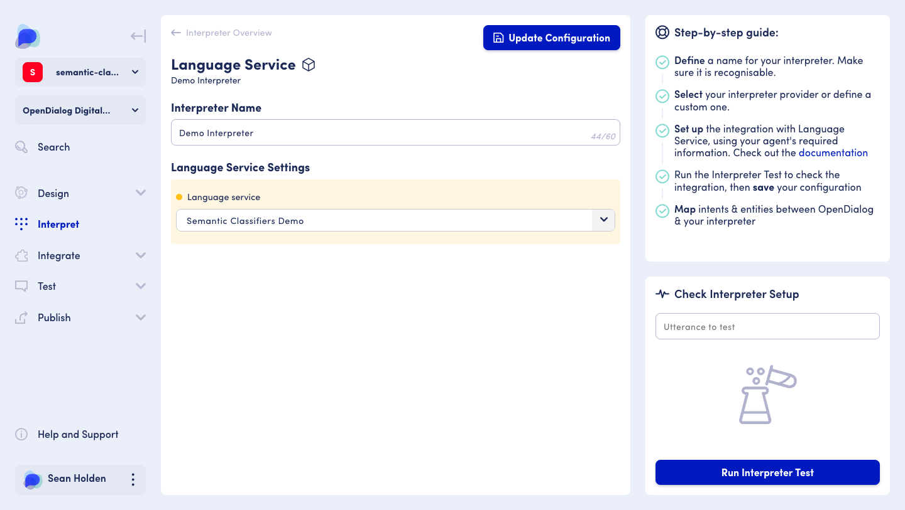

# Semantic Intent Classifier


The Semantic Intent Classifier feature is currently in BETA. &#x20;

Please reach out to [support@opendialog.ai](mailto:) for early access.


Interpreting a user's utterance is an important part of conversation design. It ensures your bot can understand what a user has said in natural language, understand whether it is a question about 'Policy' or 'Making a claim', and accurately match an intent. Conversations are non-linear and context-driven, meaning effective intent management and matching is integral to great conversation design.&#x20;

<figure><figcaption>
Classify intents and sub intents with an LLM using our Semantic intent classifier 
</figcaption></figure>

## The basics

Semantic intent classification is an incredibly versatile and performant tool, allowing you to build and manage complex conversations with ease.&#x20;

**As a conversation designer, a Semantic Intent Classifier provides many benefits:**&#x20;

* Build complex conversations easier, quicker and more efficiently&#x20;
* Use a range of LLM (Large Language Model) engines&#x20;
* Create an intent hierarchy  using Intents, and sub-intents&#x20;
* See more accurate intent matching with intent instructions specific to your use case&#x20;
* Harness additional prompts to provide background/key business or operational information
* Re-use across multiple scenarios&#x20;
* More cost-effective than regular LLM classification via training phrases

## In action&#x20;

**Flexibility in conversation design**&#x20;

Build a hierarchy within your Intents, add Intent instructions, provide additional prompt information to support Intent selection, and harness the power of an LLM to support Intent matching.

**Testable independently from a conversation**

You can configure and test your Semantic Intent Classifier using our test panel at every step, allowing you to debug, monitor token usage, review matched intents, inspect LLM logic, and see results quickly.

## Where to find&#x20;

To create a Semantic Intent Classifier, first, add it as a Language Service from the Workspace Dashboard.&#x20;

<figure><figcaption>
You can begin creating a Semantic intent classifier from the Language services landing page
</figcaption></figure>


To create a Semantic Intent Classifier Language service:&#x20;

* Log in to your OpenDialog environment&#x20;
* Choose a workspace&#x20;
* Select 'Manage Language Services'&#x20;
* Select 'Create new service'&#x20;
* Select 'Create an intent classifier using semantic descriptions' to get started &#x20;


I've created my Language Service, what do I do next? 

All language services need to work in unison with an Interpreter.&#x20;

If you have configured a Language Service that is ready to use within a conversation, you must create an Interpreter for the Language Service within a scenario.&#x20;

To create an Interpreter:&#x20;

* Select the scenario in which you wish to use the Language Service
* In the sidebar click 'Interpret'&#x20;
* Select 'Add new Interpreter'
* Add a unique Interpreter name&#x20;
* Under the Interpreter Type, select 'Language Service'
* Select the 'Semantic Intent Classifier' Language Service you created&#x20;
* Click 'Save configuration'&#x20;

I've set up an Interpreter, what do I do next? 

Great! Once you have your Language Service and interpreter set up, it can be added within the conversation designer at the intent level.&#x20;

To add your Semantic Intent Classifier to your conversation:&#x20;

* Use the sidebar and navigate to 'Design'&#x20;
* Click on 'Conversation'&#x20;
* Using the conversation design interface in the middle panel&#x20;
* Click through the correct conversation, scene, and turn until you get to the intent level&#x20;
* Select the correct 'USER' intent you wish to add it to&#x20;
* Within the right-hand sidebar, select the correct Interpreter&#x20;
* The panel will update slightly, and show a new field 'Select intent'&#x20;
* Select the intent, or sub intent you wish you use&#x20;

## Structure&#x20;

A Semantic Intent Classifier Language Service has 4 main components:&#x20;

* **Language Service configuration** - This is where you configure the Language Service, give it a name and description and select an LLM engine. When returning to the Language Setting configuration after creation, you can also review which scenarios it is currently used in.&#x20;
* **Intent and sub-intent configuration** - This is where you can create and manage both your intents/sub intents, and provide instructions. You can also search for intents you have created using the keyword search will find related search queries either within the intent name or instruction and begin to test matched intent.&#x20;
* **Prompt configuration** - OpenDialog also provides additional prompt options as part of the Semantic Intent Classifier. Here you can specify additional information pertinent to your use case (such as background/key business or operational information). Any additional prompt information you provide is embedded within the non-editable prompt template, alongside the Intents and descriptions you have created. You can also create custom output attributes to extract data from the user utterance.
* **Test panel** - Present within intent creation, and prompt configuration, the test panel amalgamates all input data across your intents and prompt as you enter it, and provides a clear view of the inputs (what is sent to the LLM) and outputs (what was received back from the LLM). &#x20;


**Note:** A complete Semantic Intent Classifier also includes:&#x20;

* A Language services [Interpreter](../../interpreters/)&#x20;
* A [user intent](../../../../the-opendialog-model/turns-and-intents.md#intents-in-turns) in the conversation designer with the selected Interpreter and Intent


## How to use&#x20;

### Overview



### Vocabulary

**Intent**&#x20;

Within a Semantic intent classifier, an intent can be a singular, or categorised collection of intents (sub intents) that provide structure and organisation in your conversation.&#x20;

**Sub intent**&#x20;

A more granular intent exists within a categorised collection of intents. For example, an intent could be 'About us'. However, further developing the intent to be more specific by adding sub intents such as 'Company', 'People', 'History' will provide more granular intents within the 'About us' intent.&#x20;

**Prompt**&#x20;

A question or statement that provides instructions to an AI system to generate a response.&#x20;

### Setting up your Semantic Intent Classifier

To get started, create a Semantic Intent Classifier Language Service.

<figure><figcaption>
Create a Semantic intent classifier and select your configuration settings 
</figcaption></figure>

#### Name and description&#x20;

When creating your Semantic Intent Classifier, it's important to give it a unique name and description that helps you identify it easily. &#x20;

#### Engine configuration&#x20;

You can choose from the following LLM engines when you create a Semantic Intent Classifier:&#x20;

* [OpenAI](openai.md)
* [Azure](azure.md)
* [Google Gemini ](google-gemini.md)
* Custom configuration


Each LLM engine requires a slightly different configuration.&#x20;


#### When using OpenAI

* Selecting 'OpenDialog managed' means you will use a service directly managed by OpenDialog, and will not need to provide any credentials. You will be able to select a model from a pre-defined dropdown list.
* Unselecting 'OpenDialog managed' means you will need to provide your OpenAI API Key, OpenAI Organisation and specify a [model name](https://platform.openai.com/docs/models).

#### When using Azure

* OpenDialog does not provide a managed service, therefore you will need to provide your Azure OpenAI API Key, Azure OpenAI Resource Name and Azure OpenAI Deployment Name.&#x20;

**When using Google Gemini**

* OpenDialog does not provide a managed service, therefore you will need to provide your Location and Project ID, as well as select the model you want to use. In addition, you will also have to provide JSON credentials which can be gathered directly from Google, and then either copied and pasted or uploaded into OpenDialog.&#x20;

**When using a custom configuration**


If you choose the 'Custom' engine, you will need to configure using JSON


### Create service

When you have configured your Language Service, you can click 'Create service' to continue. This will take you to the Intent and Sub-Intent creation section.&#x20;

### Editing your language service&#x20;

You can make changes to your Language Service (such as changing the name, description or the engine you are using) by navigating to:&#x20;

* Workspace dashboard
* Select 'Manage Language Services'
* Select the Language Service you wish to edit&#x20;
* Using the side-bar, navigate to 'Settings'


If you change the name of a Language Service you are currently using, you will also have to update any interpreters that reference the Language Service.&#x20;


### Creating an intent

With your Language Service configured, you can begin creating Intents and sub-intents.&#x20;

<figure><figcaption>
Create intents, add sub intents and test as you go
</figcaption></figure>

To create an intent you must specify:

* **A unique intent name** - to help you categorise and manage your intents. It should be unique across intents and sub-intents
* **Intent classification instruction** - used by the LLM to classify and make an accurate match

You can create an Intent and sub intents simultaneously by clicking '+ Add sub Intent' during initial intent creation, and add as many as required.&#x20;

### Managing and editing your intents

Every intent you create will be represented in a list, from latest to first created, and provide tools to let you manage your intents with ease.&#x20;

<figure><figcaption>
Editing and managing your intents is simple, quick and easy 
</figcaption></figure>

From the list view you can:&#x20;

* **Add sub-intents** - using the plus button&#x20;
* **Edit** - using the pencil button
* **Delete** - using the trash can button&#x20;

Any changes to intents are confirmed by clicking the '✓' button.&#x20;

### Test panel&#x20;

A persistent test panel is present in both the intent creation screen, and prompt screen, so you can test and iterate your Semantic Intent Classifier throughout set-up, and more collectively as a whole.&#x20;

[Tell me more about the test panel ](./#the-semantic-intent-classifier-testing-panel)

### Prompt configuration

OpenDialog also allows you to provide additional prompt information alongside your intents and their classification instructions. Within your prompt, you can also include `{attributes}`, define their values, and include custom output attributes.&#x20;

<figure><figcaption>
Providing additional prompt information will better support the operation of your language service 
</figcaption></figure>


Adding a prompt is optional and not required by default&#x20;


### Prompt template (read-only)&#x20;

By default, the prompt template is sent to the LLM alongside your intents and classification instructions and cannot be edited directly.&#x20;

The LLM requires a specific prompt format for your Semantic Intent Classifier to work as expected:

* **Task:** The task we want the LLM to complete  

* **Additional prompt information:** Any additional data the LLM should know and consider (any 'Additional prompt information' you supply using the fields below is inserted here)&#x20;
* **Goal:** What success looks like in terms of task completion&#x20;

While this is not editable, including this field provides an easy way to understand the steps the LLM will take to complete the task.&#x20;

### Additional prompt information

Additional prompt information allows you to configure and provide further information pertinent to the LLM, such as specific background/key business or operational information. &#x20;

You can also specify [attributes](../../../../core-concepts/contexts-and-attributes/about-attributes.md) within your prompt. To add an attribute to your prompt, type the curly brace symbol `{` and enter the name of the attribute you want to include. &#x20;

[Learn more about adding and creating attributes](../../../../core-concepts/contexts-and-attributes/attribute-management.md)


Attributes require a value. When using the testing panel, where possible, OpenDialog will add a default value to any attributes you create. In cases where this is not possible, ensure you add a value to any attributes within the test panel. This will **not** occur when using the action in a deployed scenario, and all attribute values will need to be provided via user input, actions, interpreters or the embed [snippet](../../../launching-your-application.md).

[Learn more about attribute values](./#attributes-and-values)


### Custom output attributes&#x20;

The prompt configuration area also allows you to create Custom output attributes, which can be used to extract data from the user utterance or create conditions to redirect your conversation. The extracted output attributes will be stored in the user context if matched for use later in the conversation.

### Add from Language Services interpreter&#x20;

After configuring your Language Service, Intents and Prompt, it's time to add an Interpreter to link your Language Service to a scenario.&#x20;

<figure><figcaption>
Create an interpreter, and select the Semantic intent classifier language service
</figcaption></figure>


To create an interpreter from a Language Service:&#x20;

* Navigate to the scenario you want to add an Interpreter to&#x20;
* Using the side-bar click 'Interpret'&#x20;
* From the Interpreter landing page, select 'Add new Interpreter'
* A 'Create Interpreter' screen will display
* Provide a unique name for your Interpreter&#x20;
* Under the Interpreter Type, select "Language Service"
* Select the 'Semantic Intent Classifier Language Service' you created
* When ready, click 'Save configuration'&#x20;


### Create interpreter&#x20;

Creating a new Interpreter from a Language Service requires some basic configuration:&#x20;

* **Name:** You must enter a unique name for your Interpreter
* **Settings:** You must choose the Language Service you want to connect the Interpreter with

Once both these are completed, you can save and complete this configuration by clicking 'Save configuration'. All Interpreters you create will be displayed on the Interpreters landing page.&#x20;

### The Semantic Intent Classifier testing panel&#x20;

Throughout the entire Semantic Intent Classifier creation process, you can test and iterate using the test panel in the sidebar.


During testing, you may see all or only some of the input/output information depending on what areas of the Semantic Intent Classifier you have already configured. For a more complete test result, ensure you complete the full set-up.


### The test panel is made up of:&#x20;

#### **→ Inputs**

This area shows the information sent to the LLM:

* **Attributes and values:** Gathered from additional prompt information
* **User utterance:** What might be sent by the user within a conversation

#### **Outputs →**

This area shows the information received from the LLM based on the input data.

#### **Success/Failure**

Indicates whether the test worked successfully, or in the case of failure, will indicate the cause of failure and some guidance on how best to make changes.

#### Matched intents&#x20;

If you have set up Intents/sub intents, any matched intents will show as part of a test, showing the sub intent that has been matched first. Sub-intents are more granular and specific and therefore should be a more accurate match.&#x20;

#### Attributes&#x20;

Displays any attributes output by the LLM within the test. You may also see additional output attributes that were not specified during configuration, for example, in the case of success, error or failure.&#x20;

#### Inspect&#x20;

The expandable inspect area shows the compiled system prompt and more specific information about the test in JSON format such as token usage.&#x20;

### Using a Semantic Intent Classifier in your scenario&#x20;

Before you can add a Semantic Intent Classifier, ensure you have completed this checklist:&#x20;

* [x] I have created a Semantic Intent Classifier Language Service&#x20;
* [x] I have added Intents with classification instructions&#x20;
* [x] (Optional) I have configured my prompt settings&#x20;
* [x] I have created an Interpreter from a Language Service&#x20;

If this list is complete, you are ready to go.&#x20;

### How to add a Semantic Intent Classifier in your scenario&#x20;

Your Semantic Intent Classifier must be added to a `USER` intent within the conversation designer, by navigating through the corresponding conversation, scene, turn and intent where you wish to add it.&#x20;

<figure><figcaption>
Add your completed Semantic intent classifier to a user intent within the conversation designer
</figcaption></figure>


To add your Semantic Intent Classifier to an intent:&#x20;

* From the 'Workspace Dashboard' select 'Manage Scenarios'&#x20;
* Select the scenario you want to add the Semantic Intent Classifier to (it must be the same scenario you created your Interpreter within)&#x20;
* Use the side-bar and navigate to 'Design' and then 'Conversation'&#x20;
* In the central conversation designer pane, click through the correct conversation, and scene, and turn to make your way to the intent level&#x20;
* Select or create a `USER` intent&#x20;
* Using the right-hand side-bar, select the Interpreter you created and linked to your Semantic Intent Classifier language service&#x20;
* Select the Intent/sub intent you want to use&#x20;


## Frequently asked questions&#x20;

#### What is a 'sub-intent' and what does it mean?&#x20;

Think of intents and sub-intents the same way you would think of the class hierarchy between 'parent' and 'child'; It simplifies complex information into organised categories.&#x20;

An Intent supports your sub-intent, and sub-intents can be much more granular and specific, the result being more accurate intent matching.&#x20;

#### How is this different to Intent Classification?&#x20;

Creating an accurate Intent Classifier requires training phrases which contain entities. While Intent Classification is still a valuable and powerful tool, it can be complex and span a variety of phrases that require a lot of testing. Semantic Intent Classification utilises the power of an LLM within your conversation design which conducts a similar (but not the same) task as training phrase creation, but easier, quicker and more efficiently.&#x20;

#### How do I use a Semantic Intent Classifier in my scenario?&#x20;

Using the conversation designer pane:&#x20;

* Navigate into the conversation, scene and turn where you want to add your Semantic Intent Classifier
* Either click on or create a `USER` intent
* In the right-hand sidebar, select the interpreter created for your Semantic Intent Classifier&#x20;
* Select the Intent or sub-intent you want to use&#x20;


You must have an Interpreter set up and configured to add an intent within your Semantic Intent Classifier to a `USER` intent within a Turn


#### How are intents compared and matched?

If both an intent and sub-intent are matched, then the conversation engine will prioritise the **sub-intent** over the intent.&#x20;

[Learn more about conversation engine prioritisation](../../../../core-concepts/how-the-conversation-engine-thinks.md#during-an-interaction-these-prioritization-rules-apply)

#### Why is my Semantic Intent Classifier not picking up my intents?&#x20;

How your intent is configured could be considered 'catch-all' - and not contain specific enough information to be matched correctly. Try adding more granular instructions to your intents.&#x20;

#### Can I reuse the same Semantic Intent Classifier in more than one scenario?&#x20;

Yes, you can - As the Semantic Intent Classifier lives at the Language Service level (outside of a scenario) it can be integrated with an Interpreter and added to any Scenario you create.&#x20;

#### Can I add more than one Semantic Intent Classifier to a Scenario?&#x20;

Yes, you can - however, Semantic Intent Classification provides an exceptional breadth of scope and flexibility, meaning you probably won't need to.&#x20;

If you are looking to provide users with a variety of source types or information, consider using our [RAG service](../retrieval-augmented-generation.md).&#x20;

#### Can I switch the LLM engine of my Semantic Intent Classifier _after_ I have completed configuring it?&#x20;

Yes, you can. OpenDialog provides different LLM engines you can use:&#x20;

* OpenAI (available as an OpenDialog Managed service)&#x20;
* Azure&#x20;
* Google Gemini

